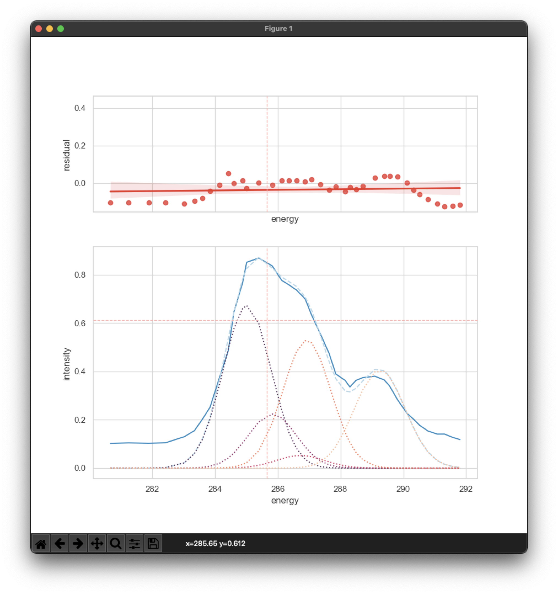
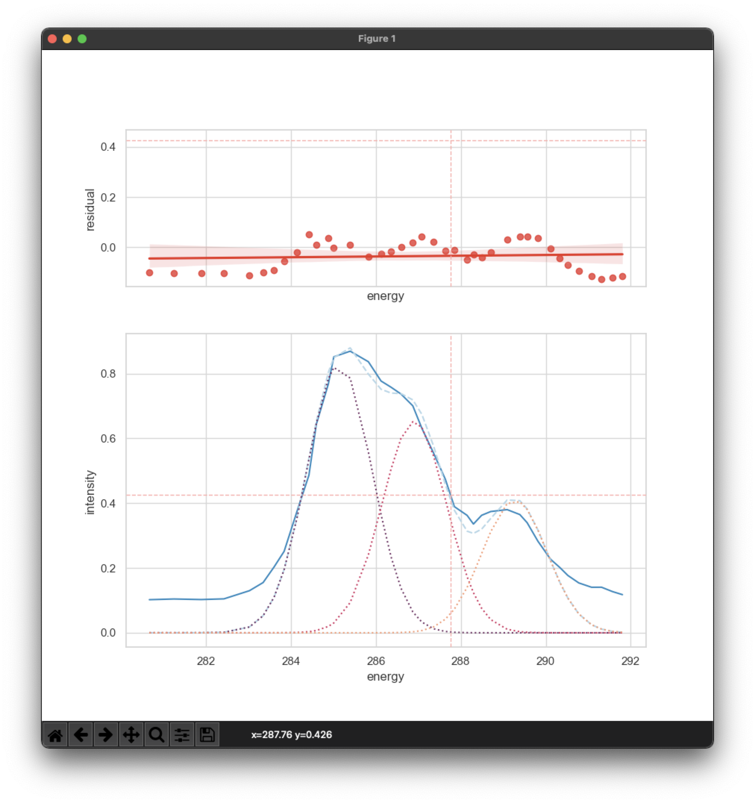
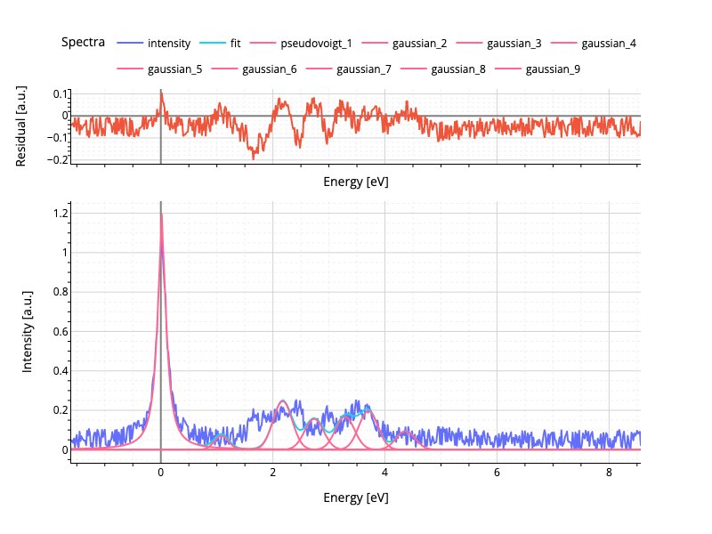
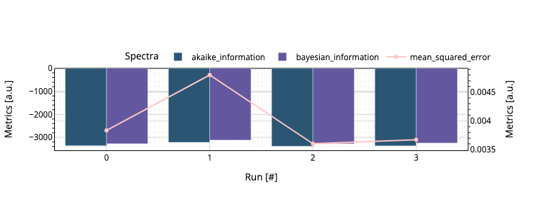

## Standard Statistics

Standard statistics will be performed according to the [`Goodness of Fit`][1],
which is implemented by default through [`lmfit`][2]. The `Goodness of Fit`
contains:

- [x] $N_{vars}$: the number of degrees of variables
- [x] $N_{free}$: the number of degrees of freedom
- [x] $N_{func}$: the number of degrees of functions
- [x] $N_{data}$: the number of data points
- [x] $residuals$: residuals
- [x] $\chi^2$: [the sum of the squares of the residuals][3]
- [x] $\textbf{red}\chi^2$: the reduced $\chi^2$
- [x] $\textnormal{AIC}$: [the Akaike Information Criterion][4]
- [x] $\textnormal{BIC}$: [the Bayesian Information Criterion][5]
- [ ] $covariance$: [the Covariance Matrix][6] (optional)

According to the provided data below, two types of fits will be compared
according to the [`Goodness of fit`][1]. In example 1, **five**
Gaussian-distributions are used to fit the data; in example 2, **three**
Gaussian-distributions are used to fit the data. The fitted spectra are shown in
the figures below.

??? info "Reference Data"

    ```csv
    Energy,Intensity
    291.80443675550987,0.11771793109307316
    291.5690317863643,0.12724843410900621
    291.3122900238649,0.14061739741579737
    291.0766791011155,0.14053244155422917
    290.7770989890252,0.15388595834073504
    290.52056318012956,0.17687038052502746
    290.3283260863409,0.2018010642652478
    290.1146698177568,0.22672402474532583
    289.81599590152325,0.2823855605928377
    289.5602015256013,0.33998563473613497
    289.389383606608,0.36492404173649806
    289.0898446852385,0.38020065029850414
    288.70417596675907,0.374292356289437
    288.48973707448056,0.3626765730350098
    288.2963878312313,0.33568377883672285
    288.14703027775414,0.36255300087272857
    287.8477385007092,0.38936816008773656
    287.63535914446874,0.4739069656083228
    287.3586398824005,0.5545764177974809
    287.0818382388907,0.6313996864356385
    286.8691293568841,0.7005537577522226
    286.5914627082384,0.7369920991048744
    286.35630488341735,0.7580611527738091
    286.1211058678756,0.7772071146672436
    285.8225143330836,0.8367148340657561
    285.39483107942857,0.8692529290464093
    285.0089152166246,0.8518060843843406
    284.8785877761387,0.767143706701473
    284.59750229766985,0.6439654306876021
    284.42277126020434,0.486210119015439
    284.14193292606006,0.3745703936545697
    283.83942827279583,0.25138439438055615
    283.6027875820274,0.2032221441314811
    283.34472771646364,0.15505217062226317
    283.0229046151628,0.12993612863862114
    282.4226322415218,0.10471968427312561
    281.88711168091606,0.10260351099406106
    281.2445776277749,0.10429490496528415
    280.6662187175784,0.10216328516593454
    ```

??? example "Example 1: _five peaks_"

    ```toml
      [fitting.peaks.1.gaussian.amplitude]
      max = 4
      min = 0
      vary = true
      value = 0.5

      [fitting.peaks.1.gaussian.center]
      max = 286
      min = 284
      vary = true
      value = 285

      [fitting.peaks.1.gaussian.fwhmg]
      max = 1.9
      min = 1.7
      vary = true
      value = 1.8

      [fitting.peaks.2.gaussian.amplitude]
      expr = "gaussian_amplitude_1 / 3"

      [fitting.peaks.2.gaussian.center]
      expr = "gaussian_center_1 + 0.8"

      [fitting.peaks.2.gaussian.fwhmg]
      max = 1.9
      min = 1.7
      vary = true
      value = 1.8

      [fitting.peaks.3.gaussian.amplitude]
      max = 4
      min = 0.1
      vary = true
      value = 0.5

      [fitting.peaks.3.gaussian.center]
      expr = "gaussian_center_1 + 1.7"

      [fitting.peaks.3.gaussian.fwhmg]
      max = 1.9
      min = 1.7
      vary = true
      value = 1.8

      [fitting.peaks.4.gaussian.amplitude]
      max = 4
      min = 0
      vary = true
      value = 0.5

      [fitting.peaks.4.gaussian.center]
      expr = "gaussian_center_1 + 1.9"

      [fitting.peaks.4.gaussian.fwhmg]
      max = 1.9
      min = 1.7
      vary = true
      value = 1.8

      [fitting.peaks.5.gaussian.amplitude]
      max = 4
      min = 0
      vary = true
      value = 0.5

      [fitting.peaks.5.gaussian.center]
      max = 288.6
      min = 292.2
      vary = true
      value = 289

      [fitting.peaks.5.gaussian.fwhmg]
      max = 2.0
      min = 1.8
      vary = true
      value = 1.9
    ```

??? example "Example 2: _three peaks_"

    ```toml
      [fitting.peaks.1.gaussian.amplitude]
      max = 4
      min = 0
      vary = true
      value = 0.5

      [fitting.peaks.1.gaussian.center]
      max = 286
      min = 285
      vary = true
      value = 285.39

      [fitting.peaks.1.gaussian.fwhmg]
      max = 1.9
      min = 1.7
      vary = true
      value = 1.8

      [fitting.peaks.2.gaussian.amplitude]
      max = 4
      min = 0
      vary = true
      value = 0.5

      [fitting.peaks.2.gaussian.center]
      max = 287
      min = 286.4
      vary = true
      value = 286.6

      [fitting.peaks.2.gaussian.fwhmg]
      max = 1.9
      min = 1.7
      vary = true
      value = 1.8

      [fitting.peaks.3.gaussian.amplitude]
      max = 4
      min = 0
      vary = true
      value = 0.5

      [fitting.peaks.3.gaussian.center]
      max = 288
      min = 290
      vary = true
      value = 288.4

      [fitting.peaks.3.gaussian.fwhmg]
      max = 1.9
      min = 1.7
      vary = true
      value = 1.8
    ```

!!! info "Fitting Results"

    | parameter            | _Example 1_          | _Example 2_          |
    | -------------------- | -------------------- | -------------------- |
    | $\chi^2$             | 0.15365078580492708  | 0.17338375921457175  |
    | $\textbf{red}\chi^2$ | 0.005487528064461682 | 0.005779458640485725 |
    | $\textnormal{AIC}$   | -193.9287463695311   | -193.21657151272893  |
    | $\textnormal{BIC}$   | -175.62956826210498  | -178.24451669756212  |

## Linear Correlation

The linear correlation between the the fitting results is calculated using the
Pearson's correlation coefficient. The Pearson's correlation coefficient is a
measure of the linear dependence between two variables.

!!! info "Correlation Results"

    Example 1:

    |            | **Peak 1** | **Peak 2** | **Peak 3** | **Peak 4** | **Peak 5** |
    | ---------- | ---------- | ---------- | ---------- | ---------- | ---------- |
    | **Peak 1** | 1.0        | 0.6284     | 0.000      | -0.091     | -0.376     |
    | **Peak 2** | 0.628      | 1.0        | 0.620      | 0.477      | -0.371     |
    | **Peak 3** | 0.000      | 0.620      | 1.0        | 0.978      | -0.274     |
    | **Peak 4** | -0.091     | 0.477      | 0.978      | 1.0,       | -0.225     |
    | **Peak 5** | -0.376     | -0.371     | -0.274     | -0.225     | 1.0        |

    Example 2:

    |            | **Peak 1** | **Peak 2** | **Peak 3** |
    | ---------- | ---------- | ---------- | ---------- |
    | **Peak 1** | 1.0        | -0.021     | -0.364     |
    | **Peak 2** | -0.021     | 1.0        | -0.241     |
    | **Peak 3** | -0.364     | -0.241     | 1.0        |



> _Five_ peak fit of the `Reference Data` above.



> _Three_ peak fit of the `Reference Data` above.

## Regression Metrics

For the regression metrics, the fitting results are compared to the reference
data. The metrics are calculated for each fit individually and based on the
[`sklearn.metrics`][7] module. Currently, the following metrics are implemented:

- [x] [`Explained Variance Score`][9]
- [x] [`R²`][10]
- [x] [`Max Error`][11]
- [x] [`Mean Absolute Error`][12]
- [x] [`Mean Squared Error`][13]
- [x] [`Mean Squared Log Error`][14]
- [x] [`Median Absolute Error`][15]
- [x] [`Mean Absolute Percentage Error`][16]

The metrics should provide a better overview of the individual fitting results
and the used model then just using the `Goodness of Fit` metrics. However, the
following metrics are not implemented yet:

- [ ] [`Mean Percentage Error`][17][^1]
- [ ] [`Mean Gamma Deviance`][18][^1]
- [ ] [`Mean Tweedie Deviance`][19][^1]
- [ ] [`Mean Pinball Loss`][20][^1]
- [ ] [`D² tweedie score`][21][^2]
- [ ] [`D² pinball score`][22][^2]
- [ ] [`D² absolute error score`][23][^2]

!!! info "Regression Metrics For [Example 6][8]"

    | **Metric**                       | **Spectra 1** | **Spectra 2** | **Spectra 3** |
    | -------------------------------- | :-----------: | :-----------: | :-----------: |
    | `explained variance score`       |     0.97      |     0.88      |     0.98      |
    | `r2 score`                       |     0.97      |     0.86      |     0.98      |
    | `max error`                      |     0.05      |     0.14      |     0.05      |
    | `mean absolute error`            |     0.02      |     0.04      |     0.02      |
    | `mean squared error`             |     0.00      |     0.00      |     0.00      |
    | `mean squared log error`         |     0.00      |     0.00      |     0.00      |
    | `median absolute error`          |     0.02      |     0.04      |     0.02      |
    | `mean absolute percentage error` |    441.19     |     0.25      |     0.62      |
    | `mean poisson deviance`          |     0.02      |     0.02      |     0.01      |

## Metric Plots

In the case of using the [Jupyter Notebook][24] interface of the `SpectraFit`
package, the metrics will be plotted automatically. It uses the

1. [Goodness of Fit Metrics][1]
2. [Regression-Metrics][7]

to plot the results for each run and can be also exported as `.csv`. The idea
is to use multiple runs and metrics together to get a better overview of the
fitting performance.




> _Example 3_ and _Example 4_ show the fit abd metric plots for the fitting
> results of four runs of the `Reference Data` above.

The user can select any of the metrics **1** and **2** by using the keywords
`bar_criteria` and `line_criteria`.

```python
sp.solver_model(
    initial_model=initial_model,
    bar_criteria=["reduced_chi_square"],
    line_criteria=["explained_variance_score", "r2_score", "max_error"],
)
```

[1]: https://en.wikipedia.org/wiki/Goodness_of_fit
[2]: https://lmfit.github.io/lmfit-py/fitting.html?highlight=goodness
[3]: https://en.wikipedia.org/wiki/Chi-squared_test
[4]: https://en.wikipedia.org/wiki/Akaike_information_criterion
[5]: https://en.wikipedia.org/wiki/Bayesian_information_criterion
[6]: https://en.wikipedia.org/wiki/Covariance_matrix
[7]: https://scikit-learn.org/stable/modules/classes.html#regression-metrics
[8]: ../../examples/example6
[9]: https://scikit-learn.org/stable/modules/generated/sklearn.metrics.explained_variance_score.html
[10]: https://scikit-learn.org/stable/modules/generated/sklearn.metrics.r2_score.html
[11]: https://scikit-learn.org/stable/modules/generated/sklearn.metrics.max_error.html
[12]: https://scikit-learn.org/stable/modules/generated/sklearn.metrics.mean_absolute_error.html
[13]: https://scikit-learn.org/stable/modules/generated/sklearn.metrics.mean_squared_error.html
[14]: https://scikit-learn.org/stable/modules/generated/sklearn.metrics.mean_squared_log_error.html
[15]: https://scikit-learn.org/stable/modules/generated/sklearn.metrics.median_absolute_error.html
[16]: https://scikit-learn.org/stable/modules/generated/sklearn.metrics.mean_absolute_percentage_error.html
[17]: https://scikit-learn.org/stable/modules/generated/sklearn.metrics.mean_percentage_error.html
[18]: https://scikit-learn.org/stable/modules/generated/sklearn.metrics.mean_gamma_deviance.html
[19]: https://scikit-learn.org/stable/modules/generated/sklearn.metrics.mean_tweedie_deviance.html
[20]: https://scikit-learn.org/stable/modules/generated/sklearn.metrics.mean_pinball_loss.html
[21]: https://scikit-learn.org/stable/modules/generated/sklearn.metrics.d2_tweedie_score.html
[22]: https://scikit-learn.org/stable/modules/generated/sklearn.metrics.d2_pinball_score.html
[23]: https://scikit-learn.org/stable/modules/generated/sklearn.metrics.d2_absolute_error_score.html
[24]: https://jupyter.org/

[^1]: requires a strictly postive `y_true` and `y_pred` array
[^2]: requires `sklearn >= 1.1.2`
