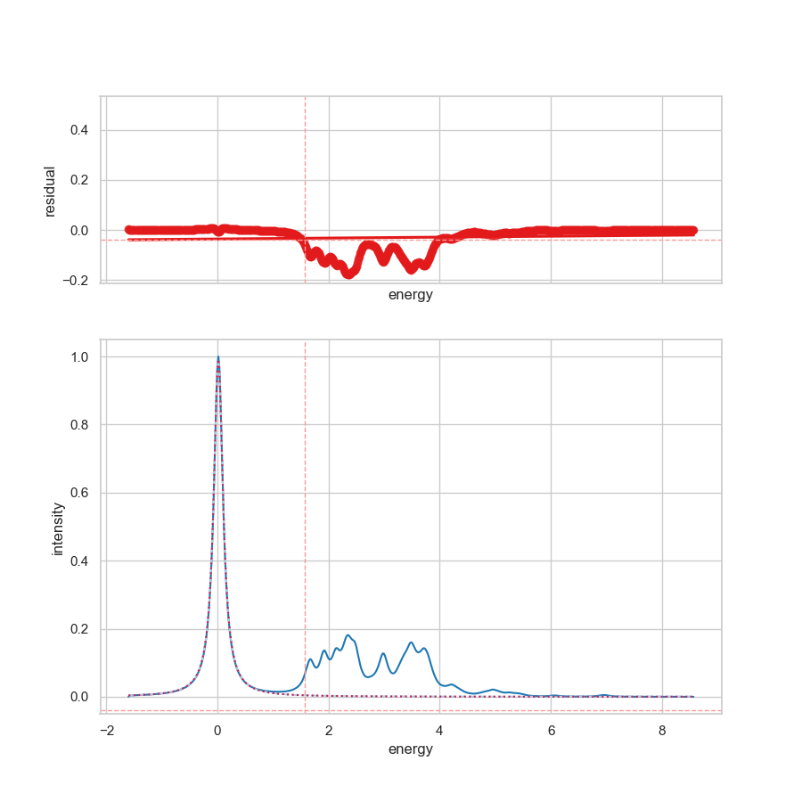
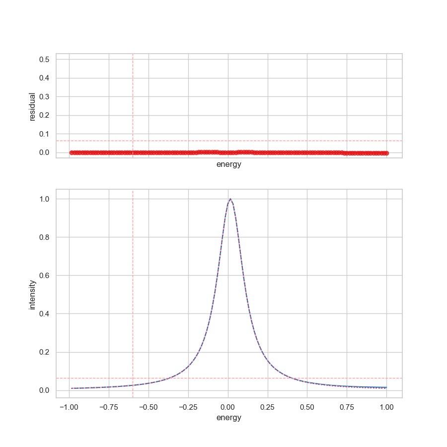

# Fitting of a Single Feature

In this example, the command-line interface of **SpectraFit** is used to fit a
single peak of the spectrum, as shown below.

```bash
spectrafit data.txt -i example_1.json -o example_1
```



In case of using the energy ranges, the spectra will be limited to the defined
energy ranges of `-e0` and `-e1`.

```bash
spectrafit data.txt -i example_1.json -o example_1 -e0 -1 -e1 +1
```



## Input File Format

The input file has to look like the following:

```json
{
  "fitting": {
    "description": {
      "project_name": "Example1",
      "project_details": "Example 1",
      "keywords": [
        "2D-Spectra",
        "fitting",
        "curve-fitting",
        "peak-fitting",
        "spectrum"
      ]
    },

    "parameters": {
      "minimizer": { "nan_policy": "propagate", "calc_covar": true },
      "optimizer": { "max_nfev": 1000, "method": "leastsq" },
      "report": { "min_correl": 0.0 }
    },
    "peaks": {
      "1": {
        "pseudovoigt": {
          "amplitude": {
            "max": 2,
            "min": 0,
            "vary": true,
            "value": 1
          },
          "center": {
            "max": 2,
            "min": -2,
            "vary": true,
            "value": 0
          },
          "fwhmg": {
            "max": 0.5,
            "min": 0.02,
            "vary": true,
            "value": 0.1
          },
          "fwhml": {
            "max": 0.5,
            "min": 0.01,
            "vary": true,
            "value": 0.1
          }
        }
      }
    }
  }
}
```

!!! tip "Parameter Definition"

    The peak parameters define initial values and constraints for the fitting process:

    - **amplitude**: Maximum intensity of the peak
    - **center**: Position of the peak maximum
    - **fwhmg**: Full Width at Half Maximum of the Gaussian component
    - **fwhml**: Full Width at Half Maximum of the Lorentzian component

## Results

After running the command, SpectraFit will generate:

1. A plot showing the original data, the fitted curve, and the residuals
2. CSV files containing the fitting results and statistics
3. A JSON file with the complete fitting project information

For more details on the output files, see the [Features](../interface/features.md) page.
