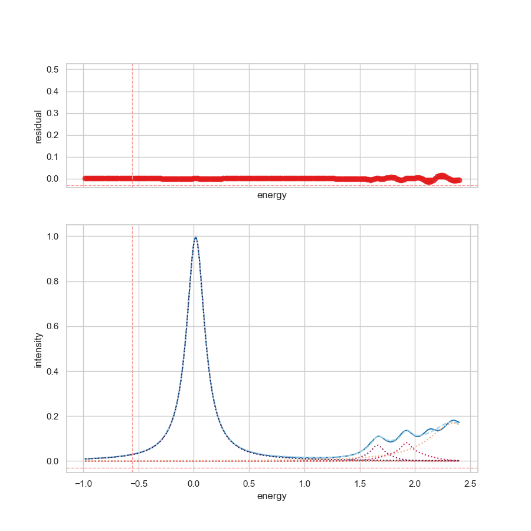

In this example, the the input-file of `SpectraFit` is used to perform a multi
peak fitting, shown in the figure below.



> Mulit peak fitting example by using 6 different pseudovoigt functions. The
> energy range is limited from -1 to 2.4 eV.

All required settings are defined in the input-file in the section `settings`.

!!! tip "settings"

    If the data source, named `infile` is defined in the input-file, any
    filename can be used, like the undersocore **\_**.

    ```shell
    spectrafit _ -i example_2.json
    ```

In this particular example, some of the pre-defined peaks are _fixed_. This is
also printed in the terminal output:

```terminal
[[Variables]]
    pseudovoigt_amplitude_1:  0.31188533 (init = 1), model_value = 0.3118853
    pseudovoigt_center_1:     0.01664784 (init = 0), model_value = 0.01664784
    pseudovoigt_fwhmg_1:     0.14329487 (init = 0.01), model_value = 0.1432949
    pseudovoigt_fwhml_1:     0.19995302 (init = 0.01), model_value = 0.199953
    pseudovoigt_amplitude_2:  0.01669370 (init = 1), model_value = 0.0166937
    pseudovoigt_center_2:     1.662 (fixed)
    pseudovoigt_fwhmg_2:     0.28628541 (init = 0.02), model_value = 0.2862854
    pseudovoigt_fwhml_2:     0.12531854 (init = 0.01), model_value = 0.1253185
    pseudovoigt_amplitude_3:  0.02456846 (init = 1), model_value = 0.02456846
    pseudovoigt_center_3:     1.924 (fixed)
    pseudovoigt_fwhmg_3:     0.43336697 (init = 0.01), model_value = 0.433367
    pseudovoigt_fwhml_3:     0.10962934 (init = 0.01), model_value = 0.1096293
    pseudovoigt_amplitude_4:  4.1999e-05 (init = 1), model_value = 4.199897e-05
    pseudovoigt_center_4:     2 (fixed)
    pseudovoigt_fwhmg_4:     0.01376736 (init = 0.01), model_value = 0.01376736
    pseudovoigt_fwhml_4:     0.08425184 (init = 0.01), model_value = 0.08425184
    pseudovoigt_amplitude_5:  0.14042084 (init = 1), model_value = 0.1404208
    pseudovoigt_center_5:     2.345 (fixed)
    pseudovoigt_fwhmg_5:     0.20598429 (init = 0.01), model_value = 0.2059843
    pseudovoigt_fwhml_5:     0.53558371 (init = 0.01), model_value = 0.5355837
```

??? example "example_2.json"

    ```json
    {
    "settings": {
        "column": [0, 1],
        "decimal": ".",
        "energy_start": -1,
        "energy_stop": 2.4,
        "header": null,
        "infile": "data.txt",
        "outfile": "example_2_results",
        "oversampling": false,
        "separator": "\t",
        "shift": 0,
        "smooth": 0,
        "verbose": false,
        "version": false
    },
    "fitting": {
        "description": {
        "project_name": "Template",
        "project_details": "Template for testing",
        "keywords": [
            "2D-Spectra",
            "fitting",
            "curve-fitting",
            "peak-fitting",
            "spectrum"
        ]
        },

        "parameters": {
        "minimizer": { "nan_policy": "propagate", "calc_covar": true },
        "optimizer": { "max_nfev": 1000, "method": "leastsq" },
        "report": { "min_correl": 0.0 }
        },
        "peaks": {
        "1": {
            "pseudovoigt": {
            "amplitude": {
                "max": 2,
                "min": 0,
                "vary": true,
                "value": 1
            },
            "center": {
                "max": 0.5,
                "min": -0.5,
                "vary": true,
                "value": 0
            },
            "fwhmg": {
                "max": 0.75,
                "min": 0.001,
                "vary": true,
                "value": 0.01
            },
            "fwhml": {
                "max": 0.75,
                "min": 0.001,
                "vary": true,
                "value": 0.01
            }
            }
        },
        "2": {
            "pseudovoigt": {
            "amplitude": {
                "max": 2,
                "min": 0,
                "vary": true,
                "value": 1
            },
            "center": {
                "max": 2,
                "min": 0,
                "vary": false,
                "value": 1.662
            },
            "fwhmg": {
                "max": 0.5,
                "min": 0.02,
                "vary": true,
                "value": 0.01
            },
            "fwhml": {
                "max": 0.5,
                "min": 0.01,
                "vary": true,
                "value": 0.01
            }
            }
        },
        "3": {
            "pseudovoigt": {
            "amplitude": {
                "max": 2,
                "min": 0,
                "vary": true,
                "value": 1
            },
            "center": {
                "max": 2,
                "min": 1.8,
                "vary": false,
                "value": 1.924
            },
            "fwhmg": {
                "max": 0.75,
                "min": 0.001,
                "vary": true,
                "value": 0.01
            },
            "fwhml": {
                "max": 0.75,
                "min": 0.001,
                "vary": true,
                "value": 0.01
            }
            }
        },
        "4": {
            "pseudovoigt": {
            "amplitude": {
                "max": 2,
                "min": 0,
                "vary": true,
                "value": 1
            },
            "center": {
                "max": 2,
                "min": 1,
                "vary": false,
                "value": 2.157
            },
            "fwhmg": {
                "max": 0.75,
                "min": 0.001,
                "vary": true,
                "value": 0.01
            },
            "fwhml": {
                "max": 0.75,
                "min": 0.001,
                "vary": true,
                "value": 0.01
            }
            }
        },
        "5": {
            "pseudovoigt": {
            "amplitude": {
                "max": 2,
                "min": 0,
                "vary": true,
                "value": 1
            },
            "center": {
                "max": 2.5,
                "min": 2,
                "vary": false,
                "value": 2.345
            },
            "fwhmg": {
                "max": 0.75,
                "min": 0.001,
                "vary": true,
                "value": 0.01
            },
            "fwhml": {
                "max": 0.75,
                "min": 0.001,
                "vary": true,
                "value": 0.01
            }
            }
        }
        }
    }
    }
    ```
