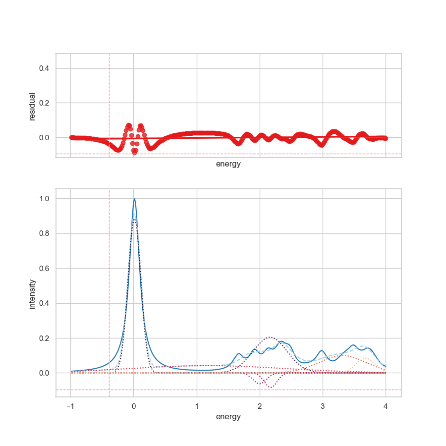

In this example, the **auto-peak-detection** is introduced. The
**auto-peak-detection** is a feature that automatically detects the peaks in the
spectra. The routine is based on SciPy's [`find_peaks`][1] routine. As described
in section [advanced usage][2], the **auto-peak-detection** can be used via
command line or explicit definitions of attributes in the section block of the
input file.

In the following example the in example the section block looks like:

```json
{
  "settings": {
    "column": ["Energy", "Intensity"],
    "decimal": ".",
    "energy_start": -1,
    "energy_stop": 4,
    "header": 0,
    "infile": "data.csv",
    "outfile": "example_7",
    "oversampling": false,
    "separator": ",",
    "shift": 0,
    "smooth": 0,
    "autopeak": {
      "model_type": "gaussian",
      "height": [0.0, 16],
      "threshold": [0.0, 16],
      "distance": 2,
      "prominence": [0.002, 12],
      "width": [0.002, 12],
      "wlen": 100
    },
    "verbose": 1,
    "version": false
  }
}
```

This results in an automatic peak detection with the following results as shown
in the figure shown below.



> Automatic detection of peaks in the spectra. In summary, 8 Gaussian
> distributions are used to fit this spectra.

!!! danger "No found peaks"

    In case no peaks are found, the routine will return an error and
    `SpectraFit` will not be able to continue.

??? note "About the automatic peak detection proposed models"

    Based on the [`find_peaks`][1] routine, the **auto-peak-detection** suggests
    the following intial models:

    ```json
      "auto_generated_models": {
            "models": {
                "gaussian_amplitude_1": {
                    "value": 1.0,
                    "min": -1.25,
                    "max": 1.25,
                    "vary": true
                },
                "gaussian_center_1": {
                    "value": 0.0166666666666608,
                    "min": 0.0083333333333304,
                    "max": 0.0333333333333216,
                    "vary": true
                },
                "gaussian_fwhmg_1": {
                    "value": 0.5986279251394535,
                    "min": 0,
                    "max": 1.197255850278907,
                    "vary": true
                },
                "gaussian_amplitude_2": {
                    "value": 0.1105553529287392,
                    "min": -0.13819419116092402,
                    "max": 0.13819419116092402,
                    "vary": true
                },
                "gaussian_center_2": {
                    "value": 1.6666666666666548,
                    "min": 0.8333333333333274,
                    "max": 3.3333333333333095,
                    "vary": true
                },
                "gaussian_fwhmg_2": {
                    "value": 0.31772487166969654,
                    "min": 0,
                    "max": 0.6354497433393931,
                    "vary": true
                },
                "gaussian_amplitude_3": {
                    "value": 0.1361582465387924,
                    "min": -0.1701978081734905,
                    "max": 0.1701978081734905,
                    "vary": true
                },
                "gaussian_center_3": {
                    "value": 1.916666666666654,
                    "min": 0.958333333333327,
                    "max": 3.833333333333308,
                    "vary": true
                },
                "gaussian_fwhmg_3": {
                    "value": 0.2807028277094332,
                    "min": 0,
                    "max": 0.5614056554188664,
                    "vary": true
                },
                "gaussian_amplitude_4": {
                    "value": 0.1431947128186528,
                    "min": -0.178993391023316,
                    "max": 0.178993391023316,
                    "vary": true
                },
                "gaussian_center_4": {
                    "value": 2.1499999999999866,
                    "min": 1.0749999999999933,
                    "max": 4.299999999999973,
                    "vary": true
                },
                "gaussian_fwhmg_4": {
                    "value": 0.1519356228913864,
                    "min": 0,
                    "max": 0.3038712457827728,
                    "vary": true
                },
                "gaussian_amplitude_5": {
                    "value": 0.1814951542166284,
                    "min": -0.2268689427707855,
                    "max": 0.2268689427707855,
                    "vary": true
                },
                "gaussian_center_5": {
                    "value": 2.349999999999985,
                    "min": 1.1749999999999925,
                    "max": 4.69999999999997,
                    "vary": true
                },
                "gaussian_fwhmg_5": {
                    "value": 1.443660360679985,
                    "min": 0,
                    "max": 2.88732072135997,
                    "vary": true
                },
                "gaussian_amplitude_6": {
                    "value": 0.1277625583305999,
                    "min": -0.15970319791324988,
                    "max": 0.15970319791324988,
                    "vary": true
                },
                "gaussian_center_6": {
                    "value": 2.983333333333317,
                    "min": 1.4916666666666585,
                    "max": 5.966666666666634,
                    "vary": true
                },
                "gaussian_fwhmg_6": {
                    "value": 0.4363360040696307,
                    "min": 0,
                    "max": 0.8726720081392614,
                    "vary": true
                },
                "gaussian_amplitude_7": {
                    "value": 0.1601857154835972,
                    "min": -0.2002321443544965,
                    "max": 0.2002321443544965,
                    "vary": true
                },
                "gaussian_center_7": {
                    "value": 3.483333333333315,
                    "min": 1.7416666666666576,
                    "max": 6.96666666666663,
                    "vary": true
                },
                "gaussian_fwhmg_7": {
                    "value": 1.1042527611053288,
                    "min": 0,
                    "max": 2.2085055222106575,
                    "vary": true
                },
                "gaussian_amplitude_8": {
                    "value": 0.142942940095969,
                    "min": -0.17867867511996124,
                    "max": 0.17867867511996124,
                    "vary": true
                },
                "gaussian_center_8": {
                    "value": 3.716666666666648,
                    "min": 1.858333333333324,
                    "max": 7.433333333333296,
                    "vary": true
                },
                "gaussian_fwhmg_8": {
                    "value": 0.18031229508920887,
                    "min": 0,
                    "max": 0.36062459017841775,
                    "vary": true
                }
            },
            "positions": [
                60,
                159,
                174,
                188,
                200,
                238,
                268,
                282
            ],
            "properties": {
                "plateau_sizes": [
                    1,
                    1,
                    1,
                    1,
                    1,
                    1,
                    1,
                    1
                ],
                "left_edges": [
                    60,
                    159,
                    174,
                    188,
                    200,
                    238,
                    268,
                    282
                ],
                "right_edges": [
                    60,
                    159,
                    174,
                    188,
                    200,
                    238,
                    268,
                    282
                ],
                "peak_heights": [
                    1.0,
                    0.1105553529287392,
                    0.1361582465387924,
                    0.1431947128186528,
                    0.1814951542166284,
                    0.1277625583305999,
                    0.1601857154835972,
                    0.142942940095969
                ],
                "left_thresholds": [
                    0.02702702702704396,
                    0.0035696947991552125,
                    0.003691875598146821,
                    0.00045265871677968583,
                    0.0012037545263766103,
                    0.002382680877353105,
                    0.0020216169513442017,
                    0.0009018152296055015
                ],
                "right_thresholds": [
                    0.027027027027006767,
                    0.0007936900971818039,
                    0.0009852120569291967,
                    0.0020910651786809897,
                    0.0017121005592188043,
                    0.0020892844213151185,
                    0.0012311588060028023,
                    0.0015135608394682143
                ],
                "prominences": [
                    0.9825400111971746,
                    0.02505732635976661,
                    0.026513865406715603,
                    0.0068667793315602965,
                    0.12393423500090289,
                    0.0589944372688672,
                    0.10262479626787169,
                    0.012376077562765209
                ],
                "left_bases": [
                    10,
                    125,
                    125,
                    138,
                    150,
                    221,
                    221,
                    276
                ],
                "right_bases": [
                    110,
                    166,
                    180,
                    191,
                    221,
                    249,
                    299,
                    299
                ],
                "widths": [
                    0.5986279251394535,
                    0.31772487166969654,
                    0.2807028277094332,
                    0.1519356228913864,
                    1.443660360679985,
                    0.4363360040696307,
                    1.1042527611053288,
                    0.18031229508920887
                ],
                "width_heights": [
                    0.9919104334440619,
                    0.11034904793658504,
                    0.13593994939422985,
                    0.1431381764254326,
                    0.18047476397177975,
                    0.12727683823647862,
                    0.15934077267186683,
                    0.1428410438861409
                ],
                "left_ips": [
                    59.70068603743048,
                    158.94220654600417,
                    173.9408709370727,
                    187.87510150335248,
                    199.1523269715794,
                    237.79614555237424,
                    267.58204603935053,
                    281.88700988131166
                ],
                "right_ips": [
                    60.29931396256993,
                    159.25993141767387,
                    174.22157376478214,
                    188.02703712624387,
                    200.5959873322594,
                    238.23248155644387,
                    268.68629880045586,
                    282.06732217640086
                ]
            }
        },
    ```

[1]: https://docs.scipy.org/doc/scipy/reference/generated/scipy.signal.find_peaks.html
[2]: ../../interface/usage/
