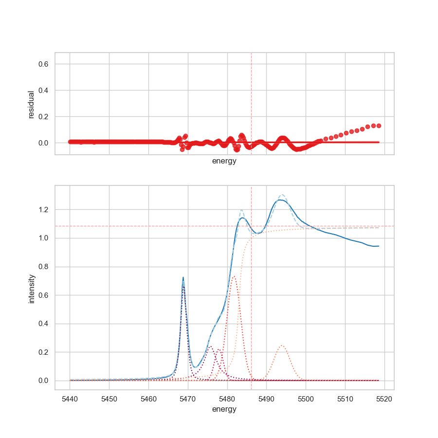

In this example, the working with [Athena][1] output files of type `.nor` is
demonstrated.

!!! note "Workaround for the Athena output file"

    1. Use of the `comment` option, which allows to remove the header of the
       Athena-output file. Next, as separator
    2. Use the `\\s+` character, it is important to make use of the
       `separator` option.
    3. The auto-rename function of `SpectraFit` change the first column to
       `Energy` and the second column to `Intensity`.

    Please also check the official documentation, [here][2].
    As well as, the GitHub repository, [here][3].

??? info "About future plans for Athena"

    * In future, automatic detection of the file type will be implemented.
    * Currently, only Athena files with one column for energy and one column for
      intensity are supported!

```json
"settings": {
    "decimal": ".",
    "energy_start": 5440,
    "energy_stop": 5520,
    "comment": "#",
    "infile": "athena.nor",
    "outfile": "example_8",
    "oversampling": false,
    "separator": "\\s+",
    "shift": 0,
    "smooth": 0,
    "verbose": 0,
    "version": false
  },
```



> Fit of an Athena NOR file with _three_ pseudovoigt, _two_ gaussian, and one
> arcus_tanh function for edge jump. See also the [model-section][3].

??? example "Results"

    ```json
        {
      "settings": {
        "decimal": ".",
        "energy_start": 5440,
        "energy_stop": 5520,
        "comment": "#",
        "infile": "athena.nor",
        "outfile": "example_8",
        "oversampling": false,
        "separator": "\\s+",
        "shift": 0,
        "smooth": 0,
        "verbose": 0,
        "version": false
      },
      "fitting": {
        "description": {
          "project_name": "Template",
          "project_details": "Template for testing",
          "keywords": [
            "2D-Spectra",
            "fitting",
            "curve-fitting",
            "peak-fitting",
            "spectrum"
          ]
        },
        "parameters": {
          "minimizer": {
            "nan_policy": "propagate",
            "calc_covar": true
          },
          "optimizer": {
            "max_nfev": 1000,
            "method": "leastsq"
          },
          "report": {
            "min_correl": 0.0
          }
        },
        "peaks": {
          "1": {
            "pseudovoigt": {
              "amplitude": {
                "max": 4,
                "min": 0,
                "vary": true,
                "value": 1
              },
              "center": {
                "max": 5470,
                "min": 5460,
                "vary": true,
                "value": 5468
              },
              "fwhmg": {
                "max": 2.75,
                "min": 0.001,
                "vary": true,
                "value": 1.0
              },
              "fwhml": {
                "max": 2.75,
                "min": 0.001,
                "vary": true,
                "value": 1.0
              }
            }
          },
          "2": {
            "pseudovoigt": {
              "amplitude": {
                "max": 4,
                "min": 0,
                "vary": true,
                "value": 1
              },
              "center": {
                "max": 5470,
                "min": 5465,
                "vary": true,
                "value": 5469
              },
              "fwhmg": {
                "max": 2.75,
                "min": 0.001,
                "vary": true,
                "value": 1.0
              },
              "fwhml": {
                "max": 2.75,
                "min": 0.001,
                "vary": true,
                "value": 1.0
              }
            }
          },
          "3": {
            "pseudovoigt": {
              "amplitude": {
                "max": 4,
                "min": 0,
                "vary": true,
                "value": 1
              },
              "center": {
                "max": 5480,
                "min": 5470,
                "vary": true,
                "value": 5473
              },
              "fwhmg": {
                "max": 3.75,
                "min": 0.1,
                "vary": true,
                "value": 1
              },
              "fwhml": {
                "max": 3.75,
                "min": 0.1,
                "vary": true,
                "value": 1
              }
            }
          },
          "4": {
            "gaussian": {
              "amplitude": {
                "max": 10,
                "min": 0.1,
                "vary": true,
                "value": 3
              },
              "center": {
                "max": 5485,
                "min": 5475,
                "vary": true,
                "value": 5478
              },
              "fwhmg": {
                "max": 4,
                "min": 0.1,
                "vary": true,
                "value": 1
              }
            }
          },
          "5": {
            "gaussian": {
              "amplitude": {
                "max": 10,
                "min": 0.1,
                "vary": true,
                "value": 4
              },
              "center": {
                "max": 5498,
                "min": 5480,
                "vary": true,
                "value": 5483
              },
              "fwhmg": {
                "max": 4.75,
                "min": 0.1,
                "vary": true,
                "value": 3
              }
            }
          },
          "6": {
            "gaussian": {
              "amplitude": {
                "max": 10,
                "min": 0.1,
                "vary": true,
                "value": 4
              },
              "center": {
                "max": 5498,
                "min": 5493,
                "vary": true,
                "value": 5494
              },
              "fwhmg": {
                "max": 4.75,
                "min": 0.1,
                "vary": true,
                "value": 3
              }
            }
          },
          "7": {
            "atan": {
              "amplitude": {
                "max": 5,
                "min": 0,
                "vary": true,
                "value": 1
              },
              "center": {
                "max": 5500,
                "min": 5483,
                "vary": true,
                "value": 5481
              },
              "sigma": {
                "max": 0.75,
                "min": 0.001,
                "vary": true,
                "value": 0.01
              }
            }
          }
        }
      }
    }
    ```

[1]: http://bruceravel.github.io/demeter/documents/Athena/index.html
[2]: https://bruceravel.github.io/demeter/
[3]: https://github.com/bruceravel/demeter
[4]: ../../doc/models/
