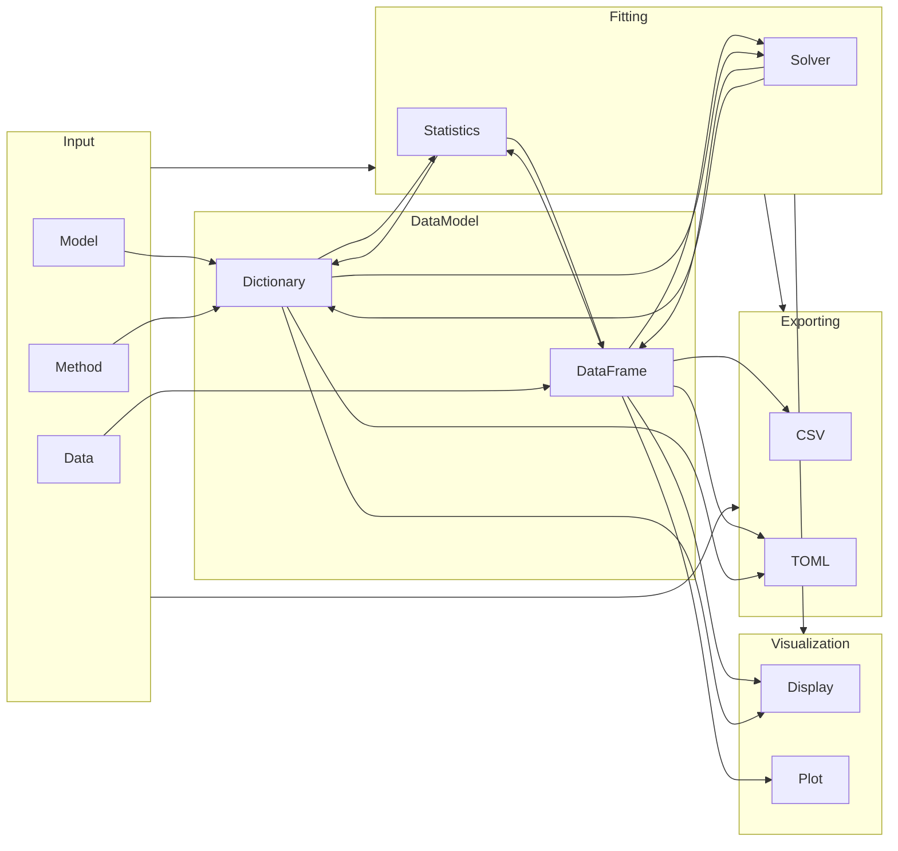
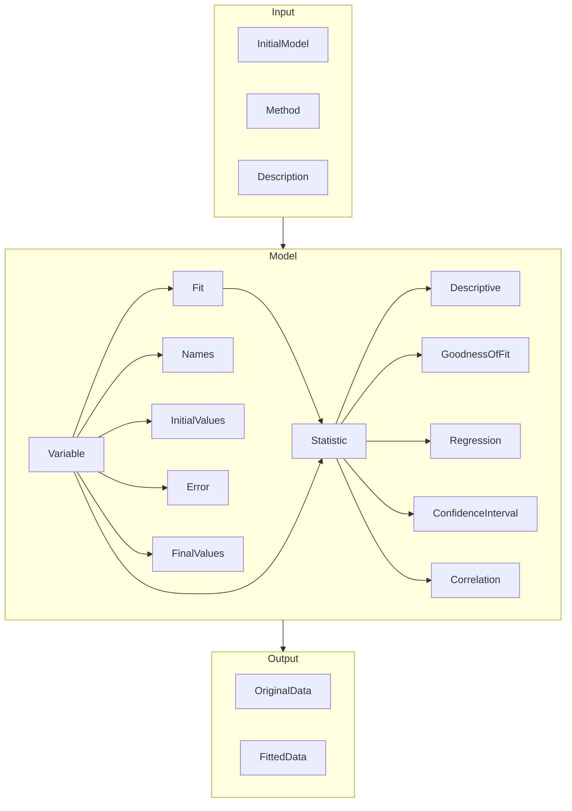

## Input

## DataFlow

The interface is divided into four sections:

1. _Input_: Data, Model, and Method
2. _Fitting_: Solving and Statistic of the Model
2. _Fitting_: Plotting and Display of Data
4. _Export_: Save the Fitting and Statistic Results

> Overview of the data flow in SpectraFit Jupyter Notebook Interface

In summary, `SpectraFit` works with two types of data structures: `DataFrame`
and `Dictionary`. The `DataFrame` is used to store the data and the fit results.
The `Dictionary` is used to store the model and method. The `DataFrame` is used
to display the results and the `Dictionary` is used to export the results.

## Input Parameter Model

## Output

The output file of the SpectraFit Jupyter interface is a [`toml`][1] file that
consists of the three _Input_, _Model_, and _Output_ sections. The reason of
using `toml` is that it is a human-readable format that is easy to edit and can
be still used as a basis for exporting (parts of) the data to a [NoSql][2] and
[Graph][3] databases.

> The details of the _Input_ and _Model_, and _Output_ sections are shown below.

The output file itself is as `.lock` file by default. This is to prevent
accidental overwriting of the input file. The `.lock`-suffix can be replaced.

[1]: https://toml.io/en/
[2]: https://en.wikipedia.org/wiki/NoSQL
[3]: https://en.wikipedia.org/wiki/Graph_database
