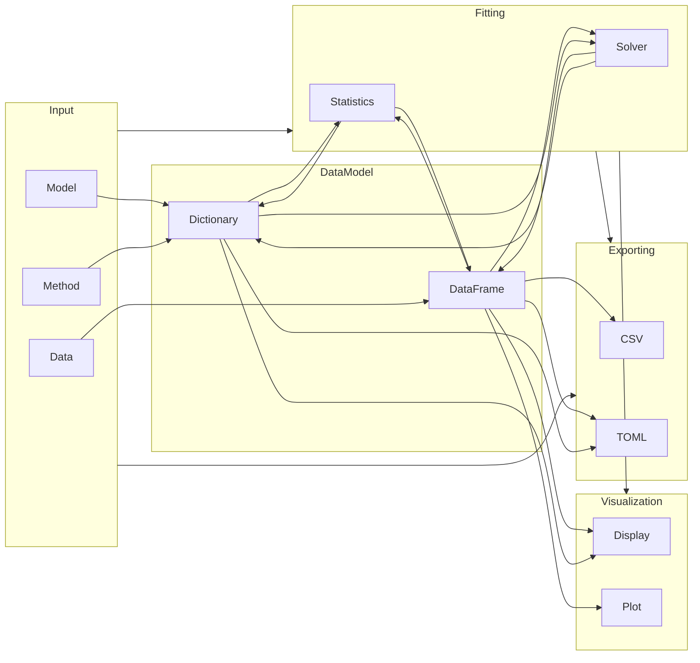
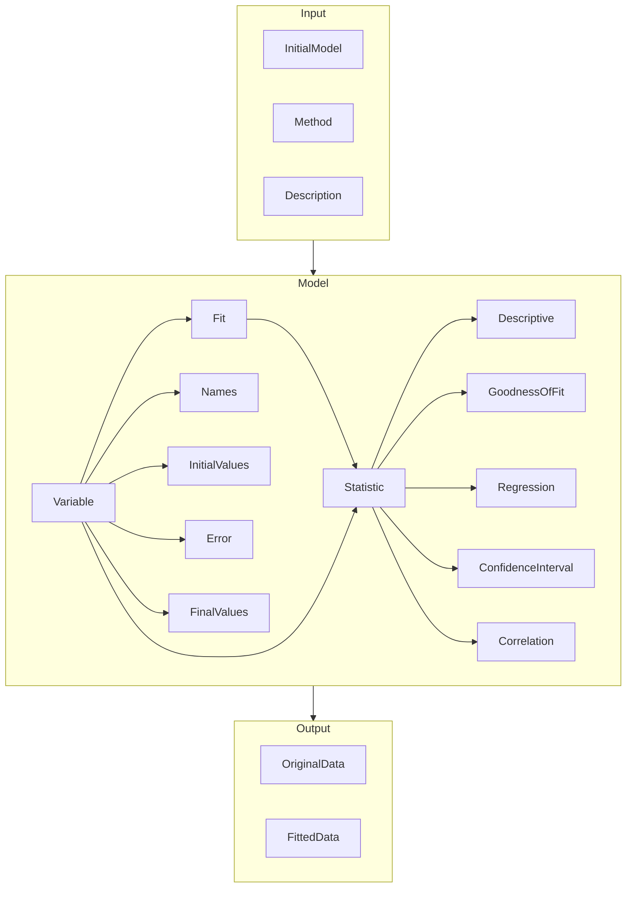

!!! abstract "About the _new_ Jupyter Notebook-Interface"

    The Jupyter Notebook-Interface is a new interface for the `SpectraFit` for
    faster and more convenient usage. It is still in development and not all
    features are implemented yet. If you have any questions or suggestions, feel
    free to contact us.

    One of the main advantages of the Jupyter Notebook-Interface is that it
    allows you to use the `SpectraFit` in a more interactive way. You can
    directly see the results of your fitting, while changing the parameters.
    This is especially useful for the fitting of spectra with many parameters,
    where it is hard to keep track of the changes in the parameters.

    Also by using the [Plotly](https://plotly.com/python/) library, the plots
    are interactive. You can zoom in and out, change the axis, and even save
    the plots as a `.png` file.

    By working in [JupyterLab](https://jupyterlab.readthedocs.io/en/stable/),
    [VSCode](https://code.visualstudio.com), or
    [PyCharms](https://www.jetbrains.com/pycharm/), the usage of the Git
    versionising system is very easy. You can easily track your changes and
    revert them if you made a mistake. Final results can be merged into the
    `main` or `release` branch, so that the data are available for everyone and
    ready to be published.

    ```mermaid
       gitGraph
        commit
        commit
        branch develop
        commit
        commit
        checkout main
        commit
        commit
        checkout develop
        commit
        commit
        merge main
        commit
        checkout main
        commit
        branch release
        commit
    ```

    Finally, the Jupyter Notebook-Interface is a good starting point for
    developing your own fitting routines. You can easily change the fitting
    routine and add your own functions.

## DataFlow

The interface is divided into four sections:

1. _Input_: Data, Model, and Method
2. _Fitting_: Solving and Statistic of the Model
3. _Fitting_: Plotting and Display of Data
4. _Export_: Save the Fitting and Statistic Results

> Overview of the data flow in SpectraFit Jupyter Notebook Interface



In summary, `SpectraFit` works with two types of data structures: `DataFrame`
and `Dictionary`. The `DataFrame` is used to store the data and the fit results.
The `Dictionary` is used to store the model and method. The `DataFrame` is used
to display the results and the `Dictionary` is used to export the results.

## Input Parameter Model

For the easiere usage of the `SpectraFit` the intial model is _now_ defined as a
`List` of `Dict` objects. While every `Dict` object represents:

1. The name of the model like `Gaussian` or `Lorentzian` or so on.
2. The parameters of the model with their initial values and bounds as a `Dict`
   object.

!!! example "Example of an Initial-Parameter-Model"

    ```python
    model = [
        {
            "pseudovoigt": {
                "amplitude": {"max": 2, "min": 0, "vary": True, "value": 1},
                "center": {"max": 2, "min": -2, "vary": True, "value": 0},
                "fwhmg": {"max": 0.4, "min": 0.1, "vary": True, "value": 0.21},
                "fwhml": {"max": 0.4, "min": 0.1, "vary": True, "value": 0.21},
            }
        },
        {
            "gaussian": {
                "amplitude": {"max": 2, "min": 0, "vary": True, "value": 1},
                "center": {"max": 2, "min": -2, "vary": True, "value": 1},
                "fwhmg": {"max": 0.4, "min": 0.1, "vary": True, "value": 0.21},
            }
        },
        {
            "lorentzian": {
                "amplitude": {"max": 2, "min": 0, "vary": True, "value": 1},
                "center": {"max": 2, "min": -2, "vary": True, "value": 1},
                "fwhml": {"max": 0.4, "min": 0.1, "vary": True, "value": 0.21},
            }
        },
    ]
    ```

## The SpectraFitNotebook Class

For running the `SpectraFit` in the Jupyter Notebook-Interface, the
`SpectraFitNotebook` class is used. It is a **new** module, which is part of the
`SpectraFit` plugins. All important settings are defined in the `__init__`
method of the class.

<!-- prettier-ignore -->
::: spectrafit.plugins.notebook.SpectraFitNotebook
    handler: python
    options:
      members:
        - __init__
      show_root_heading: true
      show_signature: false
      show_source: false

The _initial parameter model_ of the section
[Input Parameter Model](#input-parameter-model) is used in the function call of
the `SpectraFitNotebook` class.

<!-- prettier-ignore -->
::: spectrafit.plugins.notebook.SpectraFitNotebook
    handler: python
    options:
      members:
        - __init__
      show_root_heading: true
      show_signature: false
      show_source: false

## Output

The output file of the SpectraFit Jupyter interface is a [`toml`][1] file that
consists of the three _Input_, _Model_, and _Output_ sections. The reason of
using `toml` is that it is a human-readable format that is easy to edit and can
be still used as a basis for exporting (parts of) the data to a [NoSql][2] and
[Graph][3] databases.

> The details of the _Input_ and _Model_, and _Output_ sections are shown below.



The output file itself is as `.lock` file by default. This is to prevent
accidental overwriting of the input file. The `.lock`-suffix can be replaced.

??? info "About the `.lock`-output file"

    The output file is a `.lock` file by default. This is to prevent accidental
    overwriting of the input file. The `.lock`-suffix can be replaced.

    The output files contains as shown above the _Input_, _Model_, and _Output_.
    Most kind of results are stored in a way that they can be easily imported to
    `pandas.DataFrame` or `pandas.Series` objects. The _Input_ and _Model_ are
    stored in a `Dictionary` object. The _Output_ is stored in a dictionary
    way compatiable to `pandas.DataFrame`.

    ```toml
        [input.description]
        project_name = "FittingProject"
        project_details = "Fitting Project via SpectraFit v0.12.0b0"
        keywords = [
            "spectra",
        ]
        authors = [
            "authors",
        ]
        references = [
            "https://github.com/Anselmoo/spectrafit",
        ]
        version = "0.12.0b0"
        host_info = "vscode@codespaces-c3ab6e"
        timestamp = "2022-10-05 18:29:35"
        id_ = "563e6d71-d872-4e63-85aa-6780a4fd8cb0"

        [input.credits]
        dtale = "dtale v2.8.1"
        emcee = "emcee v3.1.3"
        itables = "itables v1.3.0"
        lmfit = "lmfit v1.0.3"
        numdifftools = "numdifftools v0.9.40"
        numpy = "numpy v1.21.6"
        pandas = "pandas v1.3.5"
        plotly = "plotly v5.10.0"
        pydantic = "pydantic v1.10.2"
        scipy = "scipy v1.9.1"
        sklearn = "sklearn v1.0.2"
        statsmodels = "statsmodels v0.13.1"

        [[input.initial_model]]

        [input.initial_model.pseudovoigt.amplitude]
        max = 2
        min = 0
        vary = true
        value = 1

        [input.initial_model.pseudovoigt.center]
        max = 2
        min = -2
        vary = true
        value = 0

        [input.initial_model.pseudovoigt.fwhmg]
        max = 0.4
        min = 0.1
        vary = true
        value = 0.21

        [input.initial_model.pseudovoigt.fwhml]
        max = 0.4
        min = 0.1
        vary = true
        value = 0.21

        [[input.initial_model]]

        [input.initial_model.pseudovoigt.amplitude]
        max = 2
        min = 0
        vary = true
        value = 1

        [input.initial_model.pseudovoigt.center]
        max = 2
        min = -2
        vary = true
        value = 1

        [input.initial_model.pseudovoigt.fwhmg]
        max = 0.4
        min = 0.1
        vary = true
        value = 0.21

        [input.initial_model.pseudovoigt.fwhml]
        max = 0.4
        min = 0.1
        vary = true
        value = 0.21

        [[input.initial_model]]

        [input.initial_model.pseudovoigt.amplitude]
        max = 2
        min = 0
        vary = true
        value = 1

        [input.initial_model.pseudovoigt.center]
        max = 2
        min = -2
        vary = true
        value = 1

        [input.initial_model.pseudovoigt.fwhmg]
        max = 0.4
        min = 0.1
        vary = true
        value = 0.21

        [input.initial_model.pseudovoigt.fwhml]
        max = 0.4
        min = 0.1
        vary = true
        value = 0.21

        [[input.initial_model]]

        [input.initial_model.pseudovoigt.amplitude]
        max = 2
        min = 0
        vary = true
        value = 1

        [input.initial_model.pseudovoigt.center]
        max = 2
        min = -2
        vary = true
        value = 1

        [input.initial_model.pseudovoigt.fwhmg]
        max = 0.4
        min = 0.1
        vary = true
        value = 0.21

        [input.initial_model.pseudovoigt.fwhml]
        max = 0.4
        min = 0.1
        vary = true
        value = 0.21

        [input.method]
        global_fitting = false

        [input.method.confidence_interval]
        trace = true
        maxiter = 200
        verbose = false

        [input.method.configurations]
        fitting_method = "leastsq"
        function_evals = 1000
        data_points = 611
        variable_names = [
            "pseudovoigt_amplitude_1",
            "pseudovoigt_center_1",
            "pseudovoigt_fwhmg_1",
            "pseudovoigt_fwhml_1",
            "pseudovoigt_amplitude_2",
            "pseudovoigt_center_2",
            "pseudovoigt_fwhmg_2",
            "pseudovoigt_fwhml_2",
            "pseudovoigt_amplitude_3",
            "pseudovoigt_center_3",
            "pseudovoigt_fwhmg_3",
            "pseudovoigt_fwhml_3",
            "pseudovoigt_amplitude_4",
            "pseudovoigt_center_4",
            "pseudovoigt_fwhmg_4",
            "pseudovoigt_fwhml_4",
        ]
        variable_numbers = 16
        degree_of_freedom = 595

        [input.pre_processing]
        oversampling = false
        smooth = 0
        shift = 0.0
        column = [
            "Energy",
            "Noisy",
        ]

        [solver.goodness_of_fit]
        chi_square = 4.164347734430647
        reduced_chi_square = 0.006998903755345625
        akaike_information = -3015.9962916417835
        bayesian_information = -2945.354740295038

        [solver.regression_metrics]
        index = [
            "explained_variance_score",
            "r2_score",
            "max_error",
            "mean_absolute_error",
            "mean_squared_error",
            "mean_squared_log_error",
            "median_absolute_error",
            "mean_absolute_percentage_error",
            "mean_poisson_deviance",
        ]
        columns = [
            0,
        ]
        data = [
            [
                0.7553892518876041,
            ],
            [
                0.5663096593237575,
            ],
            [
                0.2460985591365594,
            ],
            [
                0.0646833180035097,
            ],
            [
                0.006815626406596804,
            ],
            [
                0.005797545462567391,
            ],
            [
                0.054551744944657365,
            ],
            [
                0.7627825488327861,
            ],
            [
                0.2799898418525389,
            ],
        ]

        [solver.descriptive_statistic]
        index = [
            "count",
            "mean",
            "std",
            "min",
            "10%",
            "20%",
            "30%",
            "40%",
            "50%",
            "60%",
            "70%",
            "80%",
            "90%",
            "max",
        ]
        columns = [
            "energy",
            "intensity",
            "residual",
            "fit",
            "pseudovoigt_1",
            "pseudovoigt_2",
            "pseudovoigt_3",
            "pseudovoigt_4",
        ]
        data = [
            [
                611.0,
                611.0,
                611.0,
                611.0,
                611.0,
                611.0,
                611.0,
                611.0,
            ],
            [
                3.483333333333315,
                0.1089010061672899,
                -0.05451114979188872,
                0.054389856375401176,
                0.03667155501796126,
                0.0027639192027055803,
                0.013720675362421633,
                0.001233706792312711,
            ],
            [
                2.942079763251376,
                0.12546387631757053,
                0.06205209793526671,
                0.1335303362111678,
                0.12894352693788264,
                0.008020005135597976,
                0.03966674162573049,
                0.003992524046788557,
            ],
            [
                -1.6,
                0.0003137504328578,
                -0.2460985591365594,
                0.0004650535623091784,
                0.00023252595124947988,
                3.192064158401232e-05,
                0.00019178726297311872,
                8.819706502565889e-06,
            ],
            [
                -0.5833333333333369,
                0.0235251449314025,
                -0.14035295185196303,
                0.0006196763016876258,
                0.0002994922168346505,
                4.28206657130505e-05,
                0.00026581372606550475,
                1.1549693074419566e-05,
            ],
            [
                0.433333333333326,
                0.0388054517326814,
                -0.09311507189031785,
                0.0008690419617321671,
                0.0004001694321509918,
                6.042686691053815e-05,
                0.0003926710115436084,
                1.5774651127030743e-05,
            ],
            [
                1.4499999999999895,
                0.051368596301534016,
                -0.0787588361158717,
                0.001313850287334162,
                0.0005616510506130301,
                9.161828724547808e-05,
                0.0006377571048935076,
                2.28238445821406e-05,
            ],
            [
                2.466666666666652,
                0.0686872585644631,
                -0.06635925788964464,
                0.002246442705679176,
                0.0008449119788229013,
                0.0001550153496099832,
                0.0009318091779556716,
                3.591265321638052e-05,
            ],
            [
                3.483333333333315,
                0.0829227048708064,
                -0.049563604211037116,
                0.004910698918660611,
                0.0014120057370704852,
                0.00027068774018755966,
                0.0013399690804049827,
                6.456871310826007e-05,
            ],
            [
                4.499999999999979,
                0.0939886519565868,
                -0.03571705012202201,
                0.01158290567849847,
                0.002821380075303725,
                0.00042186833534211437,
                0.002082136465727273,
                0.00013659146886625366,
            ],
            [
                5.516666666666641,
                0.1143602814641988,
                -0.021285832104862984,
                0.03256935845763962,
                0.0071649881158480375,
                0.0007418487540351618,
                0.0036754599513524624,
                0.0002411645349209166,
            ],
            [
                6.533333333333305,
                0.1490857763035889,
                -0.007265231109661655,
                0.06853312977663563,
                0.01608220890188118,
                0.0016355323317059902,
                0.008059542423402248,
                0.0005295912094745145,
            ],
            [
                7.549999999999968,
                0.197732190698215,
                0.015918317627455214,
                0.13823676316551498,
                0.058683623128146116,
                0.00581818547215741,
                0.028927235998738796,
                0.0019327288393546644,
            ],
            [
                8.566666666666633,
                1.0900891532152457,
                0.15268182236055508,
                1.0230770898987258,
                1.0169916441709592,
                0.05608049958005394,
                0.2772205788359086,
                0.02507029850930853,
            ],
        ]

        [solver.linear_correlation]
        index = [
            "energy",
            "intensity",
            "residual",
            "fit",
            "pseudovoigt_1",
            "pseudovoigt_2",
            "pseudovoigt_3",
            "pseudovoigt_4",
        ]
        columns = [
            "energy",
            "intensity",
            "residual",
            "fit",
            "pseudovoigt_1",
            "pseudovoigt_2",
            "pseudovoigt_3",
            "pseudovoigt_4",
        ]
        data = [
            [
                1.0,
                -0.32244413211484907,
                -0.20677118395191862,
                -0.3990529641406147,
                -0.3283812581539729,
                -0.2687520510764311,
                -0.19071561341132515,
                -0.30621708366538997,
            ],
            [
                -0.32244413211484907,
                1.0,
                -0.11311684633334855,
                0.8870249416840682,
                0.8876757799545638,
                -0.05709181656165402,
                0.10512303449030673,
                0.06829796311246134,
            ],
            [
                -0.20677118395191862,
                -0.11311684633334855,
                1.0,
                0.3584205752450066,
                0.25021824277986177,
                0.3028581623822061,
                0.30459537044142776,
                0.27169963140154535,
            ],
            [
                -0.3990529641406147,
                0.8870249416840682,
                0.3584205752450066,
                1.0,
                0.9503294515173665,
                0.08709649111050574,
                0.24031936161631579,
                0.19043207749567295,
            ],
            [
                -0.3283812581539729,
                0.8876757799545638,
                0.25021824277986177,
                0.9503294515173665,
                1.0,
                -0.015915302090034483,
                -0.06550302353306325,
                0.17037256164805303,
            ],
            [
                -0.2687520510764311,
                -0.05709181656165402,
                0.3028581623822061,
                0.08709649111050574,
                -0.015915302090034483,
                1.0,
                0.12891390163599475,
                0.13740665162759358,
            ],
            [
                -0.19071561341132515,
                0.10512303449030673,
                0.30459537044142776,
                0.24031936161631579,
                -0.06550302353306325,
                0.12891390163599475,
                1.0,
                -0.04120594963112317,
            ],
            [
                -0.30621708366538997,
                0.06829796311246134,
                0.27169963140154535,
                0.19043207749567295,
                0.17037256164805303,
                0.13740665162759358,
                -0.04120594963112317,
                1.0,
            ],
        ]

        [solver.component_correlation.pseudovoigt_amplitude_1]

        [solver.component_correlation.pseudovoigt_center_1]

        [solver.component_correlation.pseudovoigt_fwhmg_1]

        [solver.component_correlation.pseudovoigt_fwhml_1]

        [solver.component_correlation.pseudovoigt_amplitude_2]

        [solver.component_correlation.pseudovoigt_center_2]

        [solver.component_correlation.pseudovoigt_fwhmg_2]

        [solver.component_correlation.pseudovoigt_fwhml_2]

        [solver.component_correlation.pseudovoigt_amplitude_3]

        [solver.component_correlation.pseudovoigt_center_3]

        [solver.component_correlation.pseudovoigt_fwhmg_3]

        [solver.component_correlation.pseudovoigt_fwhml_3]

        [solver.component_correlation.pseudovoigt_amplitude_4]

        [solver.component_correlation.pseudovoigt_center_4]

        [solver.component_correlation.pseudovoigt_fwhmg_4]

        [solver.component_correlation.pseudovoigt_fwhml_4]

        [solver.confidence_interval]

        [solver.covariance_matrix.pseudovoigt_amplitude_1]

        [solver.covariance_matrix.pseudovoigt_center_1]

        [solver.covariance_matrix.pseudovoigt_fwhmg_1]

        [solver.covariance_matrix.pseudovoigt_fwhml_1]

        [solver.covariance_matrix.pseudovoigt_amplitude_2]

        [solver.covariance_matrix.pseudovoigt_center_2]

        [solver.covariance_matrix.pseudovoigt_fwhmg_2]

        [solver.covariance_matrix.pseudovoigt_fwhml_2]

        [solver.covariance_matrix.pseudovoigt_amplitude_3]

        [solver.covariance_matrix.pseudovoigt_center_3]

        [solver.covariance_matrix.pseudovoigt_fwhmg_3]

        [solver.covariance_matrix.pseudovoigt_fwhml_3]

        [solver.covariance_matrix.pseudovoigt_amplitude_4]

        [solver.covariance_matrix.pseudovoigt_center_4]

        [solver.covariance_matrix.pseudovoigt_fwhmg_4]

        [solver.covariance_matrix.pseudovoigt_fwhml_4]

        [solver.variables.pseudovoigt_amplitude_1]
        init_value = 1
        model_value = 0.3858612604513847
        best_value = 0.3858612604513847

        [solver.variables.pseudovoigt_center_1]
        init_value = 0
        model_value = 0.016363267663787262
        best_value = 0.016363267663787262

        [solver.variables.pseudovoigt_fwhmg_1]
        init_value = 0.21
        model_value = 0.11545295484282288
        best_value = 0.11545295484282288

        [solver.variables.pseudovoigt_fwhml_1]
        init_value = 0.21
        model_value = 0.3042369545159014
        best_value = 0.3042369545159014

        [solver.variables.pseudovoigt_amplitude_2]
        init_value = 1
        model_value = 0.029027081908320707
        best_value = 0.029027081908320707

        [solver.variables.pseudovoigt_center_2]
        init_value = 1
        model_value = 1.1301324587722235
        best_value = 1.1301324587722235

        [solver.variables.pseudovoigt_fwhmg_2]
        init_value = 0.21
        model_value = 0.10000041080399755
        best_value = 0.10000041080399755

        [solver.variables.pseudovoigt_fwhml_2]
        init_value = 0.21
        model_value = 0.3998947332831776
        best_value = 0.3998947332831776

        [solver.variables.pseudovoigt_amplitude_3]
        init_value = 1
        model_value = 0.14355833709570587
        best_value = 0.14355833709570587

        [solver.variables.pseudovoigt_center_3]
        init_value = 1
        model_value = 1.821566080099477
        best_value = 1.821566080099477

        [solver.variables.pseudovoigt_fwhmg_3]
        init_value = 0.21
        model_value = 0.10082806344366198
        best_value = 0.10082806344366198

        [solver.variables.pseudovoigt_fwhml_3]
        init_value = 0.21
        model_value = 0.3999999999998446
        best_value = 0.3999999999998446

        [solver.variables.pseudovoigt_amplitude_4]
        init_value = 1
        model_value = 0.012903537428544665
        best_value = 0.012903537428544665

        [solver.variables.pseudovoigt_center_4]
        init_value = 1
        model_value = 0.5118623032428173
        best_value = 0.5118623032428173

        [solver.variables.pseudovoigt_fwhmg_4]
        init_value = 0.21
        model_value = 0.3453966888588779
        best_value = 0.3453966888588779

        [solver.variables.pseudovoigt_fwhml_4]
        init_value = 0.21
        model_value = 0.38844113857262086
        best_value = 0.38844113857262086

        [solver.errorbars]
        at_boundary = "pseudovoigt_fwhml_3"

        [output.df_org]
        Energy = [
            -1.6,
            -1.5833333333333337,
            -1.5666666666666669,
            -1.5500000000000005,
            -1.5333333333333337,
            -1.516666666666667,
            -1.5000000000000004,
            -1.4833333333333338,
            -1.4666666666666672,
            -1.4500000000000006,
            -1.433333333333334,
            -1.4166666666666674,
            -1.4000000000000008,
            -1.383333333333334,
            -1.3666666666666676,
            -1.3500000000000008,
            -1.3333333333333344,
            -1.3166666666666675,
            -1.3000000000000012,
            -1.2833333333333343,
            -1.266666666666668,
            -1.250000000000001,
            -1.2333333333333347,
            -1.216666666666668,
            -1.2000000000000015,
            -1.183333333333335,
            -1.1666666666666683,
            -1.1500000000000017,
            -1.133333333333335,
            -1.1166666666666685,
            -1.100000000000002,
            -1.0833333333333353,
            -1.0666666666666689,
            -1.050000000000002,
            -1.0333333333333354,
            -1.0166666666666688,
            -1.0000000000000022,
            -0.9833333333333356,
            -0.966666666666669,
            -0.9500000000000024,
            -0.9333333333333358,
            -0.9166666666666692,
            -0.9000000000000026,
            -0.8833333333333359,
            -0.8666666666666692,
            -0.8500000000000028,
            -0.8333333333333361,
            -0.8166666666666694,
            -0.8000000000000029,
            -0.7833333333333363,
            -0.7666666666666697,
            -0.750000000000003,
            -0.7333333333333365,
            -0.7166666666666699,
            -0.7000000000000033,
            -0.6833333333333367,
            -0.6666666666666701,
            -0.6500000000000035,
            -0.6333333333333369,
            -0.6166666666666702,
            -0.6000000000000036,
            -0.5833333333333369,
            -0.5666666666666704,
            -0.5500000000000038,
            -0.5333333333333372,
            -0.5166666666666706,
            -0.500000000000004,
            -0.4833333333333373,
            -0.4666666666666708,
            -0.4500000000000042,
            -0.4333333333333376,
            -0.4166666666666709,
            -0.4000000000000044,
            -0.3833333333333377,
            -0.3666666666666711,
            -0.3500000000000045,
            -0.3333333333333379,
            -0.3166666666666712,
            -0.3000000000000047,
            -0.2833333333333381,
            -0.2666666666666715,
            -0.2500000000000049,
            -0.2333333333333382,
            -0.2166666666666716,
            -0.200000000000005,
            -0.1833333333333384,
            -0.1666666666666718,
            -0.1500000000000052,
            -0.1333333333333386,
            -0.116666666666672,
            -0.1000000000000054,
            -0.0833333333333388,
            -0.0666666666666722,
            -0.0500000000000056,
            -0.0333333333333389,
            -0.0166666666666723,
            -5.773159728050815e-15,
            0.0166666666666608,
            0.0333333333333274,
            0.049999999999994,
            0.0666666666666606,
            0.0833333333333272,
            0.0999999999999938,
            0.1166666666666604,
            0.1333333333333271,
            0.1499999999999936,
            0.1666666666666603,
            0.1833333333333268,
            0.1999999999999935,
            0.21666666666666,
            0.2333333333333267,
            0.2499999999999933,
            0.2666666666666599,
            0.2833333333333265,
            0.2999999999999932,
            0.3166666666666597,
            0.3333333333333264,
            0.349999999999993,
            0.3666666666666596,
            0.3833333333333261,
            0.3999999999999928,
            0.4166666666666593,
            0.433333333333326,
            0.4499999999999926,
            0.4666666666666592,
            0.4833333333333258,
            0.4999999999999925,
            0.5166666666666592,
            0.5333333333333257,
            0.5499999999999923,
            0.5666666666666589,
            0.5833333333333255,
            0.5999999999999921,
            0.6166666666666587,
            0.6333333333333253,
            0.6499999999999919,
            0.6666666666666585,
            0.6833333333333251,
            0.6999999999999916,
            0.7166666666666583,
            0.733333333333325,
            0.7499999999999916,
            0.7666666666666581,
            0.7833333333333247,
            0.7999999999999914,
            0.8166666666666581,
            0.8333333333333246,
            0.8499999999999912,
            0.8666666666666578,
            0.8833333333333245,
            0.899999999999991,
            0.9166666666666576,
            0.933333333333324,
            0.9499999999999909,
            0.9666666666666576,
            0.983333333333324,
            0.9999999999999906,
            1.0166666666666573,
            1.033333333333324,
            1.0499999999999905,
            1.066666666666657,
            1.0833333333333235,
            1.0999999999999903,
            1.1166666666666567,
            1.1333333333333235,
            1.14999999999999,
            1.1666666666666567,
            1.1833333333333231,
            1.19999999999999,
            1.2166666666666563,
            1.2333333333333232,
            1.2499999999999896,
            1.2666666666666564,
            1.283333333333323,
            1.2999999999999896,
            1.3166666666666562,
            1.3333333333333228,
            1.3499999999999894,
            1.366666666666656,
            1.3833333333333226,
            1.3999999999999893,
            1.416666666666656,
            1.4333333333333225,
            1.449999999999989,
            1.4666666666666557,
            1.4833333333333223,
            1.499999999999989,
            1.5166666666666555,
            1.533333333333322,
            1.5499999999999887,
            1.566666666666655,
            1.583333333333322,
            1.5999999999999883,
            1.6166666666666551,
            1.6333333333333215,
            1.6499999999999884,
            1.6666666666666548,
            1.6833333333333216,
            1.699999999999988,
            1.7166666666666548,
            1.7333333333333214,
            1.749999999999988,
            1.7666666666666546,
            1.7833333333333212,
            1.7999999999999878,
            1.8166666666666544,
            1.8333333333333208,
            1.849999999999988,
            1.8666666666666545,
            1.8833333333333209,
            1.899999999999988,
            1.916666666666654,
            1.9333333333333207,
            1.9499999999999875,
            1.9666666666666537,
            1.9833333333333203,
            1.9999999999999871,
            2.0166666666666537,
            2.0333333333333203,
            2.049999999999987,
            2.066666666666653,
            2.08333333333332,
            2.0999999999999868,
            2.1166666666666534,
            2.13333333333332,
            2.1499999999999866,
            2.1666666666666528,
            2.18333333333332,
            2.1999999999999864,
            2.216666666666653,
            2.23333333333332,
            2.2499999999999862,
            2.266666666666653,
            2.2833333333333194,
            2.299999999999986,
            2.3166666666666527,
            2.3333333333333197,
            2.349999999999985,
            2.3666666666666525,
            2.383333333333319,
            2.3999999999999857,
            2.4166666666666523,
            2.433333333333319,
            2.449999999999985,
            2.466666666666652,
            2.4833333333333187,
            2.4999999999999853,
            2.516666666666652,
            2.5333333333333186,
            2.5499999999999847,
            2.566666666666652,
            2.5833333333333184,
            2.599999999999985,
            2.616666666666652,
            2.633333333333318,
            2.649999999999985,
            2.6666666666666514,
            2.683333333333318,
            2.6999999999999846,
            2.7166666666666512,
            2.7333333333333174,
            2.7499999999999845,
            2.766666666666651,
            2.7833333333333177,
            2.799999999999984,
            2.816666666666651,
            2.833333333333317,
            2.849999999999984,
            2.8666666666666507,
            2.8833333333333173,
            2.899999999999984,
            2.9166666666666505,
            2.9333333333333167,
            2.949999999999984,
            2.9666666666666504,
            2.983333333333317,
            2.999999999999984,
            3.01666666666665,
            3.033333333333317,
            3.0499999999999834,
            3.0666666666666496,
            3.0833333333333166,
            3.099999999999983,
            3.11666666666665,
            3.1333333333333164,
            3.149999999999983,
            3.1666666666666496,
            3.183333333333316,
            3.199999999999983,
            3.216666666666649,
            3.233333333333316,
            3.2499999999999822,
            3.266666666666649,
            3.283333333333316,
            3.2999999999999825,
            3.3166666666666487,
            3.333333333333316,
            3.3499999999999823,
            3.366666666666649,
            3.3833333333333155,
            3.399999999999982,
            3.4166666666666488,
            3.433333333333316,
            3.449999999999981,
            3.466666666666649,
            3.483333333333315,
            3.499999999999982,
            3.5166666666666484,
            3.533333333333315,
            3.5499999999999816,
            3.566666666666648,
            3.583333333333315,
            3.599999999999981,
            3.616666666666648,
            3.633333333333314,
            3.649999999999981,
            3.666666666666648,
            3.6833333333333136,
            3.6999999999999806,
            3.716666666666648,
            3.7333333333333134,
            3.749999999999981,
            3.766666666666648,
            3.7833333333333137,
            3.7999999999999807,
            3.8166666666666473,
            3.8333333333333135,
            3.849999999999981,
            3.866666666666647,
            3.8833333333333138,
            3.89999999999998,
            3.916666666666647,
            3.9333333333333136,
            3.94999999999998,
            3.9666666666666472,
            3.9833333333333134,
            3.99999999999998,
            4.016666666666646,
            4.033333333333314,
            4.049999999999979,
            4.066666666666647,
            4.083333333333313,
            4.09999999999998,
            4.116666666666646,
            4.133333333333312,
            4.149999999999979,
            4.166666666666647,
            4.183333333333312,
            4.19999999999998,
            4.216666666666645,
            4.233333333333313,
            4.249999999999979,
            4.266666666666646,
            4.283333333333312,
            4.299999999999979,
            4.316666666666645,
            4.333333333333313,
            4.349999999999977,
            4.366666666666646,
            4.383333333333312,
            4.399999999999979,
            4.416666666666645,
            4.433333333333312,
            4.449999999999978,
            4.466666666666645,
            4.483333333333311,
            4.499999999999979,
            4.516666666666644,
            4.533333333333312,
            4.549999999999978,
            4.566666666666645,
            4.583333333333311,
            4.599999999999977,
            4.616666666666644,
            4.633333333333312,
            4.649999999999976,
            4.666666666666645,
            4.683333333333311,
            4.699999999999978,
            4.716666666666644,
            4.733333333333311,
            4.749999999999977,
            4.766666666666644,
            4.78333333333331,
            4.799999999999978,
            4.816666666666643,
            4.833333333333311,
            4.8499999999999766,
            4.866666666666644,
            4.88333333333331,
            4.899999999999976,
            4.916666666666642,
            4.933333333333311,
            4.949999999999976,
            4.966666666666644,
            4.9833333333333085,
            4.999999999999977,
            5.016666666666643,
            5.03333333333331,
            5.049999999999976,
            5.066666666666643,
            5.083333333333309,
            5.0999999999999766,
            5.116666666666641,
            5.13333333333331,
            5.149999999999976,
            5.166666666666642,
            5.183333333333309,
            5.199999999999976,
            5.216666666666642,
            5.2333333333333085,
            5.249999999999975,
            5.266666666666643,
            5.283333333333308,
            5.299999999999976,
            5.316666666666642,
            5.333333333333309,
            5.349999999999975,
            5.366666666666641,
            5.383333333333308,
            5.399999999999976,
            5.416666666666641,
            5.433333333333309,
            5.449999999999974,
            5.466666666666642,
            5.483333333333308,
            5.499999999999975,
            5.516666666666641,
            5.533333333333308,
            5.549999999999974,
            5.566666666666642,
            5.583333333333307,
            5.599999999999975,
            5.61666666666664,
            5.633333333333308,
            5.649999999999974,
            5.666666666666641,
            5.683333333333306,
            5.699999999999974,
            5.71666666666664,
            5.733333333333308,
            5.7499999999999725,
            5.766666666666641,
            5.783333333333307,
            5.799999999999974,
            5.81666666666664,
            5.833333333333307,
            5.849999999999973,
            5.86666666666664,
            5.883333333333305,
            5.899999999999974,
            5.91666666666664,
            5.933333333333306,
            5.949999999999973,
            5.96666666666664,
            5.983333333333306,
            5.9999999999999725,
            6.016666666666639,
            6.033333333333307,
            6.049999999999972,
            6.06666666666664,
            6.0833333333333055,
            6.099999999999973,
            6.11666666666664,
            6.133333333333305,
            6.149999999999972,
            6.16666666666664,
            6.183333333333305,
            6.199999999999973,
            6.216666666666638,
            6.233333333333306,
            6.249999999999972,
            6.266666666666639,
            6.283333333333305,
            6.299999999999972,
            6.316666666666638,
            6.3333333333333055,
            6.349999999999971,
            6.36666666666664,
            6.383333333333304,
            6.399999999999972,
            6.416666666666638,
            6.433333333333305,
            6.449999999999973,
            6.466666666666638,
            6.483333333333304,
            6.499999999999972,
            6.516666666666639,
            6.533333333333305,
            6.5499999999999705,
            6.566666666666638,
            6.5833333333333055,
            6.599999999999971,
            6.616666666666637,
            6.633333333333304,
            6.649999999999972,
            6.666666666666638,
            6.683333333333303,
            6.69999999999997,
            6.716666666666638,
            6.733333333333304,
            6.74999999999997,
            6.766666666666636,
            6.783333333333305,
            6.7999999999999705,
            6.816666666666636,
            6.833333333333304,
            6.849999999999971,
            6.866666666666637,
            6.883333333333304,
            6.899999999999969,
            6.916666666666638,
            6.933333333333303,
            6.949999999999969,
            6.966666666666637,
            6.983333333333304,
            6.99999999999997,
            7.016666666666636,
            7.033333333333303,
            7.0499999999999705,
            7.066666666666636,
            7.083333333333302,
            7.0999999999999694,
            7.116666666666637,
            7.133333333333304,
            7.149999999999968,
            7.166666666666636,
            7.183333333333303,
            7.199999999999969,
            7.216666666666634,
            7.233333333333302,
            7.249999999999972,
            7.2666666666666355,
            7.283333333333301,
            7.299999999999968,
            7.316666666666637,
            7.333333333333303,
            7.349999999999967,
            7.366666666666635,
            7.383333333333303,
            7.399999999999968,
            7.416666666666633,
            7.433333333333301,
            7.44999999999997,
            7.466666666666634,
            7.4833333333333,
            7.499999999999968,
            7.5166666666666355,
            7.533333333333301,
            7.549999999999968,
            7.566666666666634,
            7.583333333333303,
            7.599999999999967,
            7.616666666666633,
            7.633333333333299,
            7.649999999999968,
            7.666666666666633,
            7.683333333333299,
            7.699999999999966,
            7.716666666666634,
            7.7333333333333,
            7.749999999999966,
            7.766666666666634,
            7.783333333333301,
            7.799999999999968,
            7.816666666666632,
            7.833333333333299,
            7.849999999999967,
            7.866666666666633,
            7.883333333333299,
            7.899999999999967,
            7.916666666666633,
            7.933333333333299,
            7.949999999999965,
            7.966666666666634,
            7.9833333333333,
            7.999999999999966,
            8.016666666666632,
            8.0333333333333,
            8.049999999999969,
            8.066666666666633,
            8.083333333333298,
            8.099999999999964,
            8.116666666666633,
            8.133333333333299,
            8.149999999999965,
            8.166666666666632,
            8.1833333333333,
            8.199999999999966,
            8.216666666666631,
            8.233333333333297,
            8.249999999999966,
            8.266666666666632,
            8.283333333333298,
            8.299999999999965,
            8.316666666666633,
            8.333333333333298,
            8.349999999999964,
            8.36666666666663,
            8.383333333333299,
            8.399999999999965,
            8.41666666666663,
            8.433333333333298,
            8.449999999999966,
            8.466666666666631,
            8.483333333333297,
            8.499999999999964,
            8.516666666666632,
            8.533333333333298,
            8.549999999999963,
            8.566666666666633,
        ]
        Noisy = [
            0.0400858489876045,
            0.0475041440952422,
            0.0351039991525463,
            0.0563217208307631,
            0.0123286079864157,
            0.053024724969143,
            0.075258573471119,
            0.0262832763496441,
            0.0115852148960622,
            0.0915722853744314,
            0.0446540782140155,
            0.0682723930643514,
            0.0558643989978353,
            0.0519569913045801,
            0.0452947674515218,
            0.0461405494528854,
            0.0235251449314025,
            0.0958572375229931,
            0.0712792242421315,
            0.1050855918507688,
            0.0842006092803171,
            0.0170856863345499,
            0.0334467210279434,
            0.0083076107264714,
            0.0691372440712335,
            0.0870026399435306,
            0.0856501918872604,
            0.0184664105258557,
            0.1012696893139263,
            0.0900266923271905,
            0.0649266938753068,
            0.0122839490137762,
            0.0511603760966481,
            0.1007672062998335,
            0.0645506382958404,
            0.085381815664481,
            0.1016522378151484,
            0.0255700571034611,
            0.0222829579317704,
            0.0177393773146719,
            0.0442297831686121,
            0.0197612635256894,
            0.0462988518357429,
            0.0530644007155577,
            0.089474904507891,
            0.0648331924597528,
            0.0440909080060478,
            0.098570421154747,
            0.0226088117964225,
            0.100762417028144,
            0.0287293767335133,
            0.0870234230693911,
            0.0676497631364179,
            0.0285448773313878,
            0.1017561009070582,
            0.0272996614703738,
            0.1131043218039902,
            0.0511879730170864,
            0.034413610336566,
            0.0528502127012304,
            0.1066084309163803,
            0.1173750907386769,
            0.121347991954812,
            0.0404159738107429,
            0.1229318938881705,
            0.0555696318939941,
            0.0882898705374889,
            0.1329954144767543,
            0.1368883871498967,
            0.1255701838721387,
            0.1085897237046845,
            0.1403809962644879,
            0.1469699555212256,
            0.1182748109964727,
            0.1231001363483661,
            0.1238992171385282,
            0.1254181731096307,
            0.0891305380394382,
            0.158725588571065,
            0.1227118489982552,
            0.1198807815874692,
            0.1908936057417852,
            0.193999550302129,
            0.1867051482381324,
            0.2080989925373333,
            0.231716527987583,
            0.2484093442785573,
            0.3310743928003237,
            0.3668499446535448,
            0.3891363703418967,
            0.4694195689321354,
            0.5580343781043237,
            0.5954783032481118,
            0.741052184253777,
            0.838197602601856,
            0.9513897921608993,
            0.9991456688422116,
            1.0900891532152457,
            0.9973225325465216,
            0.906261276926932,
            0.8241812742665023,
            0.7832498289548987,
            0.6185705157749193,
            0.5147752382697125,
            0.4950946246505369,
            0.4263263114321823,
            0.3960140991859387,
            0.2911808314695198,
            0.2944689348278017,
            0.2741346452275327,
            0.2355511806528844,
            0.1961136506830882,
            0.2283740469882358,
            0.1364080115728444,
            0.1670333281564165,
            0.1117890395141371,
            0.1112347183283852,
            0.1315763611710337,
            0.0933445558105123,
            0.108274699127454,
            0.1610756944022264,
            0.1474982352074414,
            0.1432659882191752,
            0.1314913654681022,
            0.1244863052388569,
            0.1184074961156304,
            0.0605124172015765,
            0.0508969138774366,
            0.085917365515991,
            0.0652751555730133,
            0.1026352311603495,
            0.0503265022669435,
            0.12757165389086,
            0.0987516266396387,
            0.0459542483770115,
            0.0686872585644631,
            0.0336240065145901,
            0.10388950642747,
            0.030981017827682,
            0.0726662468847266,
            0.1118161842578151,
            0.0554116157019506,
            0.0895053910756957,
            0.0233780002157516,
            0.1157596833099037,
            0.0628891458592407,
            0.0259587147421738,
            0.0618366130749174,
            0.086694542401719,
            0.1076528243174032,
            0.0332821361652725,
            0.0866334450523186,
            0.0393308623409473,
            0.0687314681428824,
            0.0260675256521662,
            0.1014934976353168,
            0.0454461185394953,
            0.0939886519565868,
            0.0329429415051325,
            0.0169099376785277,
            0.0383341597891401,
            0.0703894379388605,
            0.0711522669118668,
            0.1130682713307732,
            0.0466269650779189,
            0.0262315608729181,
            0.0349189691386569,
            0.1143602814641988,
            0.0389226993403093,
            0.0291532022343609,
            0.0463676778007255,
            0.087072889305342,
            0.0852459458774799,
            0.1096100944170928,
            0.0365951371906682,
            0.0244128373871494,
            0.0554170523536385,
            0.0493211150289454,
            0.0807675286541233,
            0.0672359465270824,
            0.0667371198804244,
            0.124788723266352,
            0.0609656027906548,
            0.0377032555333442,
            0.0698887458754342,
            0.1235228550626417,
            0.0891652911931678,
            0.0448489235796176,
            0.079972885136239,
            0.1451416603419322,
            0.1586074931234184,
            0.147568888435356,
            0.1463266258037754,
            0.1628523411311102,
            0.1471353829513583,
            0.2062214848438395,
            0.1630654132822926,
            0.1758928777746194,
            0.1752126950227775,
            0.1502835263644197,
            0.1843213781833252,
            0.0984101438250748,
            0.0961025364387875,
            0.1178829013681883,
            0.1247296157877966,
            0.1800709534730462,
            0.1968062748513115,
            0.1603595881459069,
            0.172274567609071,
            0.1404480627782839,
            0.1562904952289987,
            0.1808556877222679,
            0.1505590037511287,
            0.1424914725196525,
            0.1941605795924947,
            0.1432976185849329,
            0.1383120697448777,
            0.1361127752907559,
            0.2040094960679134,
            0.1423149422317461,
            0.2017506245985816,
            0.1881887731426838,
            0.1510163447133285,
            0.1536869671021535,
            0.205934869549883,
            0.2178817592243142,
            0.190739493718946,
            0.2131654318041914,
            0.2002379289667135,
            0.1743730193372585,
            0.184642918811308,
            0.184363304689532,
            0.1665840539177777,
            0.1750426369830076,
            0.1930883659365414,
            0.1783790656337414,
            0.2014214446265459,
            0.2050893496941885,
            0.2083428626981609,
            0.1883776620366749,
            0.2418357275235461,
            0.2522185226050003,
            0.1720573407452707,
            0.2072122625518448,
            0.2127945515829799,
            0.2473684628534042,
            0.2085219650227469,
            0.1806391973424074,
            0.2043497248840776,
            0.1075183763618777,
            0.1401827543414672,
            0.1138616642471996,
            0.1172444608402864,
            0.0711740278864589,
            0.0974309131763187,
            0.1420026532394653,
            0.0949256244750162,
            0.1421389824321976,
            0.0760557336703996,
            0.1038272957211466,
            0.0748179805071357,
            0.1264037121723935,
            0.1058130793376005,
            0.1106167472108448,
            0.1565915842927009,
            0.1067469713689568,
            0.0844531022015294,
            0.074804675948101,
            0.0964484724829219,
            0.1643175269165928,
            0.1836149511548064,
            0.1169011514457721,
            0.1711131370404347,
            0.2034876274571284,
            0.2216768281799086,
            0.1600037909378812,
            0.1439264524444178,
            0.1883469785660102,
            0.1642068181738013,
            0.1885751452102916,
            0.1728086806940242,
            0.134628467314825,
            0.1338628521056997,
            0.0839648783556106,
            0.1587726705032269,
            0.0920283209332163,
            0.107788209211439,
            0.1346652749149473,
            0.0799952463476187,
            0.1687326356264274,
            0.0975465068945242,
            0.1166101384016403,
            0.1508449734554915,
            0.1445968738494941,
            0.2040895718378188,
            0.1675800688472061,
            0.1170831814215035,
            0.1879847815021847,
            0.160148183476634,
            0.1347198074613951,
            0.220792583946414,
            0.2303159665558857,
            0.1490857763035889,
            0.1568281745439493,
            0.2123752443590348,
            0.25100925805522,
            0.2314615303990065,
            0.1880546441677943,
            0.2478455366384039,
            0.1990237175168507,
            0.1825510191735316,
            0.1999701568195698,
            0.1635708727109739,
            0.1791463340532458,
            0.1552663142413247,
            0.2241686401229685,
            0.2239345521025436,
            0.2301760879740556,
            0.1880917824184932,
            0.2211567927209456,
            0.2029135065590391,
            0.197732190698215,
            0.1630007694643638,
            0.1512627166218486,
            0.1396106260877371,
            0.1223508926003677,
            0.1055402064617497,
            0.0963077896381478,
            0.1485502409734946,
            0.1214184017475851,
            0.0660291210862589,
            0.0837698279335908,
            0.0684303132955492,
            0.0970556181439054,
            0.1431220720428972,
            0.0577469638283151,
            0.1253116163230095,
            0.0371905993888273,
            0.0616589630076424,
            0.1250045070933262,
            0.0727315712992234,
            0.0771259300130166,
            0.0885065265837407,
            0.0490365120494909,
            0.0666107115964698,
            0.0920329089825884,
            0.0538161806579193,
            0.0641216964242801,
            0.0393513777865212,
            0.0921474377697789,
            0.0590283065036887,
            0.1109702629657403,
            0.0735233481805185,
            0.0784676157054693,
            0.0602350107261773,
            0.0879375420329127,
            0.0776977151198184,
            0.0733482193458991,
            0.114039312818465,
            0.0261860321876083,
            0.0286964705107653,
            0.11560451392475,
            0.0858130879119259,
            0.084196098613148,
            0.0440181232542197,
            0.0938640230895344,
            0.0584399405493091,
            0.0532375279377581,
            0.0763364420207003,
            0.0152392136337895,
            0.0474753566919628,
            0.071056819473367,
            0.0338818747472514,
            0.0959109671223937,
            0.0384762306871883,
            0.0242302258299056,
            0.1040051095099686,
            0.0702473729480955,
            0.0916319353994431,
            0.0127844581661402,
            0.0502986784873421,
            0.0199327446103013,
            0.0776333595329825,
            0.1007212709496305,
            0.0586915218872376,
            0.0221695070100402,
            0.0385195289077894,
            0.0670377890904088,
            0.050549845290954,
            0.032369733272056,
            0.0370991809453224,
            0.039061227198213,
            0.0838591285178109,
            0.1159216290228076,
            0.1137577591154694,
            0.0291805094071906,
            0.1032523989896635,
            0.0261272758180962,
            0.1135030153808551,
            0.0906419645653427,
            0.1028378951453756,
            0.0423862975518695,
            0.1059358819751138,
            0.0423777257014955,
            0.0710885079322954,
            0.1096364232793673,
            0.0525239008865075,
            0.0457407079637011,
            0.0922052961508325,
            0.0816785225494727,
            0.0718822948512181,
            0.0240950215409985,
            0.0833789048925924,
            0.0208014427560942,
            0.0842973918416843,
            0.1077664743222709,
            0.0512643217265497,
            0.0815417937297969,
            0.0894327339677526,
            0.0392659547658063,
            0.0475894702597924,
            0.0261101490948078,
            0.0312419681929855,
            0.0670295505137679,
            0.041048209670656,
            0.05129964276444,
            0.020382663198439,
            0.0967889575767442,
            0.0597597253452205,
            0.0246505371789898,
            0.0497239740660441,
            0.0409996265061464,
            0.1036448679629334,
            0.0708784963991961,
            0.0893911657990327,
            0.0237527952805536,
            0.072711335548871,
            0.0573787731284762,
            0.0091085527836668,
            0.0703085497101525,
            0.0274292554490851,
            0.0865736229631511,
            0.0942914002527257,
            0.058034551520537,
            0.0362323260556584,
            0.0264212537284405,
            0.0834799981463918,
            0.0640120894689639,
            0.0638634796791788,
            0.0287404435540919,
            0.0285565481703482,
            0.0368212595215135,
            0.0114326135702339,
            0.0225261014228786,
            0.0638451116721148,
            0.0699097058166323,
            0.045084181785087,
            0.0137701390619269,
            0.0795465320831432,
            0.0202148073959287,
            0.0339860788913434,
            0.0715247245707952,
            0.0878874410810193,
            0.0049786511419806,
            0.0724814782405271,
            0.0259839699584688,
            0.0845294369184483,
            0.0493381005544953,
            0.0415729135400581,
            0.0633166587283098,
            0.0696329908436901,
            0.0888990859143375,
            0.0323290777517196,
            0.0595397446913068,
            0.0599329990315382,
            0.0218285985279114,
            0.0748450273972514,
            0.066864741872191,
            0.0362633418042058,
            0.046086488520168,
            0.0692000091345586,
            0.0176726844347359,
            0.0111335621150674,
            0.0942811559979988,
            0.0304719669525026,
            0.0584109496607493,
            0.0931138337073029,
            0.0425288229752701,
            0.0373407161386901,
            0.0830062860309736,
            0.0080044425753585,
            0.072481635052131,
            0.0712575511537418,
            0.0880849632020957,
            0.0096154941339536,
            0.0618600627923321,
            0.0191035653631283,
            0.0294277671312085,
            0.0222381233330112,
            0.0448367891864188,
            0.0242026502406272,
            0.051368596301534,
            0.0412715637409945,
            0.0217409752256279,
            0.0138035892628145,
            0.0468306017488839,
            0.078675494974312,
            0.0991579632247846,
            0.0773416168548849,
            0.0060393756815165,
            0.0460974614579422,
            0.0780676938944176,
            0.0276709877685096,
            0.0748236358022431,
            0.0812389911125458,
            0.0876395980227305,
            0.0214223828073205,
            0.0877381744052947,
            0.0528330469194856,
            0.0464327252824427,
            0.02108752075617,
            0.005518639162491,
            0.0351106538559915,
            0.0626355820324706,
            0.024837384168368,
            0.0991159087899267,
            0.0190123422927233,
            0.0278245387133419,
            0.041870985321227,
            0.0672879929434647,
            0.0761632863907179,
            0.092242367829754,
            0.0459857094371513,
            0.0388054517326814,
            0.039522778444956,
            0.0365574183491475,
            0.0088017259184562,
            0.0868446508932771,
            0.0308779677196103,
            0.0045625446774343,
            0.0878239553112703,
            0.0079108793864257,
            0.0794011479735613,
            0.0107787287709444,
            0.0963439453319083,
            0.0059823785687126,
            0.0056958633095433,
            0.0310615790599351,
            0.0829227048708064,
            0.0605774439841117,
            0.0572668915953104,
            0.0962633256264437,
            0.0811151534641831,
            0.0456929075095655,
            0.0910675564697078,
            0.0198030213332983,
            0.0657971970391138,
            0.0803818663017112,
            0.0909050662422189,
            0.0489708972375121,
            0.0229353199632143,
            0.0463622414478915,
            0.0072804437318259,
            0.0084955992586382,
            0.0564456843241388,
            0.0412069784911334,
            0.0305121763517826,
            0.0778464398803931,
            0.0015680766565689,
            0.053326335819032,
            0.0848227345317165,
            0.0032446273762019,
            0.0621162929432742,
            0.0844204050682049,
            0.0751668934949969,
            0.0273387565376805,
            0.0164269737816258,
            0.0556378006292679,
            0.0134868974356985,
            0.0069111592467258,
            0.0454983877934973,
            0.0125344993149182,
            0.0648178318179111,
            0.0399931479833639,
            0.0656125040396407,
            0.0927848957248886,
            0.0714903009185399,
            0.0999902449823203,
            0.0782749366303878,
            0.020378032608375,
            0.0118126649012811,
            0.0704630998258169,
            0.091578824793149,
            0.0419341665875738,
            0.0097908904115245,
            0.0003137504328578,
            0.0707667987392993,
            0.0456701092227214,
            0.0104547283394192,
            0.0011284051960105,
            0.0866336965739858,
            0.076464600305762,
            0.047443588939101,
            0.0831461690088301,
            0.0708634713443048,
            0.078013071625356,
            0.0965857708746237,
            0.0825714202399825,
            0.087463728450265,
            0.0908911860965065,
            0.0231876313888853,
        ]

        [output.df_fit]
        energy = [
            -1.6,
            -1.5833333333333337,
            -1.5666666666666669,
            -1.5500000000000005,
            -1.5333333333333337,
            -1.516666666666667,
            -1.5000000000000004,
            -1.4833333333333338,
            -1.4666666666666672,
            -1.4500000000000006,
            -1.433333333333334,
            -1.4166666666666674,
            -1.4000000000000008,
            -1.383333333333334,
            -1.3666666666666676,
            -1.3500000000000008,
            -1.3333333333333344,
            -1.3166666666666675,
            -1.3000000000000012,
            -1.2833333333333343,
            -1.266666666666668,
            -1.250000000000001,
            -1.2333333333333347,
            -1.216666666666668,
            -1.2000000000000015,
            -1.183333333333335,
            -1.1666666666666683,
            -1.1500000000000017,
            -1.133333333333335,
            -1.1166666666666685,
            -1.100000000000002,
            -1.0833333333333353,
            -1.0666666666666689,
            -1.050000000000002,
            -1.0333333333333354,
            -1.0166666666666688,
            -1.0000000000000022,
            -0.9833333333333356,
            -0.966666666666669,
            -0.9500000000000024,
            -0.9333333333333358,
            -0.9166666666666692,
            -0.9000000000000026,
            -0.8833333333333359,
            -0.8666666666666692,
            -0.8500000000000028,
            -0.8333333333333361,
            -0.8166666666666694,
            -0.8000000000000029,
            -0.7833333333333363,
            -0.7666666666666697,
            -0.750000000000003,
            -0.7333333333333365,
            -0.7166666666666699,
            -0.7000000000000033,
            -0.6833333333333367,
            -0.6666666666666701,
            -0.6500000000000035,
            -0.6333333333333369,
            -0.6166666666666702,
            -0.6000000000000036,
            -0.5833333333333369,
            -0.5666666666666704,
            -0.5500000000000038,
            -0.5333333333333372,
            -0.5166666666666706,
            -0.500000000000004,
            -0.4833333333333373,
            -0.4666666666666708,
            -0.4500000000000042,
            -0.4333333333333376,
            -0.4166666666666709,
            -0.4000000000000044,
            -0.3833333333333377,
            -0.3666666666666711,
            -0.3500000000000045,
            -0.3333333333333379,
            -0.3166666666666712,
            -0.3000000000000047,
            -0.2833333333333381,
            -0.2666666666666715,
            -0.2500000000000049,
            -0.2333333333333382,
            -0.2166666666666716,
            -0.200000000000005,
            -0.1833333333333384,
            -0.1666666666666718,
            -0.1500000000000052,
            -0.1333333333333386,
            -0.116666666666672,
            -0.1000000000000054,
            -0.0833333333333388,
            -0.0666666666666722,
            -0.0500000000000056,
            -0.0333333333333389,
            -0.0166666666666723,
            -5.773159728050815e-15,
            0.0166666666666608,
            0.0333333333333274,
            0.049999999999994,
            0.0666666666666606,
            0.0833333333333272,
            0.0999999999999938,
            0.1166666666666604,
            0.1333333333333271,
            0.1499999999999936,
            0.1666666666666603,
            0.1833333333333268,
            0.1999999999999935,
            0.21666666666666,
            0.2333333333333267,
            0.2499999999999933,
            0.2666666666666599,
            0.2833333333333265,
            0.2999999999999932,
            0.3166666666666597,
            0.3333333333333264,
            0.349999999999993,
            0.3666666666666596,
            0.3833333333333261,
            0.3999999999999928,
            0.4166666666666593,
            0.433333333333326,
            0.4499999999999926,
            0.4666666666666592,
            0.4833333333333258,
            0.4999999999999925,
            0.5166666666666592,
            0.5333333333333257,
            0.5499999999999923,
            0.5666666666666589,
            0.5833333333333255,
            0.5999999999999921,
            0.6166666666666587,
            0.6333333333333253,
            0.6499999999999919,
            0.6666666666666585,
            0.6833333333333251,
            0.6999999999999916,
            0.7166666666666583,
            0.733333333333325,
            0.7499999999999916,
            0.7666666666666581,
            0.7833333333333247,
            0.7999999999999914,
            0.8166666666666581,
            0.8333333333333246,
            0.8499999999999912,
            0.8666666666666578,
            0.8833333333333245,
            0.899999999999991,
            0.9166666666666576,
            0.933333333333324,
            0.9499999999999909,
            0.9666666666666576,
            0.983333333333324,
            0.9999999999999906,
            1.0166666666666573,
            1.033333333333324,
            1.0499999999999905,
            1.066666666666657,
            1.0833333333333235,
            1.0999999999999903,
            1.1166666666666567,
            1.1333333333333235,
            1.14999999999999,
            1.1666666666666567,
            1.1833333333333231,
            1.19999999999999,
            1.2166666666666563,
            1.2333333333333232,
            1.2499999999999896,
            1.2666666666666564,
            1.283333333333323,
            1.2999999999999896,
            1.3166666666666562,
            1.3333333333333228,
            1.3499999999999894,
            1.366666666666656,
            1.3833333333333226,
            1.3999999999999893,
            1.416666666666656,
            1.4333333333333225,
            1.449999999999989,
            1.4666666666666557,
            1.4833333333333223,
            1.499999999999989,
            1.5166666666666555,
            1.533333333333322,
            1.5499999999999887,
            1.566666666666655,
            1.583333333333322,
            1.5999999999999883,
            1.6166666666666551,
            1.6333333333333215,
            1.6499999999999884,
            1.6666666666666548,
            1.6833333333333216,
            1.699999999999988,
            1.7166666666666548,
            1.7333333333333214,
            1.749999999999988,
            1.7666666666666546,
            1.7833333333333212,
            1.7999999999999878,
            1.8166666666666544,
            1.8333333333333208,
            1.849999999999988,
            1.8666666666666545,
            1.8833333333333209,
            1.899999999999988,
            1.916666666666654,
            1.9333333333333207,
            1.9499999999999875,
            1.9666666666666537,
            1.9833333333333203,
            1.9999999999999871,
            2.0166666666666537,
            2.0333333333333203,
            2.049999999999987,
            2.066666666666653,
            2.08333333333332,
            2.0999999999999868,
            2.1166666666666534,
            2.13333333333332,
            2.1499999999999866,
            2.1666666666666528,
            2.18333333333332,
            2.1999999999999864,
            2.216666666666653,
            2.23333333333332,
            2.2499999999999862,
            2.266666666666653,
            2.2833333333333194,
            2.299999999999986,
            2.3166666666666527,
            2.3333333333333197,
            2.349999999999985,
            2.3666666666666525,
            2.383333333333319,
            2.3999999999999857,
            2.4166666666666523,
            2.433333333333319,
            2.449999999999985,
            2.466666666666652,
            2.4833333333333187,
            2.4999999999999853,
            2.516666666666652,
            2.5333333333333186,
            2.5499999999999847,
            2.566666666666652,
            2.5833333333333184,
            2.599999999999985,
            2.616666666666652,
            2.633333333333318,
            2.649999999999985,
            2.6666666666666514,
            2.683333333333318,
            2.6999999999999846,
            2.7166666666666512,
            2.7333333333333174,
            2.7499999999999845,
            2.766666666666651,
            2.7833333333333177,
            2.799999999999984,
            2.816666666666651,
            2.833333333333317,
            2.849999999999984,
            2.8666666666666507,
            2.8833333333333173,
            2.899999999999984,
            2.9166666666666505,
            2.9333333333333167,
            2.949999999999984,
            2.9666666666666504,
            2.983333333333317,
            2.999999999999984,
            3.01666666666665,
            3.033333333333317,
            3.0499999999999834,
            3.0666666666666496,
            3.0833333333333166,
            3.099999999999983,
            3.11666666666665,
            3.1333333333333164,
            3.149999999999983,
            3.1666666666666496,
            3.183333333333316,
            3.199999999999983,
            3.216666666666649,
            3.233333333333316,
            3.2499999999999822,
            3.266666666666649,
            3.283333333333316,
            3.2999999999999825,
            3.3166666666666487,
            3.333333333333316,
            3.3499999999999823,
            3.366666666666649,
            3.3833333333333155,
            3.399999999999982,
            3.4166666666666488,
            3.433333333333316,
            3.449999999999981,
            3.466666666666649,
            3.483333333333315,
            3.499999999999982,
            3.5166666666666484,
            3.533333333333315,
            3.5499999999999816,
            3.566666666666648,
            3.583333333333315,
            3.599999999999981,
            3.616666666666648,
            3.633333333333314,
            3.649999999999981,
            3.666666666666648,
            3.6833333333333136,
            3.6999999999999806,
            3.716666666666648,
            3.7333333333333134,
            3.749999999999981,
            3.766666666666648,
            3.7833333333333137,
            3.7999999999999807,
            3.8166666666666473,
            3.8333333333333135,
            3.849999999999981,
            3.866666666666647,
            3.8833333333333138,
            3.89999999999998,
            3.916666666666647,
            3.9333333333333136,
            3.94999999999998,
            3.9666666666666472,
            3.9833333333333134,
            3.99999999999998,
            4.016666666666646,
            4.033333333333314,
            4.049999999999979,
            4.066666666666647,
            4.083333333333313,
            4.09999999999998,
            4.116666666666646,
            4.133333333333312,
            4.149999999999979,
            4.166666666666647,
            4.183333333333312,
            4.19999999999998,
            4.216666666666645,
            4.233333333333313,
            4.249999999999979,
            4.266666666666646,
            4.283333333333312,
            4.299999999999979,
            4.316666666666645,
            4.333333333333313,
            4.349999999999977,
            4.366666666666646,
            4.383333333333312,
            4.399999999999979,
            4.416666666666645,
            4.433333333333312,
            4.449999999999978,
            4.466666666666645,
            4.483333333333311,
            4.499999999999979,
            4.516666666666644,
            4.533333333333312,
            4.549999999999978,
            4.566666666666645,
            4.583333333333311,
            4.599999999999977,
            4.616666666666644,
            4.633333333333312,
            4.649999999999976,
            4.666666666666645,
            4.683333333333311,
            4.699999999999978,
            4.716666666666644,
            4.733333333333311,
            4.749999999999977,
            4.766666666666644,
            4.78333333333331,
            4.799999999999978,
            4.816666666666643,
            4.833333333333311,
            4.8499999999999766,
            4.866666666666644,
            4.88333333333331,
            4.899999999999976,
            4.916666666666642,
            4.933333333333311,
            4.949999999999976,
            4.966666666666644,
            4.9833333333333085,
            4.999999999999977,
            5.016666666666643,
            5.03333333333331,
            5.049999999999976,
            5.066666666666643,
            5.083333333333309,
            5.0999999999999766,
            5.116666666666641,
            5.13333333333331,
            5.149999999999976,
            5.166666666666642,
            5.183333333333309,
            5.199999999999976,
            5.216666666666642,
            5.2333333333333085,
            5.249999999999975,
            5.266666666666643,
            5.283333333333308,
            5.299999999999976,
            5.316666666666642,
            5.333333333333309,
            5.349999999999975,
            5.366666666666641,
            5.383333333333308,
            5.399999999999976,
            5.416666666666641,
            5.433333333333309,
            5.449999999999974,
            5.466666666666642,
            5.483333333333308,
            5.499999999999975,
            5.516666666666641,
            5.533333333333308,
            5.549999999999974,
            5.566666666666642,
            5.583333333333307,
            5.599999999999975,
            5.61666666666664,
            5.633333333333308,
            5.649999999999974,
            5.666666666666641,
            5.683333333333306,
            5.699999999999974,
            5.71666666666664,
            5.733333333333308,
            5.7499999999999725,
            5.766666666666641,
            5.783333333333307,
            5.799999999999974,
            5.81666666666664,
            5.833333333333307,
            5.849999999999973,
            5.86666666666664,
            5.883333333333305,
            5.899999999999974,
            5.91666666666664,
            5.933333333333306,
            5.949999999999973,
            5.96666666666664,
            5.983333333333306,
            5.9999999999999725,
            6.016666666666639,
            6.033333333333307,
            6.049999999999972,
            6.06666666666664,
            6.0833333333333055,
            6.099999999999973,
            6.11666666666664,
            6.133333333333305,
            6.149999999999972,
            6.16666666666664,
            6.183333333333305,
            6.199999999999973,
            6.216666666666638,
            6.233333333333306,
            6.249999999999972,
            6.266666666666639,
            6.283333333333305,
            6.299999999999972,
            6.316666666666638,
            6.3333333333333055,
            6.349999999999971,
            6.36666666666664,
            6.383333333333304,
            6.399999999999972,
            6.416666666666638,
            6.433333333333305,
            6.449999999999973,
            6.466666666666638,
            6.483333333333304,
            6.499999999999972,
            6.516666666666639,
            6.533333333333305,
            6.5499999999999705,
            6.566666666666638,
            6.5833333333333055,
            6.599999999999971,
            6.616666666666637,
            6.633333333333304,
            6.649999999999972,
            6.666666666666638,
            6.683333333333303,
            6.69999999999997,
            6.716666666666638,
            6.733333333333304,
            6.74999999999997,
            6.766666666666636,
            6.783333333333305,
            6.7999999999999705,
            6.816666666666636,
            6.833333333333304,
            6.849999999999971,
            6.866666666666637,
            6.883333333333304,
            6.899999999999969,
            6.916666666666638,
            6.933333333333303,
            6.949999999999969,
            6.966666666666637,
            6.983333333333304,
            6.99999999999997,
            7.016666666666636,
            7.033333333333303,
            7.0499999999999705,
            7.066666666666636,
            7.083333333333302,
            7.0999999999999694,
            7.116666666666637,
            7.133333333333304,
            7.149999999999968,
            7.166666666666636,
            7.183333333333303,
            7.199999999999969,
            7.216666666666634,
            7.233333333333302,
            7.249999999999972,
            7.2666666666666355,
            7.283333333333301,
            7.299999999999968,
            7.316666666666637,
            7.333333333333303,
            7.349999999999967,
            7.366666666666635,
            7.383333333333303,
            7.399999999999968,
            7.416666666666633,
            7.433333333333301,
            7.44999999999997,
            7.466666666666634,
            7.4833333333333,
            7.499999999999968,
            7.5166666666666355,
            7.533333333333301,
            7.549999999999968,
            7.566666666666634,
            7.583333333333303,
            7.599999999999967,
            7.616666666666633,
            7.633333333333299,
            7.649999999999968,
            7.666666666666633,
            7.683333333333299,
            7.699999999999966,
            7.716666666666634,
            7.7333333333333,
            7.749999999999966,
            7.766666666666634,
            7.783333333333301,
            7.799999999999968,
            7.816666666666632,
            7.833333333333299,
            7.849999999999967,
            7.866666666666633,
            7.883333333333299,
            7.899999999999967,
            7.916666666666633,
            7.933333333333299,
            7.949999999999965,
            7.966666666666634,
            7.9833333333333,
            7.999999999999966,
            8.016666666666632,
            8.0333333333333,
            8.049999999999969,
            8.066666666666633,
            8.083333333333298,
            8.099999999999964,
            8.116666666666633,
            8.133333333333299,
            8.149999999999965,
            8.166666666666632,
            8.1833333333333,
            8.199999999999966,
            8.216666666666631,
            8.233333333333297,
            8.249999999999966,
            8.266666666666632,
            8.283333333333298,
            8.299999999999965,
            8.316666666666633,
            8.333333333333298,
            8.349999999999964,
            8.36666666666663,
            8.383333333333299,
            8.399999999999965,
            8.41666666666663,
            8.433333333333298,
            8.449999999999966,
            8.466666666666631,
            8.483333333333297,
            8.499999999999964,
            8.516666666666632,
            8.533333333333298,
            8.549999999999963,
            8.566666666666633,
        ]
        intensity = [
            0.0400858489876045,
            0.0475041440952422,
            0.0351039991525463,
            0.0563217208307631,
            0.0123286079864157,
            0.053024724969143,
            0.075258573471119,
            0.0262832763496441,
            0.0115852148960622,
            0.0915722853744314,
            0.0446540782140155,
            0.0682723930643514,
            0.0558643989978353,
            0.0519569913045801,
            0.0452947674515218,
            0.0461405494528854,
            0.0235251449314025,
            0.0958572375229931,
            0.0712792242421315,
            0.1050855918507688,
            0.0842006092803171,
            0.0170856863345499,
            0.0334467210279434,
            0.0083076107264714,
            0.0691372440712335,
            0.0870026399435306,
            0.0856501918872604,
            0.0184664105258557,
            0.1012696893139263,
            0.0900266923271905,
            0.0649266938753068,
            0.0122839490137762,
            0.0511603760966481,
            0.1007672062998335,
            0.0645506382958404,
            0.085381815664481,
            0.1016522378151484,
            0.0255700571034611,
            0.0222829579317704,
            0.0177393773146719,
            0.0442297831686121,
            0.0197612635256894,
            0.0462988518357429,
            0.0530644007155577,
            0.089474904507891,
            0.0648331924597528,
            0.0440909080060478,
            0.098570421154747,
            0.0226088117964225,
            0.100762417028144,
            0.0287293767335133,
            0.0870234230693911,
            0.0676497631364179,
            0.0285448773313878,
            0.1017561009070582,
            0.0272996614703738,
            0.1131043218039902,
            0.0511879730170864,
            0.034413610336566,
            0.0528502127012304,
            0.1066084309163803,
            0.1173750907386769,
            0.121347991954812,
            0.0404159738107429,
            0.1229318938881705,
            0.0555696318939941,
            0.0882898705374889,
            0.1329954144767543,
            0.1368883871498967,
            0.1255701838721387,
            0.1085897237046845,
            0.1403809962644879,
            0.1469699555212256,
            0.1182748109964727,
            0.1231001363483661,
            0.1238992171385282,
            0.1254181731096307,
            0.0891305380394382,
            0.158725588571065,
            0.1227118489982552,
            0.1198807815874692,
            0.1908936057417852,
            0.193999550302129,
            0.1867051482381324,
            0.2080989925373333,
            0.231716527987583,
            0.2484093442785573,
            0.3310743928003237,
            0.3668499446535448,
            0.3891363703418967,
            0.4694195689321354,
            0.5580343781043237,
            0.5954783032481118,
            0.741052184253777,
            0.838197602601856,
            0.9513897921608993,
            0.9991456688422116,
            1.0900891532152457,
            0.9973225325465216,
            0.906261276926932,
            0.8241812742665023,
            0.7832498289548987,
            0.6185705157749193,
            0.5147752382697125,
            0.4950946246505369,
            0.4263263114321823,
            0.3960140991859387,
            0.2911808314695198,
            0.2944689348278017,
            0.2741346452275327,
            0.2355511806528844,
            0.1961136506830882,
            0.2283740469882358,
            0.1364080115728444,
            0.1670333281564165,
            0.1117890395141371,
            0.1112347183283852,
            0.1315763611710337,
            0.0933445558105123,
            0.108274699127454,
            0.1610756944022264,
            0.1474982352074414,
            0.1432659882191752,
            0.1314913654681022,
            0.1244863052388569,
            0.1184074961156304,
            0.0605124172015765,
            0.0508969138774366,
            0.085917365515991,
            0.0652751555730133,
            0.1026352311603495,
            0.0503265022669435,
            0.12757165389086,
            0.0987516266396387,
            0.0459542483770115,
            0.0686872585644631,
            0.0336240065145901,
            0.10388950642747,
            0.030981017827682,
            0.0726662468847266,
            0.1118161842578151,
            0.0554116157019506,
            0.0895053910756957,
            0.0233780002157516,
            0.1157596833099037,
            0.0628891458592407,
            0.0259587147421738,
            0.0618366130749174,
            0.086694542401719,
            0.1076528243174032,
            0.0332821361652725,
            0.0866334450523186,
            0.0393308623409473,
            0.0687314681428824,
            0.0260675256521662,
            0.1014934976353168,
            0.0454461185394953,
            0.0939886519565868,
            0.0329429415051325,
            0.0169099376785277,
            0.0383341597891401,
            0.0703894379388605,
            0.0711522669118668,
            0.1130682713307732,
            0.0466269650779189,
            0.0262315608729181,
            0.0349189691386569,
            0.1143602814641988,
            0.0389226993403093,
            0.0291532022343609,
            0.0463676778007255,
            0.087072889305342,
            0.0852459458774799,
            0.1096100944170928,
            0.0365951371906682,
            0.0244128373871494,
            0.0554170523536385,
            0.0493211150289454,
            0.0807675286541233,
            0.0672359465270824,
            0.0667371198804244,
            0.124788723266352,
            0.0609656027906548,
            0.0377032555333442,
            0.0698887458754342,
            0.1235228550626417,
            0.0891652911931678,
            0.0448489235796176,
            0.079972885136239,
            0.1451416603419322,
            0.1586074931234184,
            0.147568888435356,
            0.1463266258037754,
            0.1628523411311102,
            0.1471353829513583,
            0.2062214848438395,
            0.1630654132822926,
            0.1758928777746194,
            0.1752126950227775,
            0.1502835263644197,
            0.1843213781833252,
            0.0984101438250748,
            0.0961025364387875,
            0.1178829013681883,
            0.1247296157877966,
            0.1800709534730462,
            0.1968062748513115,
            0.1603595881459069,
            0.172274567609071,
            0.1404480627782839,
            0.1562904952289987,
            0.1808556877222679,
            0.1505590037511287,
            0.1424914725196525,
            0.1941605795924947,
            0.1432976185849329,
            0.1383120697448777,
            0.1361127752907559,
            0.2040094960679134,
            0.1423149422317461,
            0.2017506245985816,
            0.1881887731426838,
            0.1510163447133285,
            0.1536869671021535,
            0.205934869549883,
            0.2178817592243142,
            0.190739493718946,
            0.2131654318041914,
            0.2002379289667135,
            0.1743730193372585,
            0.184642918811308,
            0.184363304689532,
            0.1665840539177777,
            0.1750426369830076,
            0.1930883659365414,
            0.1783790656337414,
            0.2014214446265459,
            0.2050893496941885,
            0.2083428626981609,
            0.1883776620366749,
            0.2418357275235461,
            0.2522185226050003,
            0.1720573407452707,
            0.2072122625518448,
            0.2127945515829799,
            0.2473684628534042,
            0.2085219650227469,
            0.1806391973424074,
            0.2043497248840776,
            0.1075183763618777,
            0.1401827543414672,
            0.1138616642471996,
            0.1172444608402864,
            0.0711740278864589,
            0.0974309131763187,
            0.1420026532394653,
            0.0949256244750162,
            0.1421389824321976,
            0.0760557336703996,
            0.1038272957211466,
            0.0748179805071357,
            0.1264037121723935,
            0.1058130793376005,
            0.1106167472108448,
            0.1565915842927009,
            0.1067469713689568,
            0.0844531022015294,
            0.074804675948101,
            0.0964484724829219,
            0.1643175269165928,
            0.1836149511548064,
            0.1169011514457721,
            0.1711131370404347,
            0.2034876274571284,
            0.2216768281799086,
            0.1600037909378812,
            0.1439264524444178,
            0.1883469785660102,
            0.1642068181738013,
            0.1885751452102916,
            0.1728086806940242,
            0.134628467314825,
            0.1338628521056997,
            0.0839648783556106,
            0.1587726705032269,
            0.0920283209332163,
            0.107788209211439,
            0.1346652749149473,
            0.0799952463476187,
            0.1687326356264274,
            0.0975465068945242,
            0.1166101384016403,
            0.1508449734554915,
            0.1445968738494941,
            0.2040895718378188,
            0.1675800688472061,
            0.1170831814215035,
            0.1879847815021847,
            0.160148183476634,
            0.1347198074613951,
            0.220792583946414,
            0.2303159665558857,
            0.1490857763035889,
            0.1568281745439493,
            0.2123752443590348,
            0.25100925805522,
            0.2314615303990065,
            0.1880546441677943,
            0.2478455366384039,
            0.1990237175168507,
            0.1825510191735316,
            0.1999701568195698,
            0.1635708727109739,
            0.1791463340532458,
            0.1552663142413247,
            0.2241686401229685,
            0.2239345521025436,
            0.2301760879740556,
            0.1880917824184932,
            0.2211567927209456,
            0.2029135065590391,
            0.197732190698215,
            0.1630007694643638,
            0.1512627166218486,
            0.1396106260877371,
            0.1223508926003677,
            0.1055402064617497,
            0.0963077896381478,
            0.1485502409734946,
            0.1214184017475851,
            0.0660291210862589,
            0.0837698279335908,
            0.0684303132955492,
            0.0970556181439054,
            0.1431220720428972,
            0.0577469638283151,
            0.1253116163230095,
            0.0371905993888273,
            0.0616589630076424,
            0.1250045070933262,
            0.0727315712992234,
            0.0771259300130166,
            0.0885065265837407,
            0.0490365120494909,
            0.0666107115964698,
            0.0920329089825884,
            0.0538161806579193,
            0.0641216964242801,
            0.0393513777865212,
            0.0921474377697789,
            0.0590283065036887,
            0.1109702629657403,
            0.0735233481805185,
            0.0784676157054693,
            0.0602350107261773,
            0.0879375420329127,
            0.0776977151198184,
            0.0733482193458991,
            0.114039312818465,
            0.0261860321876083,
            0.0286964705107653,
            0.11560451392475,
            0.0858130879119259,
            0.084196098613148,
            0.0440181232542197,
            0.0938640230895344,
            0.0584399405493091,
            0.0532375279377581,
            0.0763364420207003,
            0.0152392136337895,
            0.0474753566919628,
            0.071056819473367,
            0.0338818747472514,
            0.0959109671223937,
            0.0384762306871883,
            0.0242302258299056,
            0.1040051095099686,
            0.0702473729480955,
            0.0916319353994431,
            0.0127844581661402,
            0.0502986784873421,
            0.0199327446103013,
            0.0776333595329825,
            0.1007212709496305,
            0.0586915218872376,
            0.0221695070100402,
            0.0385195289077894,
            0.0670377890904088,
            0.050549845290954,
            0.032369733272056,
            0.0370991809453224,
            0.039061227198213,
            0.0838591285178109,
            0.1159216290228076,
            0.1137577591154694,
            0.0291805094071906,
            0.1032523989896635,
            0.0261272758180962,
            0.1135030153808551,
            0.0906419645653427,
            0.1028378951453756,
            0.0423862975518695,
            0.1059358819751138,
            0.0423777257014955,
            0.0710885079322954,
            0.1096364232793673,
            0.0525239008865075,
            0.0457407079637011,
            0.0922052961508325,
            0.0816785225494727,
            0.0718822948512181,
            0.0240950215409985,
            0.0833789048925924,
            0.0208014427560942,
            0.0842973918416843,
            0.1077664743222709,
            0.0512643217265497,
            0.0815417937297969,
            0.0894327339677526,
            0.0392659547658063,
            0.0475894702597924,
            0.0261101490948078,
            0.0312419681929855,
            0.0670295505137679,
            0.041048209670656,
            0.05129964276444,
            0.020382663198439,
            0.0967889575767442,
            0.0597597253452205,
            0.0246505371789898,
            0.0497239740660441,
            0.0409996265061464,
            0.1036448679629334,
            0.0708784963991961,
            0.0893911657990327,
            0.0237527952805536,
            0.072711335548871,
            0.0573787731284762,
            0.0091085527836668,
            0.0703085497101525,
            0.0274292554490851,
            0.0865736229631511,
            0.0942914002527257,
            0.058034551520537,
            0.0362323260556584,
            0.0264212537284405,
            0.0834799981463918,
            0.0640120894689639,
            0.0638634796791788,
            0.0287404435540919,
            0.0285565481703482,
            0.0368212595215135,
            0.0114326135702339,
            0.0225261014228786,
            0.0638451116721148,
            0.0699097058166323,
            0.045084181785087,
            0.0137701390619269,
            0.0795465320831432,
            0.0202148073959287,
            0.0339860788913434,
            0.0715247245707952,
            0.0878874410810193,
            0.0049786511419806,
            0.0724814782405271,
            0.0259839699584688,
            0.0845294369184483,
            0.0493381005544953,
            0.0415729135400581,
            0.0633166587283098,
            0.0696329908436901,
            0.0888990859143375,
            0.0323290777517196,
            0.0595397446913068,
            0.0599329990315382,
            0.0218285985279114,
            0.0748450273972514,
            0.066864741872191,
            0.0362633418042058,
            0.046086488520168,
            0.0692000091345586,
            0.0176726844347359,
            0.0111335621150674,
            0.0942811559979988,
            0.0304719669525026,
            0.0584109496607493,
            0.0931138337073029,
            0.0425288229752701,
            0.0373407161386901,
            0.0830062860309736,
            0.0080044425753585,
            0.072481635052131,
            0.0712575511537418,
            0.0880849632020957,
            0.0096154941339536,
            0.0618600627923321,
            0.0191035653631283,
            0.0294277671312085,
            0.0222381233330112,
            0.0448367891864188,
            0.0242026502406272,
            0.051368596301534,
            0.0412715637409945,
            0.0217409752256279,
            0.0138035892628145,
            0.0468306017488839,
            0.078675494974312,
            0.0991579632247846,
            0.0773416168548849,
            0.0060393756815165,
            0.0460974614579422,
            0.0780676938944176,
            0.0276709877685096,
            0.0748236358022431,
            0.0812389911125458,
            0.0876395980227305,
            0.0214223828073205,
            0.0877381744052947,
            0.0528330469194856,
            0.0464327252824427,
            0.02108752075617,
            0.005518639162491,
            0.0351106538559915,
            0.0626355820324706,
            0.024837384168368,
            0.0991159087899267,
            0.0190123422927233,
            0.0278245387133419,
            0.041870985321227,
            0.0672879929434647,
            0.0761632863907179,
            0.092242367829754,
            0.0459857094371513,
            0.0388054517326814,
            0.039522778444956,
            0.0365574183491475,
            0.0088017259184562,
            0.0868446508932771,
            0.0308779677196103,
            0.0045625446774343,
            0.0878239553112703,
            0.0079108793864257,
            0.0794011479735613,
            0.0107787287709444,
            0.0963439453319083,
            0.0059823785687126,
            0.0056958633095433,
            0.0310615790599351,
            0.0829227048708064,
            0.0605774439841117,
            0.0572668915953104,
            0.0962633256264437,
            0.0811151534641831,
            0.0456929075095655,
            0.0910675564697078,
            0.0198030213332983,
            0.0657971970391138,
            0.0803818663017112,
            0.0909050662422189,
            0.0489708972375121,
            0.0229353199632143,
            0.0463622414478915,
            0.0072804437318259,
            0.0084955992586382,
            0.0564456843241388,
            0.0412069784911334,
            0.0305121763517826,
            0.0778464398803931,
            0.0015680766565689,
            0.053326335819032,
            0.0848227345317165,
            0.0032446273762019,
            0.0621162929432742,
            0.0844204050682049,
            0.0751668934949969,
            0.0273387565376805,
            0.0164269737816258,
            0.0556378006292679,
            0.0134868974356985,
            0.0069111592467258,
            0.0454983877934973,
            0.0125344993149182,
            0.0648178318179111,
            0.0399931479833639,
            0.0656125040396407,
            0.0927848957248886,
            0.0714903009185399,
            0.0999902449823203,
            0.0782749366303878,
            0.020378032608375,
            0.0118126649012811,
            0.0704630998258169,
            0.091578824793149,
            0.0419341665875738,
            0.0097908904115245,
            0.0003137504328578,
            0.0707667987392993,
            0.0456701092227214,
            0.0104547283394192,
            0.0011284051960105,
            0.0866336965739858,
            0.076464600305762,
            0.047443588939101,
            0.0831461690088301,
            0.0708634713443048,
            0.078013071625356,
            0.0965857708746237,
            0.0825714202399825,
            0.087463728450265,
            0.0908911860965065,
            0.0231876313888853,
        ]
        residual = [
            -0.032527811258598764,
            -0.03980000814293025,
            -0.027249355886273474,
            -0.0483119792350383,
            -0.004158985579779806,
            -0.044690237655200506,
            -0.06675402473611038,
            -0.01760324575698994,
            -0.002724045823976007,
            -0.08252407193793464,
            -0.03541265130744753,
            -0.058831305454695726,
            -0.04621690939282087,
            -0.04209604731249566,
            -0.03521298734192526,
            -0.03583020261881324,
            -0.01297813094418932,
            -0.08506506366028775,
            -0.06023298135802041,
            -0.0937759284439464,
            -0.07261770360181863,
            -0.005219216360499393,
            -0.021285832104862984,
            0.004159119323291636,
            -0.05635264552371979,
            -0.07388749963008431,
            -0.0721911466166168,
            -0.004649359516167403,
            -0.08707974252913303,
            -0.07544811442288604,
            -0.04994284331490649,
            0.0031227881348071373,
            -0.03531209396248819,
            -0.08445759776936589,
            -0.047758713233551374,
            -0.06808528156660963,
            -0.0838273973706837,
            -0.007191695987907011,
            -0.0033242217384797795,
            0.0018283636127086195,
            -0.024022483936320654,
            0.0011182352428949806,
            -0.024712244013666056,
            -0.03073330648845155,
            -0.06635925788964464,
            -0.040889994120282804,
            -0.019273953613876446,
            -0.07282999928957336,
            0.004108632566202992,
            -0.07301017599641597,
            0.0001200741606441312,
            -0.057009239763334024,
            -0.03639768762096394,
            0.004024481126251821,
            -0.06778316877284757,
            0.008170790696753825,
            -0.07603389239007856,
            -0.012405628132640185,
            0.006203172290030472,
            -0.010264628938621928,
            -0.06190640543636432,
            -0.07039406120607761,
            -0.07190858623819793,
            0.011680163077574308,
            -0.06795918046802493,
            0.0025238947065854625,
            -0.026803538118804093,
            -0.06781261498172425,
            -0.0676692294667614,
            -0.05193321675293956,
            -0.03010569243579117,
            -0.05656551448071161,
            -0.05727488790963825,
            -0.022078125501263826,
            -0.019693943240457007,
            -0.012475668734442932,
            -0.0050528559622850105,
            0.04123704319373621,
            -0.017136331609185845,
            0.03150393555673871,
            0.048582281944728994,
            -0.006312233255071603,
            0.008859312677638509,
            0.03691914658895429,
            0.03915082951847154,
            0.04244236205271942,
            0.05644540152322283,
            0.008927352592496107,
            0.013749833737535244,
            0.03911154249878945,
            0.015918317627455214,
            -0.0032706036494186685,
            0.04311954198450396,
            -0.005482851831669189,
            8.601374043393228e-05,
            -0.019077453710291348,
            3.9019544640361836e-05,
            -0.06701206331651988,
            0.0005537306791078,
            0.02388066370088826,
            0.011753765480421507,
            -0.049563604211037116,
            0.019028851949226655,
            0.040042774772575784,
            -0.008648648475011234,
            0.0040245654152995525,
            -0.01236424047396234,
            0.052807693318171256,
            0.01533466667044281,
            0.005986310483244495,
            0.01874217817664145,
            0.03571579154036442,
            -0.016059561163005526,
            0.05897445294793682,
            0.013674466576345412,
            0.0562127560561993,
            0.04577432977931804,
            0.015926562474166128,
            0.04593608867768227,
            0.023883647072937192,
            -0.03510914455317829,
            -0.02695177630308948,
            -0.027518411303873405,
            -0.020064157447599,
            -0.01703400729863115,
            -0.014703854627780982,
            0.03956928432838459,
            0.04561550005189818,
            0.007033547524139122,
            0.024106400427360314,
            -0.016821333363812724,
            0.031949218525127714,
            -0.048766591560971045,
            -0.02330854411070908,
            0.02627460710421719,
            0.0005090407454845791,
            0.032748870353502,
            -0.04011001787170618,
            0.030450012122096616,
            -0.013329001923787345,
            -0.05431252147271416,
            0.0005209030414521018,
            -0.034881769960136914,
            0.03019715116586496,
            -0.06297529400357003,
            -0.010640797318919357,
            0.02600558469506802,
            -0.009906466843613335,
            -0.034549926611447866,
            -0.05504562017226133,
            0.020035679333325833,
            -0.032357419813600484,
            0.016149083797190253,
            -0.011806542732748275,
            0.03253560010805641,
            -0.04098655909166443,
            0.017195426242788484,
            -0.02893843683466768,
            0.034897850552678376,
            0.0542610159364452,
            0.036799357817024946,
            0.009152743246559639,
            0.012609099192471718,
            -0.02625746193213141,
            0.041188859906586814,
            0.06029675082738793,
            0.048569971482472815,
            -0.03467471005437574,
            0.03708521875301081,
            0.04376381794262063,
            0.024102230125137437,
            -0.018539759528706373,
            -0.018278954622200486,
            -0.04391369471972299,
            0.02810763818664712,
            0.03958212416687458,
            0.008171722857597652,
            0.014177671536353617,
            -0.017030465586946764,
            -0.0029215709442955012,
            -0.001495321521655199,
            -0.05825664361402924,
            0.007235094585622021,
            0.0325633922078584,
            0.002864275990137305,
            -0.04783545434309039,
            -0.010063225122532438,
            0.038185063815474776,
            0.007551614881075738,
            -0.052523125502385054,
            -0.06024430085055596,
            -0.042763514073199865,
            -0.03433850201305208,
            -0.04290695543319366,
            -0.01843982120292728,
            -0.06798472167832453,
            -0.01451198485491198,
            -0.01623751460662498,
            -0.0035384609219457075,
            0.03471928347027231,
            0.016021230572283024,
            0.11997950519243962,
            0.14287715574608065,
            0.1421654987110793,
            0.15268182236055508,
            0.10614303949270842,
            0.08671925790910659,
            0.10979977920193851,
            0.07787744044169631,
            0.08791416278307951,
            0.05188093332278937,
            0.009902739382372544,
            0.025239370459766847,
            0.02002641882907344,
            -0.043830852160402334,
            -0.004335569854568427,
            -0.009965734632322726,
            -0.01762464239688566,
            -0.09461324200842748,
            -0.041254614486856245,
            -0.10829996686280262,
            -0.10166449704515965,
            -0.07078537038424668,
            -0.07916915249219622,
            -0.13660271915459066,
            -0.1532582552934451,
            -0.13039485824757022,
            -0.1567133668752398,
            -0.14733169317277825,
            -0.1247015644625836,
            -0.13792721940055758,
            -0.14035295185196303,
            -0.12505414474439,
            -0.13579096568446455,
            -0.15593290750391356,
            -0.1431557341519326,
            -0.16798210402724406,
            -0.17330005314886507,
            -0.17808229696305508,
            -0.15953577416742365,
            -0.21431251301730564,
            -0.22592295590778344,
            -0.14690643099792539,
            -0.1831302193293296,
            -0.18971204714633177,
            -0.22522197905111835,
            -0.18725321443691578,
            -0.16019460957557408,
            -0.18467999003300706,
            -0.08857803873568698,
            -0.1219298503667645,
            -0.09625739927539305,
            -0.10025292024494313,
            -0.0547619184235829,
            -0.08156733108868722,
            -0.12665887602759687,
            -0.08007492364071421,
            -0.12775645483363748,
            -0.06211814941715432,
            -0.09031296078924565,
            -0.06170661247332231,
            -0.11367632765758903,
            -0.09345189191601133,
            -0.09860507468643885,
            -0.14491376437176942,
            -0.09538828486860221,
            -0.07339970303128392,
            -0.06404352718729808,
            -0.08596728795147254,
            -0.1541047177028148,
            -0.17365957662207732,
            -0.10719287429103475,
            -0.16164218202284686,
            -0.19424474345517043,
            -0.21265325327069592,
            -0.1511912202238415,
            -0.13531700838037544,
            -0.17993318356450363,
            -0.15598156928851237,
            -0.18053169071711722,
            -0.1649405984068515,
            -0.1269296444887297,
            -0.12632746679429152,
            -0.07658738210178724,
            -0.15154777225383725,
            -0.08495097207822003,
            -0.10085358965721154,
            -0.12786878010953043,
            -0.07333247518305598,
            -0.1621993791499403,
            -0.09113873776625422,
            -0.110324001042076,
            -0.14467677483057556,
            -0.1385430748458205,
            -0.19814677918432932,
            -0.1617450275434234,
            -0.11135276763563177,
            -0.1823559959054012,
            -0.15461814498261717,
            -0.12928574734261356,
            -0.2154518403009587,
            -0.2250659791006876,
            -0.14392408147174404,
            -0.1517524008655919,
            -0.2073831081067692,
            -0.2460985591365594,
            -0.2266301484795844,
            -0.18330053501032004,
            -0.24316672864344174,
            -0.19441830845251828,
            -0.17801717308214748,
            -0.19550610109013872,
            -0.1591748953071886,
            -0.1748167808874122,
            -0.15100158668528751,
            -0.21996719264773296,
            -0.2197948900388599,
            -0.22609676538675955,
            -0.18407140008788317,
            -0.21719399622492708,
            -0.19900698445018414,
            -0.1938806727702701,
            -0.15920302510309683,
            -0.14751755323545748,
            -0.13591688761234957,
            -0.11870745807644742,
            -0.10194598867748898,
            -0.09276173383617314,
            -0.1450513236174406,
            -0.11796562934530554,
            -0.06262152906664144,
            -0.08040647957412761,
            -0.06511029869798697,
            -0.0937780532554595,
            -0.13988609772066413,
            -0.054551744944657365,
            -0.12215634090981778,
            -0.03407447781868643,
            -0.05858122721004219,
            -0.12196440980416452,
            -0.06972838534194903,
            -0.0741589476098525,
            -0.08557505869551661,
            -0.04613988774269523,
            -0.06374827743620876,
            -0.08920402845021183,
            -0.05102023359214058,
            -0.06135807848468111,
            -0.03661949993839323,
            -0.08944672578930608,
            -0.05635820050253379,
            -0.10833021693414191,
            -0.0709128295480558,
            -0.07588610491869391,
            -0.057682000842353844,
            -0.08541253832914805,
            -0.07520023471689677,
            -0.07087779084617434,
            -0.11159547595719474,
            -0.02376833749714472,
            -0.026304478997046823,
            -0.11323779675556565,
            -0.08347122611644983,
            -0.08187868279226627,
            -0.04172475330119482,
            -0.09159430792057449,
            -0.056193497843629925,
            -0.0510139838867453,
            -0.07413543108579809,
            -0.01306037831275931,
            -0.04531834729317248,
            -0.06892129389778638,
            -0.031767498277845536,
            -0.09381741222061891,
            -0.03640317679630965,
            -0.022177359184867473,
            -0.10197212295356163,
            -0.06823396575317521,
            -0.08963781309696593,
            -0.010809332378793486,
            -0.04834226676855407,
            -0.01799477028842665,
            -0.07571355156046804,
            -0.09881936375697371,
            -0.0568072552415592,
            -0.020302625878099247,
            -0.0366697833232769,
            -0.06520493402536276,
            -0.04873364053114527,
            -0.030569943296200927,
            -0.035315574807983904,
            -0.037293578416257675,
            -0.08210721496029516,
            -0.11418523280417096,
            -0.11203666649191818,
            -0.027474510676159785,
            -0.10156128839224933,
            -0.024450851444356072,
            -0.1118410790778757,
            -0.08899432184798116,
            -0.10120435510958213,
            -0.04076667279050374,
            -0.1043299884961704,
            -0.0407853828486577,
            -0.06950953830773879,
            -0.1080706526687385,
            -0.050971158186005824,
            -0.04420082510919373,
            -0.09067810804893635,
            -0.08016386701053879,
            -0.07038001252415661,
            -0.02260495584988498,
            -0.0819009019749977,
            -0.019335351403083074,
            -0.08284306343942949,
            -0.10632376279523134,
            -0.04983308348216371,
            -0.0801218876046426,
            -0.08802402117512978,
            -0.037868298844695586,
            -0.046202737025149,
            -0.024734206589148783,
            -0.029876686639230945,
            -0.06567480226929763,
            -0.03970386918254506,
            -0.04996558652583713,
            -0.019058769706053868,
            -0.09547510728941004,
            -0.05845580064350026,
            -0.023356422325794685,
            -0.04843955516823473,
            -0.03972479147708764,
            -0.10237950648597496,
            -0.06962249989205195,
            -0.08814442737903318,
            -0.022515209730745164,
            -0.07148279928493904,
            -0.056159184166467535,
            -0.007897810708489033,
            -0.06910655564482816,
            -0.026235912024739256,
            -0.08538883428971192,
            -0.09311507189031785,
            -0.056866590451548724,
            -0.03507264065746342,
            -0.02526975374675683,
            -0.08233659466925977,
            -0.06287669490132658,
            -0.06273600771804824,
            -0.027620809164285446,
            -0.02744466756077926,
            -0.03571705012202201,
            -0.010335994008941904,
            -0.021436991504056955,
            -0.0627634323545474,
            -0.0688353791924646,
            -0.044017131059146175,
            -0.012710288531501097,
            -0.07849380711820797,
            -0.019169134419808925,
            -0.03294738536179939,
            -0.07049293896152206,
            -0.08686249286354879,
            -0.003960470767975352,
            -0.071469997124457,
            -0.024979120460659882,
            -0.08353115232849477,
            -0.04834631507502535,
            -0.04058756227084484,
            -0.06233767765071848,
            -0.0686603168054533,
            -0.08793265661465018,
            -0.03136883172664597,
            -0.05858562129949149,
            -0.05898493844021409,
            -0.02088654169919691,
            -0.07390891607473027,
            -0.06593451856776751,
            -0.03533894978522896,
            -0.04516787179681808,
            -0.06828711244748978,
            -0.01676545324296891,
            -0.010231942584126085,
            -0.093385094988285,
            -0.029581412007903537,
            -0.057525848997472075,
            -0.09223413620293075,
            -0.041654478158035205,
            -0.03647167417695793,
            -0.08214249772293383,
            -0.007145859338917777,
            -0.07162820891500282,
            -0.07040923474372907,
            -0.08724170973756146,
            -0.008777257414475713,
            -0.06102679718953764,
            -0.018275225811703627,
            -0.02860430912008101,
            -0.021419502896698927,
            -0.04402296289654406,
            -0.023393575197590673,
            -0.05056423012634558,
            -0.040471864567257564,
            -0.020945901691673475,
            -0.013013100503982106,
            -0.046044657389945814,
            -0.07789405512203781,
            -0.098380988460643,
            -0.0765690682278797,
            -0.005271214701153982,
            -0.04533365008732698,
            -0.07730819454347422,
            -0.026915763287327147,
            -0.07407264947454023,
            -0.08049220664925358,
            -0.08689697955569062,
            -0.020683894883096365,
            -0.08700378197909302,
            -0.05210271534918613,
            -0.045706420322734004,
            -0.020365208552788797,
            -0.004800286246563117,
            -0.034396227138472256,
            -0.061925048798682554,
            -0.024130712072634047,
            -0.09841306585029663,
            -0.018313296885791808,
            -0.027129259569156208,
            -0.041179441518282296,
            -0.0666001539037856,
            -0.07547912187502415,
            -0.09156184793270876,
            -0.04530880458269041,
            -0.03813213266942179,
            -0.03885301624168193,
            -0.03589118439037291,
            -0.00813899190006169,
            -0.08618538881822009,
            -0.030222149893706897,
            -0.003910143705211492,
            -0.08717494409188706,
            -0.007265231109661655,
            -0.07875883611587171,
            -0.010139727091580031,
            -0.0957082278690991,
            -0.005349919635913758,
            -0.005066637491742674,
            -0.03043556121002067,
            -0.0822998701059927,
            -0.05995776768242407,
            -0.05665034939212596,
            -0.09564989341108793,
            -0.08050480737658106,
            -0.045085623936946574,
            -0.090463312043363,
            -0.019201792925389125,
            -0.0651989617595317,
            -0.0797866014949867,
            -0.09031274948447945,
            -0.048381506333487694,
            -0.022348832943290133,
            -0.04577863656520664,
            -0.006699699459417196,
            -0.007917694286628576,
            -0.05587059755696915,
            -0.04063468904483728,
            -0.029942663551302897,
            -0.07727968325693997,
            -0.001004055945018234,
            -0.052765030955363605,
            -0.08426412565049139,
            -0.0026886948080778973,
            -0.06156301721255925,
            -0.08386976689044737,
            -0.07461887377461215,
            -0.0267933363656133,
            -0.015884134433047644,
            -0.05509752356130886,
            -0.012949164285212904,
            -0.006375951828091136,
            -0.044965688096445786,
            -0.012004289502400466,
            -0.06429009422399139,
            -0.039467865111146194,
            -0.06508965855922547,
            -0.09226447047135926,
            -0.07097227888997881,
            -0.09947460933785364,
            -0.07776167068825883,
            -0.019867119844045267,
            -0.011304088945559074,
            -0.0699568444630136,
            -0.09107487395926012,
            -0.041432504368487943,
            -0.009291501041257026,
            0.00018338170819013814,
            -0.07027190835254168,
            -0.045177445258302716,
            -0.009964275606698037,
            -0.0006401486440111336,
            -0.08614762128977707,
            -0.07598069151285897,
            -0.04696183199588901,
            -0.08266654940701092,
            -0.07038597470736435,
            -0.0775376837070535,
            -0.09611247755750169,
            -0.08210020753389759,
            -0.08699458249093882,
            -0.0904240931440967,
            -0.02272257782657612,
        ]
        fit = [
            0.007558037729005734,
            0.007704135952311952,
            0.007854643266272825,
            0.008009741595724804,
            0.008169622406635893,
            0.008334487313942492,
            0.008504548735008624,
            0.00868003059265416,
            0.008861169072086193,
            0.009048213436496769,
            0.00924142690656797,
            0.009441087609655674,
            0.009647489605014437,
            0.00986094399208444,
            0.010081780109596539,
            0.010310346834072157,
            0.010547013987213182,
            0.010792173862705354,
            0.011046242884111088,
            0.011309663406822393,
            0.01158290567849847,
            0.011866469974050508,
            0.01216088892308042,
            0.012466730049763036,
            0.012784598547513716,
            0.01311514031344628,
            0.013459045270643608,
            0.013817051009688296,
            0.014189946784793267,
            0.01457857790430446,
            0.014983850560400316,
            0.015406737148583337,
            0.01584828213415991,
            0.016309608530467617,
            0.016791925062289027,
            0.017296534097871366,
            0.017824840444464696,
            0.01837836111555409,
            0.01895873619329062,
            0.01956774092738052,
            0.020207299232291445,
            0.02087949876858438,
            0.021586607822076845,
            0.022331094227106153,
            0.02311564661824636,
            0.02394319833947,
            0.024816954392171353,
            0.02574042186517364,
            0.026717444362625492,
            0.02775224103172802,
            0.02884945089415743,
            0.030014183306057082,
            0.03125207551545397,
            0.03256935845763962,
            0.033972932134210626,
            0.035470452167127624,
            0.03707042941391164,
            0.038782344884446214,
            0.04061678262659647,
            0.04258558376260847,
            0.04470202548001598,
            0.04698102953259929,
            0.049439405716614065,
            0.052096136888317206,
            0.054972713420145564,
            0.058093526600579565,
            0.0614863324186848,
            0.06518279949503006,
            0.0692191576831353,
            0.07363696711919913,
            0.07848403126889333,
            0.0838154817837763,
            0.08969506761158735,
            0.09619668549520888,
            0.10340619310790909,
            0.11142354840408526,
            0.12036531714734568,
            0.1303675812331744,
            0.14158925696187916,
            0.1542157845549939,
            0.1684630635321982,
            0.1845813724867136,
            0.20285886297976752,
            0.22362429482708668,
            0.24724982205580484,
            0.2741588900403024,
            0.3048547458017801,
            0.3400017453928198,
            0.38059977839108006,
            0.42824791284068614,
            0.4853378865595906,
            0.554763774454905,
            0.6385978452326158,
            0.7355693324221078,
            0.83828361634229,
            0.9323123384506079,
            0.9991846883868519,
            1.0230770898987258,
            0.9978762632256294,
            0.9301419406278203,
            0.8359350397469238,
            0.7336862247438616,
            0.6375993677241459,
            0.5548180130422883,
            0.48644597617552565,
            0.43035087684748186,
            0.3836498587119764,
            0.34398852478769104,
            0.3098036014982445,
            0.2801209557107772,
            0.25429335882952586,
            0.23182944222345261,
            0.21231448582523027,
            0.19538246452078123,
            0.1807077947327619,
            0.1680017955703364,
            0.15700904810770325,
            0.14750292364519982,
            0.13928064448819458,
            0.13215834620039119,
            0.12596654984904812,
            0.12054645890435192,
            0.11574757691530178,
            0.1114272080205032,
            0.10745229794022575,
            0.10370364148784941,
            0.10008170152996108,
            0.09651241392933478,
            0.09295091304013012,
            0.08938155600037362,
            0.08581389779653678,
            0.08227572079207121,
            0.07880506232988896,
            0.07544308252892962,
            0.07222885548122869,
            0.06919629930994768,
            0.0663728768680921,
            0.06377948855576382,
            0.061431029949778615,
            0.059337244960939256,
            0.05750366278510094,
            0.0559325187434027,
            0.05462362111555879,
            0.05357515138161656,
            0.05278438930633367,
            0.05224834854032134,
            0.05196429943724182,
            0.05193014623130406,
            0.05214461579027114,
            0.05260720414514187,
            0.053317815498598334,
            0.05427602523871811,
            0.05547994613813755,
            0.05692492541013413,
            0.05860312576022261,
            0.06050693854365237,
            0.06264154478228379,
            0.06505021512191912,
            0.06784079205781088,
            0.0711709536149729,
            0.07513351760616505,
            0.07954218118542014,
            0.08376136610433851,
            0.08681080939864179,
            0.08781582498450571,
            0.08652831170030603,
            0.08348894062112971,
            0.07968557140982306,
            0.07600791809332011,
            0.07291702017698153,
            0.07046990792586294,
            0.06853312977663563,
            0.06696699125527941,
            0.0656963996973698,
            0.06470277537731532,
            0.06399496155402398,
            0.06358877521123615,
            0.06349878656529902,
            0.06373706306717654,
            0.0643143755827869,
            0.0652417983587692,
            0.06653207965232276,
            0.06820069737627682,
            0.0702666477412026,
            0.0727530218655715,
            0.07568740071955131,
            0.07910206607063536,
            0.08303398739509238,
            0.08752450001731474,
            0.09261853483954716,
            0.09836319227286244,
            0.10480537436215615,
            0.11198812379072332,
            0.11994538569791653,
            0.12869556174843103,
            0.13823676316551498,
            0.14855342842738062,
            0.15965536316799442,
            0.1716742341008318,
            0.185002809834692,
            0.20034260875560822,
            0.21838964901751443,
            0.23897969218486814,
            0.2600484000792676,
            0.2774114381483517,
            0.2862139929657546,
            0.2835255327604181,
            0.2701593673478454,
            0.2501520080507673,
            0.2283622255613634,
            0.20817142855178808,
            0.19075842710464044,
            0.17579837421089556,
            0.16251789134872593,
            0.15032972743209236,
            0.13896204873036447,
            0.12834633511255497,
            0.11848813289387025,
            0.10939625405948593,
            0.10106032774488985,
            0.09345065773577897,
            0.08652427609752417,
            0.08023097432908183,
            0.07451781460995727,
            0.06933215039529234,
            0.06462350393086908,
            0.06034463547137578,
            0.056452064928951606,
            0.05290623579393525,
            0.04967145487467489,
            0.04671569941075043,
            0.04401035283756896,
            0.0415299091733877,
            0.03925167129854304,
            0.03715545843262785,
            0.035223331481808784,
            0.03343934059930184,
            0.03178929654532342,
            0.030260565735105827,
            0.028841887869251237,
            0.027523214506240457,
            0.026295566697216832,
            0.025150909747345324,
            0.024082043222515198,
            0.023082504436648138,
            0.022146483802285843,
            0.02126875058583111,
            0.020444587766833333,
            0.01966973485107054,
            0.018940337626190712,
            0.01825290397470271,
            0.017604264971806546,
            0.016991540595343274,
            0.016412109462875996,
            0.015863582087631486,
            0.015343777211868415,
            0.014850700834301983,
            0.014382527598560124,
            0.013937584253245275,
            0.013514334931900948,
            0.013111368033813388,
            0.012727384514804457,
            0.012361187421589162,
            0.01201167252440595,
            0.011677819920931476,
            0.011358686500354598,
            0.01105339917024549,
            0.010761148760802919,
            0.010481184531449361,
            0.010212809213777985,
            0.009955374532729072,
            0.00970827715473735,
            0.009470955017587851,
            0.009242884001957968,
            0.009023574909212684,
            0.008812570714039708,
            0.008609444064042349,
            0.008413795001506574,
            0.008225248885288944,
            0.008043454493174368,
            0.0078680822871727,
            0.007698822826095297,
            0.007535385311408183,
            0.007377496253823362,
            0.007224898249389655,
            0.007077348854996279,
            0.006934619554227459,
            0.006796494805416886,
            0.0066627711645627224,
            0.006533256476487115,
            0.006407769128269972,
            0.006286137359564306,
            0.006168198624915938,
            0.006053799003673588,
            0.005942792653489487,
            0.0058350413037827065,
            0.005730413785871719,
            0.005628785596783509,
            0.005530038494016842,
            0.0054340601187815585,
            0.0053407436454552815,
            0.005249987455198113,
            0.005161694831844865,
            0.005075773678357376,
            0.004992136252265605,
            0.004910698918660611,
            0.00483138191942209,
            0.004754109157474262,
            0.0046788079949621475,
            0.004605409064332405,
            0.004533846091384103,
            0.004464055729431093,
            0.004395977403785306,
            0.004329553165833583,
            0.0042647275560371845,
            0.004201447475235542,
            0.004139662063683686,
            0.0040793225872960415,
            0.004020382330610028,
            0.0039627964960185225,
            0.0039065221088549484,
            0.0038515179279448863,
            0.0037977443612669526,
            0.0037451633863911094,
            0.003693738475387537,
            0.003643434523920283,
            0.0035942177842607226,
            0.0035460558019746596,
            0.003498917356053982,
            0.0034527724022795636,
            0.0034075920196174614,
            0.0033633483594631974,
            0.003320014597562232,
            0.003277564888445897,
            0.003235974322233076,
            0.003195218883657737,
            0.003155275413191716,
            0.0031161215701408715,
            0.003077735797600206,
            0.0030400972891616723,
            0.0030031859572743763,
            0.0029669824031640923,
            0.0029314678882240847,
            0.0028966243067956726,
            0.0028624341602610376,
            0.0028288805323765653,
            0.0027959470657787228,
            0.002763617939598992,
            0.0027318778481279712,
            0.0027007119804728225,
            0.002670106001154908,
            0.0026400460315983837,
            0.0026105186324626994,
            0.00258151078677539,
            0.002553009883823454,
            0.0025250037037646417,
            0.002497480402921637,
            0.0024704284997247583,
            0.0024438368612702543,
            0.0024176946904635767,
            0.002391991513718477,
            0.0023667171691843514,
            0.0023418617954760745,
            0.002317415820881727,
            0.0022933699530248777,
            0.002269715168959907,
            0.002246442705679176,
            0.002223544051012799,
            0.0022010109349022144,
            0.002178835321030189,
            0.0021570093987903216,
            0.002135525575580624,
            0.0021143764694058625,
            0.002093554901774791,
            0.002073053890878647,
            0.0020528666450381275,
            0.0020329865564069627,
            0.002013407194920283,
            0.0019941223024771693,
            0.001975125787346715,
            0.0019564117187880273,
            0.0019379743218746505,
            0.0019198079725144673,
            0.0019019071926567876,
            0.0018842666456784021,
            0.001866881131940952,
            0.0018497455845124938,
            0.0018328550650460462,
            0.0018162047598087316,
            0.0017997899758550734,
            0.0017836061373384948,
            0.0017676487819553235,
            0.0017519135575157357,
            0.0017363962186366377,
            0.001721092623551218,
            0.001705998731030816,
            0.0016911105974141694,
            0.0016764243737401284,
            0.0016619363029793943,
            0.001647642717361536,
            0.0016335400357934682,
            0.0016196247613657552,
            0.0016058934789434098,
            0.001592342852837797,
            0.0015789696245566143,
            0.0015657706106288055,
            0.0015527427005016733,
            0.001539882854507367,
            0.001527188101896157,
            0.001514655538933915,
            0.0015022823270614827,
            0.0014900656911135193,
            0.0014780029175947007,
            0.0014660913530111265,
            0.0014543284022548175,
            0.001442711527039564,
            0.001431238244385985,
            0.0014199061251543021,
            0.001408712792622821,
            0.0013976559211107131,
            0.001386733234643396,
            0.0013759425056590162,
            0.0013652815537545555,
            0.0013547482444702663,
            0.00134434048811094,
            0.0013340562386028668,
            0.0013238934923851323,
            0.0013138502873341618,
            0.0013039247017202354,
            0.0012941148531951142,
            0.001284418897809371,
            0.0012748350290587573,
            0.0012653614769584376,
            0.0012559965071441553,
            0.0012467384199995185,
            0.0012375855498084377,
            0.001228536263931962,
            0.0012195889620086678,
            0.0012107420751777676,
            0.001201994065324341,
            0.0011933434243458427,
            0.0011847886734391855,
            0.001176328362407844,
            0.0011679610689882755,
            0.0011596853981949776,
            0.0011514999816836721,
            0.0011434034771320295,
            0.001135394567637324,
            0.001127471961130555,
            0.0011196343898064523,
            0.0011118806095689396,
            0.0011042093994914903,
            0.0010966195612919956,
            0.001089109918821645,
            0.001081679317567405,
            0.001074326624167704,
            0.0010670507259408282,
            0.0010598505304258033,
            0.0010527249649352338,
            0.0010456729761197762,
            0.0010386935295440061,
            0.0010317856092731392,
            0.0010249482174705116,
            0.0010181803740052474,
            0.0010114811160701065,
            0.0010048494978089177,
            0.0009982845899535325,
            0.0009917854794699518,
            0.0009853512692132582,
            0.000978981077591319,
            0.0009726740382367954,
            0.0009664292996873214,
            0.0009602460250736286,
            0.0009541233918153105,
            0.0009480605913241152,
            0.0009420568287144895,
            0.0009361113225211382,
            0.0009302233044234942,
            0.000924392018976837,
            0.0009186167233499187,
            0.0009128966870688149,
            0.0009072311917669926,
            0.0009016195309413146,
            0.0008960610097138028,
            0.0008905549445990639,
            0.0008851006632772246,
            0.0008796975043721539,
            0.0008743448172348969,
            0.0008690419617321671,
            0.0008637883080397646,
            0.0008585832364407225,
            0.0008534261371281743,
            0.0008483164100127338,
            0.0008432534645342465,
            0.0008382367194778879,
            0.0008332656027944599,
            0.0008283395514246741,
            0.0008234580111274904,
            0.0008186204363122736,
            0.0008138262898747389,
            0.0008090750430365286,
            0.0008043661751884201,
            0.0007996991737369355,
            0.0007950735339544261,
            0.0007904887588323951,
            0.0007859443589380843,
            0.0007814398522741905,
            0.0007769747641415969,
            0.0007725486270051957,
            0.0007681609803625181,
            0.0007638113706152153,
            0.0007594993509433823,
            0.0007552244811824538,
            0.0007509863277028739,
            0.0007467844632922244,
            0.0007426184670398794,
            0.0007384879242241342,
            0.0007343924262016854,
            0.0007303315702994681,
            0.0007263049597086985,
            0.0007223122033812035,
            0.0007183529159278832,
            0.0007144267175192426,
            0.0007105332337880507,
            0.000706672095733954,
            0.0007028429396300634,
            0.0006990454069314908,
            0.0006952791441856912,
            0.0006915438029447066,
            0.0006878390396791029,
            0.0006841645156937526,
            0.0006805198970452342,
            0.0006769048544608899,
            0.0006733190632596114,
            0.0006697622032740685,
            0.0006662339587745897,
            0.0006627340183945098,
            0.00065926207505701,
            0.0006558178259034042,
            0.0006524009722228075,
            0.0006490112193832387,
            0.0006456482767640444,
            0.0006423118576895925,
            0.0006390016793643687,
            0.0006357174628092016,
            0.0006324589327988414,
            0.0006292258178006256,
            0.00062601784991443,
            0.0006228347648137011,
            0.0006196763016876258,
            0.0006165422031844392,
            0.000613432215355772,
            0.0006103460876020483,
            0.0006072835726189246,
            0.0006042444263447966,
            0.000601228407909174,
            0.0005982352795820961,
            0.0005952648067244909,
            0.00059231675773945,
            0.0005893909040244061,
            0.0005864870199241666,
            0.0005836048826848572,
            0.0005807442724087043,
            0.0005779049720096244,
            0.0005750867671696497,
            0.0005722894462961217,
            0.0005695128004797045,
            0.000566756623453124,
            0.000564020711550666,
            0.0005613048636683923,
            0.0005586088812251089,
            0.0005559325681240026,
            0.0005532757307149458,
            0.000550638177757537,
            0.0005480197203847487,
            0.0005454201720671986,
            0.0005428393485781557,
            0.0005402770679590399,
            0.0005377331504855948,
            0.0005352074186346645,
            0.0005326996970515113,
            0.0005302098125177339,
            0.0005277375939197193,
            0.0005252828722177028,
            0.0005228454804152294,
            0.0005204252535293413,
            0.0005180220285610909,
            0.000515635644466661,
            0.0005132659421289709,
            0.0005109127643297337,
            0.0005085759557220265,
            0.0005062553628032984,
            0.0005039508338888776,
            0.0005016622190858536,
            0.0004993893702674741,
            0.0004971321410479382,
            0.0004948903867576099,
            0.0004926639644186812,
            0.0004904527327211621,
            0.0004882565519993664,
            0.0004860752842087285,
            0.00048390879290304,
            0.00048175694321198753,
            0.0004796196018191784,
            0.00047749663694045263,
            0.00047538791830251115,
            0.00047329331712200884,
            0.0004712127060849114,
            0.0004691459593261782,
            0.0004670929524097922,
            0.0004650535623091784,
        ]
        pseudovoigt_1 = [
            0.006451554509034198,
            0.006585476698527853,
            0.006723599444187362,
            0.006866099702525926,
            0.007013163816216949,
            0.0071649881158480375,
            0.007321779567005761,
            0.007483756466621231,
            0.00765114919289272,
            0.007824201013529807,
            0.0080031689575396,
            0.008188324756304799,
            0.00837995586029303,
            0.00857836653839354,
            0.008783879067610845,
            0.00899683502166381,
            0.009217596667954879,
            0.009446548483400347,
            0.00968409880076276,
            0.009930681598418475,
            0.010186758447944685,
            0.010452820635545076,
            0.010729391475174148,
            0.011017028833299556,
            0.011316327887590212,
            0.011627924144476788,
            0.011952496743543858,
            0.012290772080133076,
            0.012643527781423882,
            0.013011597075684151,
            0.01339587359942948,
            0.013797316692993212,
            0.014216957241602159,
            0.014655904126607477,
            0.015115351360190628,
            0.015596585986834072,
            0.016100996846328455,
            0.01663008430633814,
            0.017185471087862603,
            0.017768914324670374,
            0.018382319018365047,
            0.019027753074673776,
            0.019707464134425492,
            0.02042389844522613,
            0.021179722057897966,
            0.021977844676359676,
            0.02282144654201824,
            0.02371400879541487,
            0.024659347830611748,
            0.02566165424379928,
            0.02672553707947959,
            0.027856074198537122,
            0.029058869736428856,
            0.03034011979134436,
            0.031706687687266186,
            0.03316619040244032,
            0.034727098048431555,
            0.036398848639181476,
            0.03819198081610905,
            0.04011828770991005,
            0.04219099574132177,
            0.04442497291476291,
            0.04683697206823475,
            0.049445915643454574,
            0.052273229871266175,
            0.055343237874757804,
            0.058683623128146116,
            0.06232597702980798,
            0.06630644710985636,
            0.07066650564573977,
            0.0754538622297807,
            0.08072354809561633,
            0.0865392046413466,
            0.0929746132766423,
            0.10011550783252181,
            0.10806171310231452,
            0.11692965146252672,
            0.1268552501743809,
            0.1379972585005336,
            0.15054093590219972,
            0.16470198589610846,
            0.1807304740577059,
            0.19891431981982804,
            0.2195820292405393,
            0.2431054778806263,
            0.2699078041089904,
            0.3004919145611932,
            0.3355217853239132,
            0.37599687841073004,
            0.4235157762782212,
            0.4804696595641729,
            0.5497519568007259,
            0.633434178459169,
            0.7302446591163978,
            0.8327877032169321,
            0.9266336548237922,
            0.9933101309121424,
            1.0169916441709592,
            0.9915625935063777,
            0.923579900732058,
            0.8291011014616887,
            0.7265528253201399,
            0.6301341852038639,
            0.5469831874900762,
            0.4781973060759377,
            0.42163703250551204,
            0.37441166765097234,
            0.3341583967956935,
            0.29930517189314515,
            0.2688690333717684,
            0.24219426967402488,
            0.21878185880359247,
            0.1982108301771455,
            0.18011096594246295,
            0.16415527919953526,
            0.1500572813396592,
            0.13756822305479785,
            0.126473579122887,
            0.11658912336248697,
            0.10775700009766069,
            0.09984204793951613,
            0.09272849729680356,
            0.08631707802212014,
            0.08052252685282763,
            0.07527146150664026,
            0.07050057931784638,
            0.06615513687814854,
            0.06218766957140914,
            0.05855691404082395,
            0.05522690132297337,
            0.05216619300462455,
            0.049347237004653904,
            0.04674582333507303,
            0.044340623429679704,
            0.04211279937384167,
            0.04004567167422453,
            0.03812443612998154,
            0.03633592196337197,
            0.0346683846896924,
            0.033111328299380155,
            0.03165535222832937,
            0.03029201933891263,
            0.029013741751538886,
            0.027813681877679103,
            0.02668566642902416,
            0.02562411152930284,
            0.0246239573479953,
            0.023680610919141587,
            0.02278989601219161,
            0.021948009092358427,
            0.02115148055094467,
            0.020397140506308774,
            0.01968208857738346,
            0.019003667117125776,
            0.01835943746558472,
            0.01774715884357494,
            0.01716476956003318,
            0.016610370250483664,
            0.01608220890188118,
            0.015578667451456545,
            0.015098249774910696,
            0.014639570903102538,
            0.014201347326846924,
            0.013782388267082977,
            0.013381587802907538,
            0.012997917763149507,
            0.01263042129858331,
            0.012278207061799077,
            0.01194044393037342,
            0.01161635621650215,
            0.011305219312816264,
            0.011006355729838315,
            0.010719131485558146,
            0.010442952812012097,
            0.010177263147618553,
            0.009921540387427014,
            0.00967529436643698,
            0.009438064553789252,
            0.009209417937970971,
            0.00898894708524485,
            0.008776268355346884,
            0.008571020260123768,
            0.008372861952226982,
            0.008181471832266508,
            0.007996546263972852,
            0.007817798387937855,
            0.007644957025417106,
            0.007477765664492792,
            0.007315981521625775,
            0.007159374672280312,
            0.007007727244891813,
            0.006860832672975331,
            0.006718495000646718,
            0.006580528237254991,
            0.006446755757209141,
            0.006317009741429294,
            0.006191130657165497,
            0.00606896677321016,
            0.005950373707786558,
            0.0058352140066272856,
            0.0057233567489670895,
            0.00561467717936478,
            0.005509056363442378,
            0.005406380865786744,
            0.005306542448402178,
            0.00520943778823279,
            0.005114968212392079,
            0.005023039449845543,
            0.00493356139839091,
            0.004846447905870799,
            0.004761616564635282,
            0.0046789885183471745,
            0.004598488280292001,
            0.004520043562418069,
            0.004443585114389939,
            0.0043690465719919795,
            0.004296364314267665,
            0.00422547732882508,
            0.004156327084780567,
            0.004088857412850447,
            0.004023014392135744,
            0.003958746243177141,
            0.0038960032268871582,
            0.0038347375489939444,
            0.003774903269656456,
            0.0037164562179342114,
            0.0036593539108163682,
            0.003603555476534982,
            0.0035490215819057435,
            0.0034957143634566454,
            0.0034435973621209587,
            0.0033926354612855637,
            0.003342794827999363,
            0.003294042857159187,
            0.003246348118502354,
            0.003199680306245956,
            0.0031540101912231775,
            0.003109309575376309,
            0.0030655512484749543,
            0.0030227089469361972,
            0.0029807573146308957,
            0.0029396718655676623,
            0.0028994289483524676,
            0.0028600057123281428,
            0.002821380075303725,
            0.00278353069278905,
            0.0027464369286549417,
            0.0027100788271441382,
            0.002674437086162409,
            0.002639493031783471,
            0.0026052285939051397,
            0.0025716262829977824,
            0.0025386691678894275,
            0.0025063408545351715,
            0.002474625465721366,
            0.002443507621657903,
            0.0024129724214145306,
            0.002383005425159532,
            0.0023535926371614246,
            0.0023247204895165043,
            0.002296375826567041,
            0.002268545889976869,
            0.0022412183044329165,
            0.00221438106394285,
            0.002188022518700651,
            0.002162131362493396,
            0.0021366966206239407,
            0.002111707638325495,
            0.0020871540696453823,
            0.0020630258667763738,
            0.0020393132698151746,
            0.002016006796928622,
            0.0019930972349091807,
            0.00197057563010223,
            0.0019484332796885372,
            0.0019266617233061032,
            0.001905252734996408,
            0.001884198315460775,
            0.0018634906846132905,
            0.0018431222744173924,
            0.0018230857219938522,
            0.0018033738629884618,
            0.0017839797251883332,
            0.0017648965223761943,
            0.001746117648412635,
            0.001727636671536676,
            0.0017094473288755206,
            0.0016915435211547656,
            0.0016739193076007561,
            0.0016565689010271608,
            0.00163948666309819,
            0.0016226670997612578,
            0.0016061048568421898,
            0.0015897947157964107,
            0.00157373158960983,
            0.0015579105188434368,
            0.0015423266678158717,
            0.001526975320918523,
            0.0015118518790578905,
            0.0014969518562202547,
            0.001482270876153846,
            0.0014678046691639585,
            0.0014535490690166402,
            0.0014395000099467752,
            0.0014256535237665462,
            0.0014120057370704852,
            0.0013985528685333893,
            0.001385291226297652,
            0.0013722172054466027,
            0.001359327285560662,
            0.001346618028353213,
            0.0013340860753832376,
            0.001321728145841887,
            0.0013095410344102598,
            0.0012975216091857982,
            0.0012856668096747834,
            0.0012739736448485542,
            0.00126243919126114,
            0.0012510605912260935,
            0.0012398350510504266,
            0.001228759839323596,
            0.0012178322852595923,
            0.0012070497770902734,
            0.0011964097605081162,
            0.0011859097371566723,
            0.0011755472631670737,
            0.001165319947738969,
            0.0011552254517643709,
            0.0011452614864929456,
            0.0011354258122373,
            0.0011257162371169321,
            0.0011161306158395088,
            0.0011066668485182271,
            0.001097322879524026,
            0.0010880966963714958,
            0.0010789863286373525,
            0.001069989846910393,
            0.0010611053617718942,
            0.001052331022805446,
            0.0010436650176352605,
            0.0010351055709920082,
            0.00102665094380531,
            0.001018299432321993,
            0.0010100493672493035,
            0.0010018991129222491,
            0.0009938470664943163,
            0.0009858916571508069,
            0.000978031345344078,
            0.0009702646220499828,
            0.0009625900080448621,
            0.000955006053202416,
            0.0009475113358098609,
            0.0009401044619027391,
            0.0009327840646178341,
            0.0009255488035636,
            0.0009183973642075971,
            0.0009113284572803772,
            0.0009043408181953498,
            0.000897433206484109,
            0.0008906044052467844,
            0.0008838532206169301,
            0.0008771784812405398,
            0.0008705790377687444,
            0.0008640537623638019,
            0.0008576015482179594,
            0.0008512213090848309,
            0.0008449119788229013,
            0.0008386725109508099,
            0.0008325018782140594,
            0.0008263990721628279,
            0.0008203631027405453,
            0.0008143929978829367,
            0.0008084878031272145,
            0.0008026465812311434,
            0.0007968684118016764,
            0.0007911523909329079,
            0.0007854976308530531,
            0.0007799032595802287,
            0.0007743684205867524,
            0.0007688922724717471,
            0.0007634739886417989,
            0.0007581127569994575,
            0.0007528077796393428,
            0.0007475582725516663,
            0.0007423634653329402,
            0.0007372226009036958,
            0.0007321349352330006,
            0.0007270997370696034,
            0.0007221162876795085,
            0.0007171838805898232,
            0.0007123018213386901,
            0.0007074694272311522,
            0.0007026860271007832,
            0.0006979509610769371,
            0.0006932635803574455,
            0.0006886232469866502,
            0.0006840293336385934,
            0.0006794812234052596,
            0.0006749783095897089,
            0.0006705199955039966,
            0.000666105694271731,
            0.0006617348286351698,
            0.0006574068307667149,
            0.000653121142084712,
            0.0006488772130734227,
            0.0006446745031070824,
            0.0006405124802779196,
            0.0006363906212280456,
            0.0006323084109851145,
            0.0006282653428016559,
            0.0006242609179979815,
            0.0006202946458085881,
            0.0006163660432319529,
            0.0006124746348836497,
            0.0006086199528526898,
            0.0006048015365610193,
            0.0006010189326260815,
            0.0005972716947263814,
            0.0005935593834699622,
            0.0005898815662657386,
            0.0005862378171976018,
            0.0005826277169012395,
            0.0005790508524435922,
            0.0005755068172048977,
            0.000571995210763241,
            0.0005685156387815695,
            0.0005650677128970929,
            0.00056165105061303,
            0.0005582652751926294,
            0.0005549100155554229,
            0.0005515849061756448,
            0.000548289586982781,
            0.0005450237032641805,
            0.0005417869055696945,
            0.0005385788496182866,
            0.0005353991962065727,
            0.0005322476111192386,
            0.0005291237650413012,
            0.0005260273334721584,
            0.0005229579966413997,
            0.0005199154394263203,
            0.0005168993512711156,
            0.0005139094261077049,
            0.000510945362278155,
            0.0005080068624586595,
            0.0005050936335850466,
            0.0005022053867797719,
            0.0004993418372803695,
            0.0004965027043693247,
            0.0004936877113053347,
            0.0004908965852559298,
            0.00048812905723142534,
            0.00048538486202016434,
            0.0004826637381250359,
            0.00047996542770123245,
            0.00047728967649521975,
            0.0004746362337848924,
            0.00047200485232089164,
            0.00046939528826905424,
            0.0004668073011539751,
            0.00046424065380364836,
            0.0004616951122951779,
            0.0004591704459015178,
            0.0004566664270392347,
            0.00045418283121725895,
            0.0004517194369866102,
            0.0004492760258910727,
            0.0004468523824188027,
            0.00044444829395484133,
            0.0004420635507345254,
            0.0004396979457977635,
            0.00043735127494417045,
            0.0004350233366890317,
            0.00043271393222009077,
            0.00043042286535513083,
            0.0004281499425003447,
            0.0004258949726094675,
            0.0004236577671436626,
            0.0004214381400321405,
            0.0004192359076335004,
            0.00041705088869777,
            0.0004148829043291442,
            0.00041273177794939035,
            0.00041059733526192257,
            0.00040847940421651893,
            0.00040637781497467594,
            0.00040429239987558414,
            0.0004022229934027129,
            0.0004001694321509918,
            0.00039813155479457484,
            0.00039610920205518,
            0.0003941022166709876,
            0.0003921104433660897,
            0.0003901337288204763,
            0.000388171921640551,
            0.00038622487233016395,
            0.0003842924332621498,
            0.00038237445865036383,
            0.00038047080452220444,
            0.00037858132869161333,
            0.00037670589073254335,
            0.0003748443519528833,
            0.00037299657536883434,
            0.00037116242567972614,
            0.0003693417692432653,
            0.00036753447405120577,
            0.0003657404097054375,
            0.0003639594473944794,
            0.0003621914598703739,
            0.0003604363214259707,
            0.00035869390787259746,
            0.00035696409651810387,
            0.0003552467661452785,
            0.00035354179699062467,
            0.0003518490707234936,
            0.0003501684704255664,
            0.0003484998805706766,
            0.00034684318700496875,
            0.0003451982769273865,
            0.0003435650388704834,
            0.0003419433626815495,
            0.0003403331395040504,
            0.00033873426175936965,
            0.0003371466231288519,
            0.0003355701185361388,
            0.00033400464412979285,
            0.00033245009726620434,
            0.00033090637649277706,
            0.00032937338153138514,
            0.00032785101326209676,
            0.00032633917370716143,
            0.0003248377660152561,
            0.0003233466944459813,
            0.0003218658643546072,
            0.0003203951821770636,
            0.0003189345554151691,
            0.00031748389262209546,
            0.0003160431033880613,
            0.0003146120983262533,
            0.00031319078905897205,
            0.0003117790882039914,
            0.00031037690936113713,
            0.0003089841670990728,
            0.00030760077694229516,
            0.0003062266553583319,
            0.00030486171974513656,
            0.0003035058884186836,
            0.00030215908060075397,
            0.00030082121640690883,
            0.0002994922168346505,
            0.00029817200375176624,
            0.00029686049988484947,
            0.0002955576288080006,
            0.00029426331493169586,
            0.0002929774834918315,
            0.0002917000605389316,
            0.00029043097292752196,
            0.00028917014830566375,
            0.00028791751510464703,
            0.0002866730025288399,
            0.0002854365405456905,
            0.00028420805987587876,
            0.000282987491983618,
            0.00028177476906710047,
            0.0002805698240490854,
            0.0002793725905676295,
            0.0002781830029669526,
            0.0002770009962884426,
            0.0002758265062617907,
            0.0002746594692962596,
            0.00027349982247207923,
            0.00027234750353197164,
            0.0002712024508727979,
            0.00027006460353732893,
            0.0002689339012061366,
            0.0002678102841896045,
            0.00026669369342005226,
            0.0002655840704439776,
            0.0002644813574144093,
            0.00026338549708337163,
            0.00026229643279445796,
            0.0002612141084755104,
            0.00026013846863140645,
            0.000259069458336948,
            0.00025800702322985384,
            0.00025695110950385054,
            0.00025590166390186345,
            0.00025485863370930433,
            0.0002538219667474557,
            0.0002527916113669457,
            0.00025176751644131963,
            0.0002507496313606994,
            0.0002497379060255346,
            0.00024873229084043934,
            0.0002477327367081176,
            0.00024673919502337256,
            0.00024575161766720184,
            0.0002447699570009717,
            0.00024379416586067586,
            0.00024282419755127242,
            0.00024186000584110065,
            0.00024090154495637356,
            0.00023994876957574764,
            0.00023900163482496814,
            0.00023806009627158723,
            0.00023712410991975487,
            0.0002361936322050814,
            0.00023526861998957054,
            0.00023434903055662238,
            0.00023343482160610238,
            0.00023252595124947988,
        ]
        pseudovoigt_2 = [
            0.00023574146837707923,
            0.00023863062011164192,
            0.00024157311304093506,
            0.000244570265900601,
            0.0002476234383543824,
            0.0002507340325249198,
            0.00025390349459163185,
            0.0002571333164590508,
            0.00026042503749917786,
            0.00026378024637162885,
            0.0002672005829255556,
            0.00027068774018755966,
            0.00027424346644006184,
            0.00027786956739485005,
            0.00028156790846680887,
            0.0002853404171531334,
            0.0002891890855236375,
            0.0002931159728281191,
            0.00029712320822709057,
            0.00030121299365258006,
            0.00030538760680610917,
            0.0003096494043014035,
            0.0003140008249598505,
            0.00031844439326723093,
            0.0003229827230007798,
            0.0003276185210362147,
            0.0003323545913449775,
            0.00033719383919260224,
            0.0003421392755498235,
            0.0003471940217288021,
            0.00035236131425765287,
            0.00035764451000733964,
            0.00036304709158592994,
            0.0003685726730162217,
            0.0003742250057138227,
            0.00038000798478394197,
            0.0003859256556563917,
            0.0003919822210796591,
            0.0003981820484963511,
            0.0004045296778238863,
            0.00041102982966599436,
            0.0004176874139824056,
            0.0004245075392460799,
            0.0004314955221194477,
            0.0004386568976834324,
            0.00044599743025550506,
            0.0004535231248357079,
            0.0004612402392224933,
            0.0004691552968433728,
            0.0004772751003487861,
            0.0004856067460213076,
            0.0004941576390563215,
            0.0005029355097746705,
            0.0005119484308325229,
            0.0005212048354988638,
            0.0005307135370766374,
            0.0005404837495496717,
            0.0005505251095441939,
            0.0005608476997009984,
            0.0005714620735622735,
            0.0005823792820857369,
            0.000593610901908212,
            0.0006051690654911129,
            0.0006170664932916445,
            0.0006293165281159318,
            0.0006419331718238947,
            0.0006549311245706083,
            0.0006683258267852832,
            0.000682133504106995,
            0.0006963712155161048,
            0.0007110569049221142,
            0.0007262094564926988,
            0.0007418487540351618,
            0.0007579957447707597,
            0.0007746725078746358,
            0.0007919023281897911,
            0.000809709775563009,
            0.0008281207902944024,
            0.0008471627752407632,
            0.0008668646951667153,
            0.000887257183997487,
            0.0009083726606936204,
            0.0009302454545419634,
            0.0009529119407397908,
            0.0009764106872409233,
            0.0010007826139354673,
            0.0010260711653496885,
            0.0010523224981810722,
            0.0010795856851276808,
            0.001107912936632447,
            0.0011373598423444695,
            0.0011679856343033122,
            0.0011998534740818463,
            0.0012330307663818462,
            0.001267589501868372,
            0.0013036066323586185,
            0.0013411644818537287,
            0.0013803511973242287,
            0.0014212612436383827,
            0.001463995947566118,
            0.0015086640964087367,
            0.0015553825975074824,
            0.0016042772056849039,
            0.0016554833265867023,
            0.0017091469049355834,
            0.0017654254079025537,
            0.0018244889151683627,
            0.001886521328815472,
            0.0019517217179905375,
            0.0020203058153455272,
            0.0020925076846451227,
            0.0021685815816684098,
            0.0022488040336921533,
            0.0023334761664881186,
            0.0024229263119760524,
            0.002517512934537286,
            0.002617627919615763,
            0.0027237002747334594,
            0.002836200300562836,
            0.0029556442983859183,
            0.0030825998903030805,
            0.0032176920401290944,
            0.0033616098762415695,
            0.0035151144329520264,
            0.0036790474444812495,
            0.0038543413455542404,
            0.004042030655164218,
            0.004243264945287115,
            0.004459323624209587,
            0.004691632794369774,
            0.004941784476506238,
            0.005211558524143267,
            0.005502947582713684,
            0.00581818547215741,
            0.006159779384628139,
            0.006530546280656114,
            0.00693365382348537,
            0.0073726660908141695,
            0.007851594113729373,
            0.008374950966859926,
            0.008947810602418832,
            0.009575868783698465,
            0.010265503187728032,
            0.011023827811293678,
            0.011858733953131516,
            0.012778905889438509,
            0.01379379344071586,
            0.014913515392781206,
            0.01614865663761244,
            0.01750990773833871,
            0.019007479970220082,
            0.020650221523835454,
            0.02244440471967224,
            0.024392400210683826,
            0.02649227851564113,
            0.028741274269610165,
            0.031148417229287073,
            0.03375991103996412,
            0.03668569498458858,
            0.04008478181922448,
            0.04405062661466261,
            0.04839691872011682,
            0.0524874659117125,
            0.055340810010566045,
            0.05608049958005394,
            0.05445609566105517,
            0.051005343868011685,
            0.04671256301544255,
            0.042463270870198896,
            0.03871360288247993,
            0.03551491236438253,
            0.03272721940905286,
            0.03020335695237356,
            0.02785970702167658,
            0.025667986286526664,
            0.023626011751872223,
            0.021737086626755175,
            0.020001592770871993,
            0.018415524086390266,
            0.01697145785528843,
            0.015659896177163766,
            0.014470357004841642,
            0.013392135070500922,
            0.012414791794778912,
            0.011528448118233555,
            0.010723941307179076,
            0.009992891255076417,
            0.009327708784840396,
            0.008721568515206047,
            0.008168361577093478,
            0.007662638285834398,
            0.0071995472665842735,
            0.006774775062708194,
            0.006384488599118105,
            0.006025281779289133,
            0.005694126789294035,
            0.005388330239738491,
            0.00510549400990564,
            0.004843480507792862,
            0.004600381984205061,
            0.004374493511103924,
            0.00416428923560027,
            0.003968401539174882,
            0.0037856027590222334,
            0.0036147891597895785,
            0.003454966876296675,
            0.0033052395791961183,
            0.0031647976449221816,
            0.003032908638158779,
            0.0029089089392485986,
            0.002792196370484003,
            0.002682223694199416,
            0.002578492872222219,
            0.002480549990757825,
            0.002387980767412494,
            0.002300406568016013,
            0.002217480870400674,
            0.002138886120510261,
            0.0020643309333210984,
            0.0019935475972047245,
            0.0019262898456789538,
            0.0018623308650946235,
            0.0018014615107879296,
            0.0017434887076780842,
            0.0016882340142811232,
            0.0016355323317059902,
            0.0015852307414535114,
            0.0015371874577991419,
            0.0014912708822469088,
            0.0014473587490290863,
            0.0014053373519239793,
            0.0013651008437977972,
            0.0013265506012682888,
            0.0012895946477563362,
            0.0012541471289532445,
            0.0012201278354001673,
            0.001187461767463968,
            0.0011560787385112355,
            0.001125913012538199,
            0.0010969029729167863,
            0.0010689908192724764,
            0.0010421222898242865,
            0.0010162464067956835,
            0.0009913152427523054,
            0.0009672837059416667,
            0.0009441093429050002,
            0.000921752156804821,
            0.0009001744400664203,
            0.0008793406200693229,
            0.0008592171167478531,
            0.00083977221107001,
            0.0008209759234623391,
            0.0008027999013366846,
            0.0007852173149538927,
            0.0007682027609305042,
            0.0007517321727583622,
            0.0007357827377644756,
            0.0007203328199901828,
            0.0007053618885152932,
            0.0006908504507949299,
            0.0006767799906147836,
            0.0006631329103048249,
            0.0006498924768825889,
            0.0006370427718252728,
            0.0006245686441954012,
            0.0006124556668679375,
            0.0006006900956277408,
            0.0005892588309253395,
            0.0005781493820963846,
            0.0005673498338659239,
            0.0005568488149730655,
            0.0005466354687647121,
            0.000536699425619038,
            0.0005270307770703196,
            0.0005176200515167354,
            0.000508458191401887,
            0.0004995365317691791,
            0.0004908467800958519,
            0.00048238099732048875,
            0.00047413157998428237,
            0.00046609124341224,
            0.00045825300586595994,
            0.0004506101736046031,
            0.00044315632679527356,
            0.0004358853062182626,
            0.00042879120071649495,
            0.00042186833534211437,
            0.00041511126015645163,
            0.00040851473964267384,
            0.00040207374269323853,
            0.000395783433136869,
            0.0003896391607721995,
            0.00038363645287743534,
            0.00037777100616746806,
            0.0003720386791717685,
            0.00036643548500816484,
            0.0003609575845292479,
            0.0003556012798196702,
            0.0003503630080240069,
            0.00034523933548617856,
            0.00034022695218262767,
            0.0003353226664325947,
            0.00033052339986988085,
            0.0003258261826614673,
            0.0003212281489592707,
            0.00031672653257217476,
            0.00031231866284624535,
            0.0003080019607418077,
            0.00030377393509672067,
            0.0002996321790658478,
            0.00029557436672731426,
            0.00029159824984669765,
            0.0002877016547908354,
            0.00028388247958340283,
            0.0002801386910948926,
            0.00027646832236003985,
            0.00027286947001614587,
            0.0002693402918561271,
            0.0002658790044904651,
            0.0002624838811125672,
            0.00025915324936235485,
            0.00025588548928317926,
            0.00025267903136745584,
            0.00024953235468663684,
            0.0002464439851014047,
            0.00024341249354818356,
            0.00024043649439827627,
            0.00023751464388613994,
            0.0002346456386034962,
            0.00023182821405614627,
            0.00022906114328053505,
            0.00022634323551725324,
            0.000223673334938825,
            0.00022105031942925625,
            0.00021847309941295926,
            0.00021594061673078523,
            0.00021345184356101474,
            0.00021100578138326856,
            0.00020860145998339845,
            0.0002062379364975225,
            0.00020391429449345363,
            0.0002016296430878675,
            0.00019938311609762375,
            0.00019717387122375135,
            0.00019500108926666032,
            0.00019286397337123345,
            0.00019076174830050033,
            0.00018869365973666908,
            0.00018665897360834165,
            0.00018465697544280712,
            0.000182686969742342,
            0.00018074827938351743,
            0.00017884024503853977,
            0.00017696222461771686,
            0.00017511359273216542,
            0.00017329374017593314,
            0.00017150207342673154,
            0.00016973801416452693,
            0.00016800099880725787,
            0.00016629047806299344,
            0.0001646059164978651,
            0.00016294679211914607,
            0.0001613125959728719,
            0.0001597028317554287,
            0.0001581170154385554,
            0.00015655467490723702,
            0.0001550153496099832,
            0.00015349859022101243,
            0.000152003958313879,
            0.00015053102604610695,
            0.0001490793758544034,
            0.0001476486001600542,
            0.0001462383010841091,
            0.0001448480901719934,
            0.00014347758812718558,
            0.00014212642455362667,
            0.00014079423770653118,
            0.00013948067425129495,
            0.00013818538903019267,
            0.00013690804483658617,
            0.00013564831219636448,
            0.00013440586915635497,
            0.0001331804010794499,
            0.00013197160044621016,
            0.0001307791666627091,
            0.00012960280587439733,
            0.00012844223078577064,
            0.0001272971604856386,
            0.00012616732027779273,
            0.00012505244151688854,
            0.00012395226144935385,
            0.0001228665230591544,
            0.00012179497491824263,
            0.0001207373710415324,
            0.00011969347074623937,
            0.0001186630385154432,
            0.00011764584386572159,
            0.00011664166121872385,
            0.00011565026977654455,
            0.00011467145340077541,
            0.00011370500049510704,
            0.0001127507038913658,
            0.00011180836073886838,
            0.00011087777239698718,
            0.0001099587443308177,
            0.00010905108600984892,
            0.00010815461080953565,
            0.00010726913591568027,
            0.00010639448223153209,
            0.0001055304742875163,
            0.00010467694015350755,
            0.00010383371135356781,
            0.00010300062278306813,
            0.00010217751262812019,
            0.00010136422228724235,
            0.00010056059629519258,
            9.976648224889646e-05,
            9.898173073540858e-05,
            9.820619526184028e-05,
            9.743973218719553e-05,
            9.668220065605389e-05,
            9.593346253404488e-05,
            9.51933823450573e-05,
            9.446182721013268e-05,
            9.373866678798853e-05,
            9.302377321712502e-05,
            9.231702105946415e-05,
            9.161828724547807e-05,
            9.09274510207593e-05,
            9.024439389399171e-05,
            8.956899958627895e-05,
            8.890115398179145e-05,
            8.82407450796914e-05,
            8.758766294729966e-05,
            8.694179967446648e-05,
            8.63030493291127e-05,
            8.567130791390481e-05,
            8.504647332403402e-05,
            8.442844530606376e-05,
            8.381712541781891e-05,
            8.321241698928238e-05,
            8.261422508447429e-05,
            8.202245646428234e-05,
            8.14370195502194e-05,
            8.085782438907864e-05,
            8.028478261846433e-05,
            7.971780743317078e-05,
            7.915681355238769e-05,
            7.860171718770728e-05,
            7.805243601191232e-05,
            7.750888912852178e-05,
            7.697099704207495e-05,
            7.643868162913179e-05,
            7.591186610997133e-05,
            7.539047502096833e-05,
            7.487443418762996e-05,
            7.43636706982738e-05,
            7.385811287833114e-05,
            7.335769026525753e-05,
            7.286233358403479e-05,
            7.237197472324807e-05,
            7.188654671172359e-05,
            7.140598369571097e-05,
            7.09302209165966e-05,
            7.045919468913323e-05,
            6.99928423801728e-05,
            6.953110238788893e-05,
            6.907391412147634e-05,
            6.862121798131443e-05,
            6.817295533958374e-05,
            6.772906852132231e-05,
            6.728950078591206e-05,
            6.685419630898225e-05,
            6.642310016472144e-05,
            6.599615830858538e-05,
            6.55733175603924e-05,
            6.515452558779524e-05,
            6.47397308901207e-05,
            6.432888278256669e-05,
            6.39219313807493e-05,
            6.351882758558887e-05,
            6.311952306852911e-05,
            6.272397025707846e-05,
            6.233212232066773e-05,
            6.194393315681468e-05,
            6.155935737758885e-05,
            6.117835029636868e-05,
            6.080086791488429e-05,
            6.042686691053815e-05,
            6.0056304623997545e-05,
            5.968913904705182e-05,
            5.9325328810728176e-05,
            5.896483317365956e-05,
            5.860761201069854e-05,
            5.8253625801771534e-05,
            5.790283562096746e-05,
            5.755520312585497e-05,
            5.721069054702295e-05,
            5.686926067783933e-05,
            5.6530876864422444e-05,
            5.619550299582043e-05,
            5.586310349439305e-05,
            5.553364330639206e-05,
            5.520708789273497e-05,
            5.48834032199676e-05,
            5.456255575141108e-05,
            5.424451243848939e-05,
            5.392924071223277e-05,
            5.361670847495307e-05,
            5.3306884092087144e-05,
            5.2999736384204616e-05,
            5.269523461917555e-05,
            5.239334850449556e-05,
            5.209404817976326e-05,
            5.179730420930806e-05,
            5.150308757496384e-05,
            5.121136966898589e-05,
            5.092212228710715e-05,
            5.0635317621731636e-05,
            5.035092825526098e-05,
            5.006892715355175e-05,
            4.9789287659500285e-05,
            4.9511983486752345e-05,
            4.9236988713535144e-05,
            4.896427777660818e-05,
            4.869382546533125e-05,
            4.842560691584621e-05,
            4.8159597605370935e-05,
            4.7895773346601954e-05,
            4.7634110282224133e-05,
            4.737458487952488e-05,
            4.7117173925110624e-05,
            4.686185451972335e-05,
            4.6608604073154506e-05,
            4.6357400299255545e-05,
            4.610822121104148e-05,
            4.586104511588657e-05,
            4.561585061080932e-05,
            4.537261657784558e-05,
            4.5131322179507904e-05,
            4.48919468543285e-05,
            4.465447031248482e-05,
            4.4418872531505815e-05,
            4.418513375205715e-05,
            4.39532344738038e-05,
            4.3723155451347766e-05,
            4.349487769024074e-05,
            4.3268382443068764e-05,
            4.304365120560808e-05,
            4.28206657130505e-05,
            4.259940793629716e-05,
            4.237986007831869e-05,
            4.216200457058118e-05,
            4.1945824069535604e-05,
            4.173130145317062e-05,
            4.151841981762629e-05,
            4.1307162473868536e-05,
            4.1097512944421906e-05,
            4.088945496016074e-05,
            4.0682972457156746e-05,
            4.047804957358205e-05,
            4.0274670646666443e-05,
            4.007282020970835e-05,
            3.9872482989137726e-05,
            3.9673643901630045e-05,
            3.947628805127077e-05,
            3.9280400726768734e-05,
            3.9085967398717864e-05,
            3.8892973716906184e-05,
            3.870140550767089e-05,
            3.8511248771299185e-05,
            3.8322489679473446e-05,
            3.813511457276005e-05,
            3.794910995814099e-05,
            3.7764462506587614e-05,
            3.7581159050675453e-05,
            3.739918658223915e-05,
            3.7218532250067494e-05,
            3.703918335763677e-05,
            3.6861127360882574e-05,
            3.668435186600881e-05,
            3.6508844627333125e-05,
            3.633459354516873e-05,
            3.6161586663741094e-05,
            3.5989812169139515e-05,
            3.581925838730224e-05,
            3.564991378203531e-05,
            3.548176695306378e-05,
            3.531480663411513e-05,
            3.514902169103396e-05,
            3.4984401119927796e-05,
            3.4820934045342924e-05,
            3.465860971847026e-05,
            3.449741751537987e-05,
            3.4337346935284795e-05,
            3.4178387598832374e-05,
            3.402052924642354e-05,
            3.386376173655898e-05,
            3.3708075044211943e-05,
            3.355345925922714e-05,
            3.339990458474534e-05,
            3.32474013356529e-05,
            3.3095939937056106e-05,
            3.29455109227799e-05,
            3.27961049338901e-05,
            3.264771271723927e-05,
            3.2500325124035296e-05,
            3.235393310843282e-05,
            3.220852772614642e-05,
            3.2064100133085834e-05,
            3.192064158401232e-05,
        ]
        pseudovoigt_3 = [
            0.0007434419830450699,
            0.0007507128686160477,
            0.0007580908172593036,
            0.0007655779388313236,
            0.0007731763953559211,
            0.0007808884025778644,
            0.0007887162315706901,
            0.0007966622104008668,
            0.000804728725850574,
            0.0008129182252014634,
            0.0008212332180818895,
            0.0008296762783801815,
            0.0008382500462266816,
            0.0008469572300473795,
            0.0008558006086921047,
            0.0008647830336403935,
            0.0008739074312882685,
            0.0008831768053193538,
            0.0008925942391638712,
            0.0009021628985492797,
            0.000911886034146453,
            0.0009217669843155228,
            0.0009318091779556716,
            0.0009420161374634133,
            0.0009523914818040808,
            0.0009629389297015049,
            0.0009736623029510927,
            0.000984565529861792,
            0.0009956526488326869,
            0.0010069278120702723,
            0.0010183952894527544,
            0.0010300594725480496,
            0.0010419248787924965,
            0.0010539961558376596,
            0.0010662780860729788,
            0.0010787755913324313,
            0.0010914937377937985,
            0.0011044377410795766,
            0.0011176129715690616,
            0.0011310249599316344,
            0.0011446794028918226,
            0.0011585821692372757,
            0.0011727393060814025,
            0.0011871570453930555,
            0.001201841810806333,
            0.0012168002247242924,
            0.0012320391157311223,
            0.0012475655263281592,
            0.0012633867210099779,
            0.0012795101946977143,
            0.001295943681547758,
            0.0013126951641549902,
            0.0013297728831708476,
            0.0013471853473576755,
            0.0013649413441020795,
            0.0013830499504113303,
            0.0014015205444182994,
            0.0014203628174219044,
            0.0014395867864916922,
            0.001459202807666882,
            0.001479221589782062,
            0.0014996542089536764,
            0.001520512123763564,
            0.0015418071911780453,
            0.001563551683243453,
            0.0015857583046015836,
            0.0016084402108712868,
            0.001631611027945363,
            0.0016552848722550706,
            0.001679476372057964,
            0.001704200689808354,
            0.0017294735456736207,
            0.001755311242263723,
            0.0017817306906457832,
            0.0018087494377203757,
            0.001836385695041362,
            0.0018646583691666393,
            0.0018935870936331604,
            0.0019231922626560126,
            0.001953495066658261,
            0.001984517529745741,
            0.002016282549249013,
            0.002048813937463388,
            0.002082136465727273,
            0.002116275910989229,
            0.0021512591050250373,
            0.002187113986477892,
            0.0022238696559076154,
            0.0022615564340486114,
            0.002300205923491276,
            0.002339851074017772,
            0.002380526251840721,
            0.002422267313012436,
            0.0024651116812930483,
            0.0025090984307884158,
            0.002554268373693195,
            0.0026006641535010807,
            0.0026483303440732195,
            0.0026973135549874174,
            0.002747662543625152,
            0.00279942833449103,
            0.0028526643463002628,
            0.002907426527414626,
            0.0029637735002562655,
            0.0030217667153823683,
            0.003081470615962355,
            0.00314295281346358,
            0.0032062842754220318,
            0.0032715395262519,
            0.0033387968621329343,
            0.003408138581107934,
            0.003479651229625566,
            0.0035534258668769147,
            0.0036295583483990147,
            0.0037081496305562452,
            0.0037893060976624884,
            0.00387313991367497,
            0.003959769400576459,
            0.004049319445768284,
            0.004141921941024593,
            0.004237716255811198,
            0.004336849748053183,
            0.004439478315747608,
            0.004545766993164895,
            0.004655890595769323,
            0.004770034418420312,
            0.004888394991897439,
            0.0050111809033299955,
            0.005138613686713319,
            0.0052709287903677324,
            0.0054083766289509585,
            0.005551223728482213,
            0.0056997539737883105,
            0.005854269968853043,
            0.006015094521757253,
            0.006182572267256959,
            0.006357071441582256,
            0.006538985825774876,
            0.006728736875846264,
            0.006926776060262987,
            0.007133587427790827,
            0.00734969043159628,
            0.007575643038765545,
            0.007812045158115074,
            0.008059542423402248,
            0.008318830373879533,
            0.00859065907966142,
            0.008875838265698491,
            0.00917524299540015,
            0.009489819983262539,
            0.009820594615408152,
            0.0101686787679256,
            0.010535279525538701,
            0.010921708917700288,
            0.011329394806004957,
            0.011759893076205832,
            0.012214901310517843,
            0.01269627414177455,
            0.013206040520930624,
            0.013746423164002233,
            0.014319860484536331,
            0.014929031363915771,
            0.015576883165153443,
            0.016266663457311793,
            0.01700195598838597,
            0.017786721525531714,
            0.0186253442740139,
            0.01952268469117981,
            0.02048413962982959,
            0.02151571087671275,
            0.022624083295728976,
            0.023816713939377687,
            0.025101933651213833,
            0.026489062837742758,
            0.027988543225576326,
            0.029612087514961895,
            0.031372848856621706,
            0.03328561195767127,
            0.03536700727695433,
            0.0376357490696348,
            0.04011289679128417,
            0.04282213728799896,
            0.045790081866969076,
            0.049046567166107245,
            0.05262494087866848,
            0.05656230166699042,
            0.060899645430024095,
            0.06568184539862586,
            0.0709573587710084,
            0.07677750497678451,
            0.0831950980851647,
            0.09026214086216666,
            0.09802622514102374,
            0.1065253520748513,
            0.1157815404381573,
            0.12579612912224228,
            0.13655643939836418,
            0.14807485463048348,
            0.16048534954695753,
            0.1741827623061555,
            0.18987046992348694,
            0.20824616249443517,
            0.22914710813021938,
            0.2505103285039637,
            0.26815271863987905,
            0.2772205788359086,
            0.2747843878682466,
            0.26165837407085246,
            0.2418798850709205,
            0.22030845430160315,
            0.20032618724623708,
            0.18311253161411228,
            0.16834322480695693,
            0.15524542478660136,
            0.14323237371701944,
            0.13203269205528412,
            0.12157827850872892,
            0.11187506619144072,
            0.1029322248032438,
            0.09473971475256536,
            0.08726814702284713,
            0.080474838924547,
            0.07430984715561413,
            0.0687204807635566,
            0.0636543232856607,
            0.05906111165801199,
            0.054893806693236215,
            0.05110911586856149,
            0.04766765827897713,
            0.04453390531368777,
            0.04167598862023342,
            0.03906543664310303,
            0.03667687971575139,
            0.03448774898276798,
            0.03247798446413233,
            0.0306297609392563,
            0.028927235998738796,
            0.027356321854527015,
            0.025904480800983013,
            0.024560543224624653,
            0.02331454652548826,
            0.02215759307303934,
            0.021081725263450417,
            0.02007981579927823,
            0.019145471428839683,
            0.01827294852979479,
            0.017457079079966565,
            0.016693205716282758,
            0.01597712473294245,
            0.015305036008793134,
            0.01467349897981584,
            0.014079393885212645,
            0.013519887615288878,
            0.012992403576970268,
            0.012494595069438683,
            0.01202432172913906,
            0.011579628661413465,
            0.011158727926308662,
            0.010759982089652906,
            0.010381889588178088,
            0.01002307169005445,
            0.009682260860393248,
            0.00935829036565775,
            0.009050084972026803,
            0.0087566526110316,
            0.00847707690162431,
            0.008210510431575462,
            0.007956168713023983,
            0.007713324737370576,
            0.007481304063723325,
            0.00725948038296124,
            0.007047271506331821,
            0.006844135733480774,
            0.006649568560040994,
            0.006463099689485145,
            0.006284290317956935,
            0.006112730664316496,
            0.005948037720727086,
            0.005789853201831089,
            0.005637841672959311,
            0.005491688839930624,
            0.005351099984865076,
            0.00521579853408321,
            0.005085524745624454,
            0.004960034505211819,
            0.004839098220638263,
            0.004722499805570293,
            0.004610035744671725,
            0.004501514232758352,
            0.004396754381414647,
            0.004295585487146182,
            0.004197846355716059,
            0.004103384677826986,
            0.004012056451770934,
            0.003923725449080308,
            0.0038382627195847237,
            0.0037555461326097025,
            0.0036754599513524624,
            0.0035978944377387605,
            0.0035227454853073363,
            0.0034499142778867007,
            0.0033793069720265065,
            0.0033108344013238335,
            0.0032444118009460113,
            0.0031799585507973557,
            0.003117397935909687,
            0.003056656922755956,
            0.002997665950295605,
            0.002940358734658732,
            0.0028846720864662344,
            0.0028305457398648134,
            0.002777922192430173,
            0.002726746555159694,
            0.0026769664118376866,
            0.002628531687112959,
            0.0025813945226799582,
            0.0025355091610020667,
            0.0024908318360587333,
            0.0024473206706377123,
            0.0024049355797299806,
            0.0023636381796180053,
            0.002323391702278618,
            0.0022841609147498127,
            0.0022459120431363023,
            0.0022086127009525525,
            0.0021722318215236774,
            0.0021367395941845773,
            0.0021021074040362487,
            0.002068307775035201,
            0.0020353143162075297,
            0.002003101670793831,
            0.0019716454681443936,
            0.0019409222781965716,
            0.0019109095683776034,
            0.0018815856627867893,
            0.001852929703520705,
            0.0018249216140141915,
            0.0017975420642783113,
            0.0017707724379242187,
            0.001744594800869174,
            0.0017189918716275824,
            0.0016939469930962766,
            0.0016694441057489354,
            0.0016454677221600673,
            0.0016220029027838388,
            0.0015990352329178718,
            0.001576550800786314,
            0.001554536176680675,
            0.0015329783931005618,
            0.0015118649258401417,
            0.0014911836759692104,
            0.001470922952661079,
            0.001451071456822074,
            0.0014316182654803883,
            0.0014125528168942908,
            0.0013938648963422145,
            0.0013755446225592915,
            0.001357582434787077,
            0.0013399690804049827,
            0.0013226956031138959,
            0.0013057533316439553,
            0.0012891338689602079,
            0.0012728290819412295,
            0.0012568310915072396,
            0.001241132263175495,
            0.0012257251980220324,
            0.0012106027240299114,
            0.001195757887805243,
            0.0011811839466432479,
            0.0011668743609276155,
            0.0011528227868472405,
            0.0011390230694153518,
            0.0011254692357767575,
            0.0011121554887897525,
            0.001099076200869878,
            0.0010862259080834412,
            0.0010735993044792582,
            0.0010611912366477927,
            0.001048996698497257,
            0.0010370108262369253,
            0.001025228893558302,
            0.0010136463070053042,
            0.001002258601525032,
            0.0009910614361911558,
            0.0009800505900922935,
            0.0009692219583781853,
            0.0009585715484567577,
            0.0009480954763355794,
            0.0009377899631014489,
            0.0009276513315322315,
            0.0009176760028352677,
            0.0009078604935070241,
            0.0008982014123088359,
            0.0008886954573539036,
            0.0008793394133008523,
            0.0008701301486494853,
            0.0008610646131344465,
            0.0008521398352128224,
            0.0008433529196417893,
            0.0008347010451426828,
            0.0008261814621479548,
            0.0008177914906277098,
            0.0008095285179925924,
            0.0008013899970700175,
            0.0007933734441507951,
            0.0007854764371034033,
            0.0007776966135532102,
            0.0007700316691241404,
            0.0007624793557403271,
            0.0007550374799854414,
            0.000747703901517461,
            0.0007404765315367611,
            0.0007333533313054837,
            0.0007263323107162376,
            0.0007194115269082555,
            0.0007125890829292362,
            0.000705863126441134,
            0.0006992318484682825,
            0.0006926934821862553,
            0.000686246301749974,
            0.0006798886211596083,
            0.0006736187931628921,
            0.0006674352081925109,
            0.0006613362933373129,
            0.0006553205113460886,
            0.0006493863596627778,
            0.0006435323694919509,
            0.0006377571048935074,
            0.0006320591619055314,
            0.0006264371676943311,
            0.000620889779730682,
            0.0006154156849913782,
            0.0006100135991851855,
            0.0006046822660023696,
            0.0005994204563869631,
            0.0005942269678310099,
            0.0005891006236900068,
            0.0005840402725188452,
            0.0005790447874275306,
            0.0005741130654560318,
            0.0005692440269675948,
            0.0005644366150599166,
            0.0005596897949935686,
            0.0005550025536371098,
            0.0005503738989283143,
            0.0005458028593510075,
            0.00054128848342697,
            0.0005368298392224377,
            0.0005324260138687065,
            0.0005280761130963918,
            0.000523779260782894,
            0.0005195345985126525,
            0.0005153412851497659,
            0.0005111984964225918,
            0.0005071054245199446,
            0.000503061277698515,
            0.0004990652799011625,
            0.0004951166703857406,
            0.0004912147033641153,
            0.0004873586476510696,
            0.0004835477863227749,
            0.00047978141638454244,
            0.00047605884844756146,
            0.0004723794064143502,
            0.0004687424271726525,
            0.00046514726029752053,
            0.0004615932677613369,
            0.0004580798236515356,
            0.0004546063138957821,
            0.0004511721359944023,
            0.0004477766987598271,
            0.0004444194220628567,
            0.00044109973658553044,
            0.00043781708358041696,
            0.00043457091463612347,
            0.0004313606914488546,
            0.0004281858855998287,
            0.00042504597833839454,
            0.0004219404603706704,
            0.00041886883165355665,
            0.0004158306011939531,
            0.0004128252868530476,
            0.0004098524151555143,
            0.00040691152110349275,
            0.00040400214799520684,
            0.00040112384724809013,
            0.0003982761782262949,
            0.00039545870807245896,
            0.0003926710115436084,
            0.00038991267085108314,
            0.00038718327550437407,
            0.00038448242215876005,
            0.00038180971446664165,
            0.00037916476293246675,
            0.0003765471847711539,
            0.00037395660376991427,
            0.00037139265015337803,
            0.0003688549604519387,
            0.0003663431773732255,
            0.00036385694967662095,
            0.000361395932050741,
            0.00035895978499379404,
            0.0003565481746967505,
            0.00035416077292923945,
            0.0003517972569281053,
            0.00034945730928854867,
            0.0003471406178577896,
            0.00034484687563118155,
            0.00034257578065071493,
            0.00034032703590584337,
            0.0003381003492365797,
            0.00033589543323879256,
            0.00033371200517165814,
            0.00033154978686719905,
            0.00032940850464186703,
            0.000327287889210112,
            0.00032518767559988626,
            0.0003231076030700353,
            0.0003210474150295302,
            0.0003190068589584896,
            0.00031698568633095,
            0.00031498365253933844,
            0.00031300051682060586,
            0.00031103604218397967,
            0.00030908999534029377,
            0.0003071621466328574,
            0.00030525226996982525,
            0.00030336014275803247,
            0.0003014855458382558,
            0.0002996282634218673,
            0.00029778808302884725,
            0.0002959647954271232,
            0.0002941581945732007,
            0.00029236807755405453,
            0.0002905942445302544,
            0.0002888364986802892,
            0.00028709464614606634,
            0.0002853684959795515,
            0.00028365786009052906,
            0.0002819625531954525,
            0.0002802823927673573,
            0.00027861719898681427,
            0.00027696679469389735,
            0.00027533100534114324,
            0.00027370965894747744,
            0.0002721025860530835,
            0.00027050961967519846,
            0.00026893059526480816,
            0.0002673653506642213,
            0.00026581372606550475,
            0.00026427556396976045,
            0.0002627507091472193,
            0.0002612390085981419,
            0.00025974031151449704,
            0.00025825446924241123,
            0.0002567813352453629,
            0.00025532076506811077,
            0.00025387261630133276,
            0.00025243674854696777,
            0.00025101302338423836,
            0.00024960130433634054,
            0.00024820145683778703,
            0.0002468133482023878,
            0.00024543684759185583,
            0.00024407182598502064,
            0.0002427181561476404,
            0.00024137571260279546,
            0.00024004437160185453,
            0.00023872401109599687,
            0.00023741451070828098,
            0.00023611575170624674,
            0.00023482761697504091,
            0.00023354999099105177,
            0.00023228275979604463,
            0.0002310258109717859,
            0.00022977903361514677,
            0.00022854231831367217,
            0.0002273155571216118,
            0.000226098643536396,
            0.0002248914724755526,
            0.00022369394025405313,
            0.00022250594456207708,
            0.00022132738444319123,
            0.00022015816027292864,
            0.00021899817373776458,
            0.00021784732781447589,
            0.00021670552674988024,
            0.00021557267604094493,
            0.00021444868241525834,
            0.000213333453811855,
            0.00021222689936239013,
            0.0002111289293726526,
            0.00021003945530441377,
            0.00020895838975759875,
            0.00020788564645278198,
            0.00020682114021399302,
            0.00020576478695183022,
            0.0002047165036468753,
            0.00020367620833340158,
            0.00020264382008337143,
            0.00020161925899071713,
            0.00020060244615589673,
            0.00019959330367072322,
            0.00019859175460345925,
            0.00019759772298417262,
            0.00019661113379034647,
            0.00019563191293274122,
            0.00019465998724150127,
            0.00019369528445250262,
            0.0001927377331939353,
            0.00019178726297311872,
        ]
        pseudovoigt_4 = [
            0.00012729976854938745,
            0.00012931576505640667,
            0.00013137989178522508,
            0.00013349368846695574,
            0.0001356587567086406,
            0.00013787676299167046,
            0.00014014944184053533,
            0.00014247859917301226,
            0.00014486611584372172,
            0.00014731395139386638,
            0.000149824148020928,
            0.00015239883478313768,
            0.00015504023205466163,
            0.00015775065624866938,
            0.0001605325248267789,
            0.0001633883616148163,
            0.00016632080244639616,
            0.00016933260115753492,
            0.00017242663595736765,
            0.00017560591620206152,
            0.00017887358960122314,
            0.00018223294988850637,
            0.00018568744499074857,
            0.00018924068573283745,
            0.00019289645511864022,
            0.00019665871823176586,
            0.00020053163280368182,
            0.00020451956050082572,
            0.00020862707898686769,
            0.000212858994821232,
            0.00021722035726042953,
            0.00022171647303473598,
            0.00022635292217933022,
            0.0002311355750062621,
            0.000236070610311598,
            0.0002411645349209166,
            0.000246424204686049,
            0.0002518568470567157,
            0.0002574700853626064,
            0.00026327196495462037,
            0.00026927098136857956,
            0.0002754761106909231,
            0.00028189684232386903,
            0.00028854321436752025,
            0.00029542585185863174,
            0.0003025560081305273,
            0.00030994560958628087,
            0.0003176073042081114,
            0.00032555451416039344,
            0.0003338014928822399,
            0.00034236338710877823,
            0.0003512563043086483,
            0.0003604973860795911,
            0.00037010488810505895,
            0.00038009826734349423,
            0.0003904982771993349,
            0.0004013270715121148,
            0.0004126083182986405,
            0.0004243673242947312,
            0.00043663117146926396,
            0.0004494288668264128,
            0.0004627915069744958,
            0.00047675245912463907,
            0.0004913475603929459,
            0.0005066153375200096,
            0.0005225972493962789,
            0.0005393379550967846,
            0.0005568856104914369,
            0.0005752921969168734,
            0.0005946138858852839,
            0.0006149114443821658,
            0.0006362506859936496,
            0.0006587029739418835,
            0.0006823457831500379,
            0.0007072633297922765,
            0.0007335472785395787,
            0.0007612975400893147,
            0.0007906231748659461,
            0.0008216434234487486,
            0.0008544888909691928,
            0.0008893029223465235,
            0.0009262432190650682,
            0.0009654837679341218,
            0.0010072171800803178,
            0.001051657576948379,
            0.0010990442123514485,
            0.0011496460887593489,
            0.0012037679148179474,
            0.001261757861173716,
            0.0013240177023412533,
            0.0013910160790554054,
            0.0014633057680351362,
            0.001541545986352449,
            0.0016265308580351464,
            0.0017192251927012315,
            0.0018208086207638537,
            0.0019327288393546644,
            0.002056764186369066,
            0.0021950949206259993,
            0.0023503814045711473,
            0.0025258458543354883,
            0.0027253524799138572,
            0.0029534787871825733,
            0.0032155687253691526,
            0.0035177564792700754,
            0.003866948318104888,
            0.00427074933237209,
            0.004737322387760068,
            0.0052751683608568845,
            0.005892819661530359,
            0.006598442889747929,
            0.007399350608566169,
            0.00830142574751571,
            0.00930846406343115,
            0.010421439590694366,
            0.011637695198477419,
            0.012950057219614673,
            0.014345874847002883,
            0.01580600137937649,
            0.01730377986331999,
            0.018804185763417712,
            0.0202634198193661,
            0.021629410701192467,
            0.022843799741558663,
            0.023845898393334924,
            0.024578686406028484,
            0.02499613900475088,
            0.02507029850930853,
            0.024796061688383265,
            0.02419209309266273,
            0.023297543686455043,
            0.022165701534791818,
            0.02085653743831393,
            0.019430003658239457,
            0.01794118220100163,
            0.016437509087810085,
            0.014957715473042935,
            0.013531914675802807,
            0.012182314270510579,
            0.010924189634436192,
            0.009766912526561916,
            0.008714940189195327,
            0.007768733137526322,
            0.006925596534528702,
            0.006180446500775749,
            0.005526500747700468,
            0.004955889568869237,
            0.004460181653682776,
            0.004030820145066939,
            0.003659467331182194,
            0.003338260362025435,
            0.0030599844406482904,
            0.002818173315543145,
            0.0026071491646242426,
            0.0024220149729918,
            0.0022586123542614233,
            0.0021134566824456843,
            0.001983659689696802,
            0.0018668476504104922,
            0.0017610811802896385,
            0.001664780732055414,
            0.0015766601982850179,
            0.0014956697006256409,
            0.0014209476636809612,
            0.001351781613158265,
            0.0012875767505696415,
            0.0012278311805208153,
            0.001172116641401623,
            0.0011200636629181938,
            0.0010713502012866909,
            0.001025692952935166,
            0.0009828406983667687,
            0.0009425691661338718,
            0.00090467702593837,
            0.0008689827175937751,
            0.0008353218997628434,
            0.0008035453614222954,
            0.000773517282966496,
            0.0007451137658609602,
            0.0007182215726188173,
            0.0006927370349743835,
            0.0006685650993583732,
            0.0006456184865798513,
            0.0006238169480499241,
            0.0006030866046966111,
            0.0005833593574439508,
            0.0005645723601177382,
            0.000546667547133333,
            0.0005295912094745145,
            0.000513293613388858,
            0.0004977286569715415,
            0.00048285356042987297,
            0.0004686285863446726,
            0.00045501678669214517,
            0.0004419837737754504,
            0.0004294975125493722,
            0.00041752813211246324,
            0.0004060477543951512,
            0.0003950303382948257,
            0.000384451537704129,
            0.00037428857205026894,
            0.00036452010811418114,
            0.0003551261520315122,
            0.00034608795049489354,
            0.0003373879002808454,
            0.0003290094653165647,
            0.000320937100583294,
            0.00031315618222523353,
            0.0003056529432971414,
            0.00029841441464084536,
            0.0002914283704317289,
            0.0002846832779815504,
            0.00027816825142439294,
            0.00027187300894867975,
            0.0002657878332704911,
            0.00025990353507236594,
            0.0002542114191577082,
            0.0002487032530941918,
            0.00024337123814047103,
            0.0002382079822693065,
            0.00023320647511714,
            0.00022836006470540403,
            0.00022366243579260604,
            0.0002191075897286448,
            0.00021468982569404022,
            0.00021040372321690594,
            0.00020624412586968437,
            0.00020220612605599073,
            0.00019828505080546688,
            0.00019447644850139747,
            0.00019077607647207529,
            0.00018717988938256292,
            0.00018368402836865363,
            0.0001802848108595327,
            0.00017697872103991522,
            0.0001737624009063461,
            0.00017063264187591105,
            0.0001675863769088652,
            0.00016462067310966334,
            0.00016173272477360893,
            0.0001589198468488219,
            0.00015617946878552892,
            0.00015350912874676582,
            0.00015090646815651493,
            0.00014836922656306418,
            0.00014589523679700426,
            0.00014348242040477022,
            0.00014112878334001421,
            0.00013883241189635933,
            0.00013659146886625366,
            0.00013440418991171854,
            0.00013226888013378028,
            0.00013018391082828654,
            0.00012814771641666238,
            0.0001261587915409373,
            0.0001242156883131008,
            0.00012231701370951604,
            0.00012046142710173725,
            0.00011864763791565452,
            0.00011687440341142062,
            0.00011514052657710915,
            0.00011344485412951104,
            0.00011178627461590368,
            0.00011016371661101987,
            0.00010857614700381351,
            0.00010702256936896008,
            0.00010550202241834735,
            0.00010401357852810804,
            0.00010255634233702277,
            0.00010112944941237652,
            9.973206497959362e-05,
            9.836338271219754e-05,
            9.702262357885176e-05,
            9.570903474443117e-05,
            9.442188852225685e-05,
            9.316048137479408e-05,
            9.192413296027607e-05,
            9.071218522286067e-05,
            8.952400152406778e-05,
            8.835896581337597e-05,
            8.721648183597651e-05,
            8.609597237579899e-05,
            8.49968785320285e-05,
            8.391865902743449e-05,
            8.286078954692636e-05,
            8.182276210483767e-05,
            8.080408443952511e-05,
            7.980427943394449e-05,
            7.882288456094063e-05,
            7.785945135205586e-05,
            7.691354488872546e-05,
            7.598474331479188e-05,
            7.507263736932259e-05,
            7.417682993877431e-05,
            7.329693562759391e-05,
            7.24325803463953e-05,
            7.158340091689617e-05,
            7.07490446928413e-05,
            6.99291691961777e-05,
            6.912344176778625e-05,
            6.833153923210848e-05,
            6.755314757504148e-05,
            6.678796163450542e-05,
            6.603568480311763e-05,
            6.529602874243578e-05,
            6.456871310826007e-05,
            6.385346528650694e-05,
            6.315002013919458e-05,
            6.245811976009941e-05,
            6.177751323966622e-05,
            6.110795643877414e-05,
            6.0449211770979364e-05,
            5.980104799287484e-05,
            5.916324000222233e-05,
            5.8535568643530905e-05,
            5.791782052076889e-05,
            5.730978781691305e-05,
            5.6711268120050873e-05,
            5.612206425576599e-05,
            5.554198412554926e-05,
            5.4970840550989e-05,
            5.440845112350566e-05,
            5.385463805940774e-05,
            5.3309228060053536e-05,
            5.277205217691552e-05,
            5.224294568135206e-05,
            5.1721747938899056e-05,
            5.120830228790433e-05,
            5.0702455922334056e-05,
            5.020405977858767e-05,
            4.9712968426166585e-05,
            4.9229039962046705e-05,
            4.8752135908612804e-05,
            4.828212111501784e-05,
            4.781886366183713e-05,
            4.7362234768891845e-05,
            4.69121087061224e-05,
            4.646836270739712e-05,
            4.6030876887145996e-05,
            4.5599534159714936e-05,
            4.517422016133865e-05,
            4.475482317463679e-05,
            4.434123405553926e-05,
            4.3933346162553253e-05,
            4.353105528828533e-05,
            4.31342595931381e-05,
            4.2742859541102e-05,
            4.235675783756797e-05,
            4.1975859369087085e-05,
            4.1600071145010166e-05,
            4.122930224093826e-05,
            4.086346374392225e-05,
            4.0502468699348124e-05,
            4.0146232059450836e-05,
            3.9794670633398334e-05,
            3.944770303889274e-05,
            3.910524965523492e-05,
            3.8767232577803496e-05,
            3.8433575573898346e-05,
            3.810420403990382e-05,
            3.777904495972496e-05,
            3.745802686445532e-05,
            3.714107979323375e-05,
            3.6828135255251186e-05,
            3.651912619286808e-05,
            3.621398694580651e-05,
            3.591265321638052e-05,
            3.561506203573126e-05,
            3.5321151731032906e-05,
            3.5030861893638865e-05,
            3.4744133348136317e-05,
            3.4460908122280735e-05,
            3.418112941778101e-05,
            3.39047415819086e-05,
            3.363169007990365e-05,
            3.336192146815315e-05,
            3.309538336811576e-05,
            3.283202444097102e-05,
            3.2571794362968474e-05,
            3.2314643801455854e-05,
            3.206052439156465e-05,
            3.180938871353253e-05,
            3.156119027064279e-05,
            3.13158834677621e-05,
            3.1073423590457326e-05,
            3.0833766784674724e-05,
            3.0596870036963064e-05,
            3.036269115522535e-05,
            3.0131188749981824e-05,
            2.9902322216130045e-05,
            2.9676051715185857e-05,
            2.945233815799186e-05,
            2.9231143187878474e-05,
            2.9012429164265075e-05,
            2.879615914668688e-05,
            2.8582296879236474e-05,
            2.8370806775406292e-05,
            2.8161653903321597e-05,
            2.7954803971351296e-05,
            2.7750223314086668e-05,
            2.7547878878676415e-05,
            2.73477382115085e-05,
            2.7149769445228033e-05,
            2.695394128608219e-05,
            2.6760223001582255e-05,
            2.656858440847431e-05,
            2.637899586100906e-05,
            2.6191428239503077e-05,
            2.6005852939182695e-05,
            2.5822241859302918e-05,
            2.5640567392533282e-05,
            2.5460802414603712e-05,
            2.5282920274202637e-05,
            2.5106894783120624e-05,
            2.4932700206632728e-05,
            2.476031125411295e-05,
            2.4589703069874283e-05,
            2.4420851224228542e-05,
            2.4253731704759448e-05,
            2.408832090780375e-05,
            2.392459563013422e-05,
            2.3762533060839543e-05,
            2.360211077339524e-05,
            2.3443306717921232e-05,
            2.3286099213620304e-05,
            2.31304669413932e-05,
            2.2976388936625275e-05,
            2.2823844582140598e-05,
            2.267281360131847e-05,
            2.2523276051368855e-05,
            2.2375212316761684e-05,
            2.222860310280693e-05,
            2.2083429429380678e-05,
            2.193967262479411e-05,
            2.1797314319801064e-05,
            2.1656336441741282e-05,
            2.151672120881513e-05,
            2.1378451124487055e-05,
            2.1241508972014002e-05,
            2.110587780909609e-05,
            2.0971540962645826e-05,
            2.0838482023673546e-05,
            2.0706684842285537e-05,
            2.0576133522792528e-05,
            2.04468124189253e-05,
            2.031870612915516e-05,
            2.0191799492116336e-05,
            2.006607758212806e-05,
            1.9941525704813538e-05,
            1.981812939281373e-05,
            1.969587440159341e-05,
            1.957474670533735e-05,
            1.945473249293429e-05,
            1.9335818164046678e-05,
            1.9217990325264122e-05,
            1.910123578633838e-05,
            1.8985541556497985e-05,
            1.8870894840840648e-05,
            1.8757283036801506e-05,
            1.8644693730695437e-05,
            1.8533114694331517e-05,
            1.8422533881698254e-05,
            1.8312939425717484e-05,
            1.8204319635065686e-05,
            1.8096662991060836e-05,
            1.7989958144613404e-05,
            1.788419391324005e-05,
            1.7779359278138402e-05,
            1.7675443381321447e-05,
            1.7572435522810525e-05,
            1.7470325157885e-05,
            1.736910189438786e-05,
            1.7268755490085464e-05,
            1.716927585008063e-05,
            1.7070653024277432e-05,
            1.697287720489693e-05,
            1.687593872404226e-05,
            1.6779828051312343e-05,
            1.6684535791462817e-05,
            1.6590052682113346e-05,
            1.6496369591499992e-05,
            1.6403477516272053e-05,
            1.631136757933186e-05,
            1.6220031027717048e-05,
            1.612945923052401e-05,
            1.6039643676871766e-05,
            1.595057597390539e-05,
            1.5862247844838035e-05,
            1.5774651127030743e-05,
            1.5687777770109125e-05,
            1.5601619834116323e-05,
            1.5516169487701216e-05,
            1.543141900634123e-05,
            1.5347360770598943e-05,
            1.5263987264411844e-05,
            1.5181291073414421e-05,
            1.5099264883291956e-05,
            1.5017901478165242e-05,
            1.4937193739005742e-05,
            1.4857134642080348e-05,
            1.4777717257425238e-05,
            1.469893474734811e-05,
            1.4620780364958258e-05,
            1.4543247452723966e-05,
            1.4466329441056444e-05,
            1.4390019846919929e-05,
            1.4314312272467325e-05,
            1.4239200403700893e-05,
            1.4164678009157388e-05,
            1.4090738938617163e-05,
            1.4017377121836881e-05,
            1.3944586567305038e-05,
            1.3872361361020227e-05,
            1.3800695665291228e-05,
            1.372958371755889e-05,
            1.3659019829239095e-05,
            1.358899838458646e-05,
            1.3519513839578316e-05,
            1.3450560720818636e-05,
            1.3382133624461414e-05,
            1.3314227215153146e-05,
            1.3246836224994013e-05,
            1.3179955452517365e-05,
            1.3113579761687273e-05,
            1.3047704080913532e-05,
            1.2982323402084039e-05,
            1.2917432779613972e-05,
            1.285302732951163e-05,
            1.2789102228460474e-05,
            1.2725652712917053e-05,
            1.2662674078224557e-05,
            1.2600161677741709e-05,
            1.2538110921986612e-05,
            1.2476517277795207e-05,
            1.2415376267494352e-05,
            1.2354683468088815e-05,
            1.2294434510462308e-05,
            1.223462507859195e-05,
            1.2175250908776116e-05,
            1.2116307788875438e-05,
            1.2057791557566472e-05,
            1.199969810360801e-05,
            1.1942023365119718e-05,
            1.1884763328872858e-05,
            1.182791402959289e-05,
            1.17714715492736e-05,
            1.1715432016502813e-05,
            1.165979160579917e-05,
            1.1604546536959936e-05,
            1.1549693074419566e-05,
            1.1495227526618874e-05,
            1.1441146245384534e-05,
            1.1387445625318838e-05,
            1.1334122103199315e-05,
            1.1281172157388283e-05,
            1.1228592307251951e-05,
            1.1176379112589003e-05,
            1.1124529173068383e-05,
            1.1073039127676236e-05,
            1.10219056541718e-05,
            1.0971125468551968e-05,
            1.0920695324524533e-05,
            1.0870612012989836e-05,
            1.0820872361530753e-05,
            1.0771473233910767e-05,
            1.0722411529580051e-05,
            1.0673684183189398e-05,
            1.0625288164111887e-05,
            1.0577220475972071e-05,
            1.0529478156182599e-05,
            1.048205827548814e-05,
            1.043495793751651e-05,
            1.038817427833676e-05,
            1.0341704466024225e-05,
            1.029554570023236e-05,
            1.024969521177124e-05,
            1.0204150262192567e-05,
            1.0158908143381157e-05,
            1.0113966177152738e-05,
            1.0069321714857943e-05,
            1.0024972136992415e-05,
            9.980914852812852e-06,
            9.937147299959026e-06,
            9.893666944081498e-06,
            9.85047127847511e-06,
            9.807557823717935e-06,
            9.764924127315824e-06,
            9.722567763352301e-06,
            9.680486332143746e-06,
            9.638677459899803e-06,
            9.597138798388894e-06,
            9.555868024608754e-06,
            9.514862840461968e-06,
            9.474120972436259e-06,
            9.433640171289635e-06,
            9.393418211740234e-06,
            9.353452892160713e-06,
            9.313742034277226e-06,
            9.274283482872875e-06,
            9.235075105495481e-06,
            9.196114792169761e-06,
            9.157400455113611e-06,
            9.118930028458686e-06,
            9.080701467975007e-06,
            9.042712750799608e-06,
            9.004961875169138e-06,
            8.967446860156361e-06,
            8.930165745410519e-06,
            8.893116590901422e-06,
            8.856297476667217e-06,
            8.819706502565889e-06,
        ]

        [output.df_pre]
    ```

[1]: https://toml.io/en/
[2]: https://en.wikipedia.org/wiki/NoSQL
[3]: https://en.wikipedia.org/wiki/Graph_database
