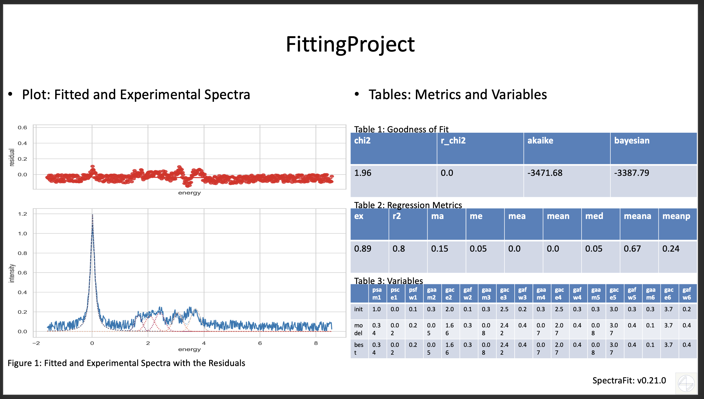

!!! abstract "About the PPTX Converter"

    The `spectrafit-pptx-converter` command line tool allows to convert
    parts of the Spectrafit's `*.lock`-files into a PowerPoint presentation.
    The `*.lock`-files are created by the [Spectrafit-Notebook-Plugin][1]
    and contain the following information:

    - [x] A fitting plot of the data with the fit results and the residuals.
    - [x] Three tables for:
        - [x] [The Goodness of Fit (GoF)][2] parameters.
        - [x] The [regression metrics][3].
        - [x] The fit parameters.

!!! warning "The `spectrafit-pptx-converter` is still in development"

    The `spectrafit-pptx-converter` is still in development and the
    `spectrafit-pptx-converter` command line tool is not yet available.

## PPTX Converter

The `spectrafit-pptx-converter` command line tool can be used like this:

```shell
    ➜ spectrafit-pptx-converter -h
    usage: spectrafit-pptx-converter [options] infile

    Converter for 'SpectraFit' from *.lock output to a PowerPoint presentation.

    positional arguments:
    infile                Filename of the *.lock file to convert to a powerpoint presentation.

    options:
    -h, --help            show this help message and exit
    -f {16:9,16:9HDR,4:3}, --file-format {16:9,16:9HDR,4:3}
                            File format of the PowerPoint presentation. Default is '16:9'.
```

The following export formats are supported:

- [x] `16:9`: PowerPoint presentation with the format `16:9` (**width:** 1280px, **height:** 720px).
- [x] `16:9HDR`: PowerPoint presentation with the format `16:9HDR` (**width:** 1920px, **height:** 1080px).
- [x] `4:3`: PowerPoint presentation with the format `4:3` (**width:** 960px, **height:** 720px).

!!! info "Example of the PPTX Converter"

    The resulting graph looks like this:

    

[1]: ../../plugins/jupyter_interface
[2]: https://lmfit.github.io/lmfit-py/fitting.html#goodness-of-fit-statistics
[3]: https://scikit-learn.org/stable/modules/model_evaluation.html#common-cases-predefined-values
