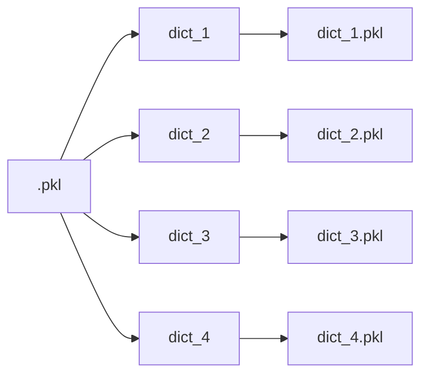

!!! abstract "About the Pkl Converter and Visualizer"

    With the `spectrafit-pkl-converter` command line tool you can convert the
    [pkl files][1] with nested dictionaries and list or `numpy arrays` to [list-of-dictionaries][2] with `numpy arrays`. This is useful for further
    processing with other tools.

    In general, the pickle files can be very complex and contain nested
    dictionaries and lists, as shown in the following example:

    ```mermaid
    stateDiagram
        [*] --> pkl
        pkl --> list
        pkl --> np.array
        pkl --> dict
        pkl --> else
        dict --> dict
        dict --> list
        dict --> np.array
        list --> list
        list --> np.array
        np.array --> np.array
        np.array --> list
        np.array --> dict
        dict -->  list_of_dicts
        list_of_dicts --> [*]
    ```

    For the visualization of the pkl files, the `spectrafit-pkl-visualizer`
    command line tool can be used. It creates a graph of the pkl file and

## PKL Converter

The `spectrafit-pkl-converter` command line tool can be used like this:

```shell
    ➜ spectrafit-pkl-converter -h
    usage: spectrafit-pkl-converter [-h] [-f {utf-16,utf-8,latin1,utf-32}] [-e {pkl.gz,pkl,npy,npz}] infile

    Converter for 'SpectraFit' from pkl files to CSV files.

    positional arguments:
    infile                Filename of the pkl file to convert.

    options:
    -h, --help            show this help message and exit
    -f {latin1,utf-16,utf-8,utf-32}, --file-format {latin1,utf-16,utf-8,utf-32}
                            File format for the optional encoding of the pickle file. Default is 'latin1'.
    -e {pkl.gz,pkl,npy,npz}, --export-format {pkl.gz,pkl,npy,npz}
                            File format for export of the output file. Default is 'pkl'.
```

The following export files are possible:

- [x] `pkl`: Pickle file as `pkl` file and _compressed_ `pkl.gz` file.
- [x] `npy`: Numpy array as `npy` file and _compressed_ `npz` file.

In case of using other file formats, the `spectrafit-pkl-converter` supports
the following file formats:

- [x] `utf-8`: UTF-8 encoded file.
- [x] `utf-16`: UTF-16 encoded file.
- [x] `utf-32`: UTF-32 encoded file.
- [x] `latin1`: Latin-1 encoded file.

All keys up to the first key-value pair of a `numpy.ndarray` or `list` are
merged into a single string, which is used as a new filename. A list will
be converted to a `numpy.ndarray` with the shape `(len(list),)`.



!!! info "Using the `spectrafit-pkl-converter` as a Python module"

    In the case of using `spectrafit-pkl-converter` as a Python module, the
    following:

    ```python
    from spectrafit.plugins.pkl_converter import PklConverter

    pkl_converter = PklConverter()
    list_dict = pkl_converter.convert_pkl_to_csv(
        infile="test.pkl",
    )
    ```

    The `list_dict` variable contains the converted data as a list of
    dictionaries.

    See also:

    ::: spectrafit.plugins.pkl_converter.PklConverter
    :members:
    :undoc-members:

## PKL Visualizer

The `spectrafit-pkl-visualizer` should be used for the visualization of the
pkl files. It creates a graph of the pkl file and exports it as a graph file.

The `spectrafit-pkl-visualizer` command line tool can be used like this:

```shell
    ➜ spectrafit-pkl-visualizer -h
    usage: spectrafit-pkl-visualizer [-h] [-f {utf-32,utf-16,latin1,utf-8}] [-e {jpg,pdf,jpeg,png}] infile

    Converter for 'SpectraFit' from pkl files to a graph.

    positional arguments:
    infile                Filename of the pkl file to convert to graph.

    options:
    -h, --help            show this help message and exit
    -f {latin1,utf-16,utf-8,utf-32}, --file-format {latin1,utf-16,utf-8,utf-32}
                            File format for the optional encoding of the pickle file. Default is 'latin1'.
    -e {jpg,pdf,jpeg,png}, --export-format {jpg,pdf,jpeg,png}
                            File extension for the graph export.
```

Furthermore the `spectrafit-pkl-visualizer` allows export the structure of the
pkl file as a JSON file. The information about the attributes and their
structure is stored in the JSON file. The following example shows the
structure of the JSON file:

??? example "Example of the JSON file"

    ```json
    {
      "file_1": {
        "attribute_1": "<class 'list'>",
        "attribute_2": "<class 'str'>",
        "attribute_3": "<class 'numpy.ndarray'> of shape (201,)",
        "attribute_4": "<class 'numpy.ndarray'> of shape (199,)",
        "attribute_5": "<class 'numpy.ndarray'> of shape (10, 201, 10000)",
        "attribute_6": "<class 'numpy.ndarray'> of shape (10, 201, 10000)",
        "attribute_7": "<class 'numpy.ndarray'> of shape (10, 201, 10000)",
        "attribute_8": "<class 'numpy.ndarray'> of shape (10, 199, 10000)",
        "attribute_9": "<class 'numpy.ndarray'> of shape (10, 199, 10000)",
        "attribute_10": "<class 'numpy.ndarray'> of shape (10, 199, 10000)",
        "attribute_11": "<class 'numpy.ndarray'> of shape (10, 199, 10000)",
        "attribute_12": "<class 'numpy.ndarray'> of shape (10000,)",
        "attribute_13": "<class 'list'>",
        "attribute_14": "<class 'numpy.ndarray'> of shape (10, 201)",
        "attribute_16": "<class 'int'>",
        "attribute_17": "<class 'str'>",
        "attribute_19": "<class 'str'>"
      },
      "file_2": {
        "attribute_1": "<class 'list'>",
        "attribute_2": "<class 'str'>",
        "attribute_3": "<class 'numpy.ndarray'> of shape (201,)",
        "attribute_4": "<class 'numpy.ndarray'> of shape (199,)",
        "attribute_5": "<class 'numpy.ndarray'> of shape (10, 201, 10000)",
        "attribute_6": "<class 'numpy.ndarray'> of shape (10, 201, 10000)",
        "attribute_7": "<class 'numpy.ndarray'> of shape (10, 201, 10000)",
        "attribute_8": "<class 'numpy.ndarray'> of shape (10, 199, 10000)",
        "attribute_9": "<class 'numpy.ndarray'> of shape (10, 199, 10000)",
        "attribute_10": "<class 'numpy.ndarray'> of shape (10, 199, 10000)",
        "attribute_11": "<class 'numpy.ndarray'> of shape (10, 199, 10000)",
        "attribute_12": "<class 'numpy.ndarray'> of shape (10000,)",
        "attribute_13": "<class 'list'>",
        "attribute_14": "<class 'numpy.ndarray'> of shape (10, 201)",
        "attribute_16": "<class 'int'>",
        "attribute_17": "<class 'str'>",
        "attribute_19": "<class 'str'>"
      }
    }
    ```

!!! info "Example of the graph"

    The resulting graph looks like this:

    

[1]: https://docs.python.org/3/library/pickle.html
[2]: https://pythonexamples.org/python-list-of-dictionaries/
